# Handbook

## 硬件及虚拟化

### 各厂商服务器存储默认管理口登录信息合集

服务器管理口合集：

| 设备类型       | 设备型号                | 默认管理IP                            | 默认用户名    | 默认密码   |
| -------------- | ----------------------- | ------------------------------------- | ------------- | ---------- |
| IBM服务器      | IBM P小型机ASMI         | hmc1:192.168.2.147 hmc2:192.168.3.147 | admin         | admin      |
|                | IBM X系列IMM端口        | 192.168.70.125/24                     | USERID        | PASSW0RD   |
|                | IBM BCH刀箱管理模块     | 192.168.70.125-126/24                 | USERID        | PASSW0RD   |
|                | IBM BCH刀箱网络模块     | 192.168.70.127-128/24                 | admin         | admin      |
|                | IBM BCH刀箱光纤模块     | 192.168.70.129-130/24                 | admin         | pasword    |
|                | IBM pureFlexCMM模块     | 192.168.70.100                        | USERID        | PASSW0RD   |
| 华为服务器     | E6000                   | 10.10.1.101-10.10.1.110               | root          | Huawei12#$ |
|                | RH2288 v3系列           | 192.168.2.100                         | root          | Huawei12#$ |
|                | RH2288 v5系列           | 192.168.2.100                         | Administrator | Admin@9000 |
|                | T6000                   | 10.10.1.101-10.10.1.102               | root          | Huawei12#$ |
|                | X6000                   | 10.10.1.101-10.10.1.104               | root          | Huawei12#$ |
| 华为鲲鹏服务器 | TaiShan 200             | 192.168.2.100/24                      | Administrator | Admin@9000 |
|                | TaiShan 100             | 192.168.2.100/24                      | root          | Huawei12#$ |
| 浪潮服务器     | NF5270M4                | 手动配置                              | admin         | admin      |
|                | NF8560M2                | 192.168.1.100                         | ADMIN         | ADMIN      |
| H3C服务器      | R4900 G2/G3             | HDM：192.168.1.2/24                   | admin         | Password@_ |
|                | B16000                  | 192.168.100.100/24                    | admin         | Password@_ |
| Dell服务器     | IDRAC                   | 192.168.0.120                         | root          | calvin     |
| 联想服务器     | RQ940                   | 192.168.0.120                         | admin         | admin      |
|                | RD530/RD630/RD540/RD640 | 手动设置                              | lenovo        | len0vO     |
|                | 万全R520                | 手动设置                              | lenovo        | lenovo     |
|                | ThinkSystem SR850       | 手动设置                              | USERID        | PASSW0RD   |
| 曙光服务器     | I840-G25                | 手动设置                              | admin         | admin      |

存储管理口合集：

| 设备类型     | 设备型号                                                     | 默认管理IP                                                   | 默认用户名                                  | 默认密码      |
| ------------ | ------------------------------------------------------------ | ------------------------------------------------------------ | ------------------------------------------- | ------------- |
| IBM存储      | DS存储                                                       | port1 A控192.168.128.101/24<br>port1 B控192.168.128.102/24<br/>port2 A控192.168.129.101/24<br/>port2 B控192.168.129.102/24 | 用IBM DS Storage Manager Client管理软件连接 |               |
|              | v5030                                                        | T口：192.168.0.1                                             | superuser                                   | passw0rd      |
|              | V7000                                                        | 上 192.168.70.121<br/>下 192.168.70.122                      | superuser                                   | passw0rd      |
|              |                                                              |                                                              |                                             |               |
| 华为存储     | OceanStor 5300 V3/5500     V3(V300R003C00/V300R003C10版本)   | A管理口：192.168.128.101/24     B管理口：192.168.128.102/24  | admin                                       | Admin@storage |
|              | OceanStor 5300 V3/5500     V3(V300R003C20版本)               | A管理口：192.168.128.101/16     B管理口：192.168.128.102/16  | admin                                       | Admin@storage |
|              | OceanStor 5600 V3/5800 V3/6800  V3(V300R003C00/V300R003C10版本) | A管理口：192.168.128.101/16     B管理口：192.168.128.102/16  | admin                                       | Admin@storage |
|              | OceanStor 5600 V3/5800 V3/6800 V3(V300R003C20版本)           | A管理口：192.168.128.101/16     B管理口：192.168.128.102/16  | admin                                       | Admin@storage |
|              | 以上默认的内部心跳IP                                         | 双控：127.127.127.10-11/24     四控：127.127.127.10-13/24    |                                             |               |
|              | 以上维护网口IP                                               | 172.31.128.101/16     172.31.128.102/16                      |                                             |               |
| 华赛存储     | S1200                                                        | 192.168.168.1                                                | root                                        | password      |
|              | V1000/S500                                                   | 192.168.128.101-102/24                                       | admin                                       | 123456        |
| Dell存储     | MD3600                                                       | 192.168.128.101/102                                          | 用DELL MDSM软件连接                         |               |
| Lenovo EMC   | 5100                                                         | 1.1.1.1/1.1.1.2                                              | root                                        | lenovo        |
| 非Lenovo EMC | VNX5700                                                      | 1.1.1.1/1.1.1.2                                              | sysadmin                                    | sysadmin      |
| 曙光存储     | DS800-G35                                                    | 192.168.0.210/192.168.0.220                                  | admin                                       | admin         |
| 宏杉存储     | MS系列                                                       | 192.168.0.210/192.168.0.220                                  | admin                                       | admin         |
| 同有存储     | NetStor iSUM450G2                                            | 192.168.0.200                                                | administator                                | password      |

光纤交换机管理口合集：

| 设备类型 | 设备型号    | 默认管理IP  | 默认用户名 | 默认密码 |
| -------- | ----------- | ----------- | ---------- | -------- |
| 博科     | Brocade通用 | 10.77.77.77 | admin      | password |


### 浪潮服务器管理口地址设置

- **NF5240m3/NF5140m3/NF5280m3/SA5212H2/NP5540M3/NF5270M3/NF5170M3/NF8420m3**

  IPMI主板集成管理芯片BMC IP 设置

  开机按DEL键进入BIOS设置

  选择"Server Mgmt"---"BMC Network Configuration"---"lan channel 1/2"---"static ip address"

  lan channel 1:指的是复用管理网口，网卡1接口

  lan channel 2:指的是IPMI管理专用接口，一般需要设置这个接口

- **NF8560M2/NF8560M/NF8560**

  集成IPMI管理卡IP地址可以在BIOS中“Advanced"---"IPMI Configuration"---"Set LAN Configuration"---"IP Address"---"static"菜单中查看和设置

  说明：NF8560M2出厂时主板集成的IPMI管理卡IP地址默认为：192.168.1.100

  如果重新更改了IP地址，保存后，还需要对服务器进行重新启动或断电(拔下电源线)操作后才能正常使用。

- **NF5220/NF5120/NF5225/NF5280M2**

  IPMI主板集成管理芯片BMC IP 设置

  开机按DEL键进入BIOS设置

  选择"Server Mgmt"---"BMC Network Configuration"---"lan channel 1/2"---"static ip address"

  lan channel 1:指的是复用管理网口，网卡1接口

  lan channel 2:指的是IPMI管理专用接口，一般需要设置这个接口

- **NF5270M4/NF5280M4**

  IPMI主板集成管理芯片BMC IP 设置

  开机按DEL键进入BIOS设置

  选择"Server Mgmt"---"BMC Network Configuration"---"Configuration address source"---"statically or dynamically"

  BMC Sharelink Management Channel:指的是复用管理网口，网卡1接口

  BMC Dedicated Management Channel:指的是IPMI管理专用接口，一般需要设置这个接口

- **NF8460M3**

  请使用用户名：root 密码：superuser 或用户名：ADMIN 密码：ADMIN


### PM8060 RAID 阵列卡热备盘设置(基于浪潮服务器)

> 浪潮服务器常见的阵列卡类型
> 1.LSI 9361-8I 这类阵列卡应用比较广泛，配置阵列直接进入到9361-8I的配置界面就可以配置了，功能都在里面，配置也比较简单，唯一要注意的就是开机需要设置BOIS里Boot Mode的模式，默认是UEFI MODE，需要改成Legacy,这样开机自检才能检测到阵列卡。
>
> 2.PM8060 这类阵列卡在做冗余热备盘的设置时，在自检到阵列卡后进入阵列卡里设置，没有提供相关的热备盘设置功能，要想做热备盘必须在BIOS里PMC选项里做。

1. BIOS里设置Boot Mode的模式为 UEFI模式，设置成这个模式才可以在BIOS里配置阵列信息。

   开机F2进入BIOS-->Advanced-->CSM Configuration-->Boot Mode [UEFI mode]-->storage [UEFI]

   

   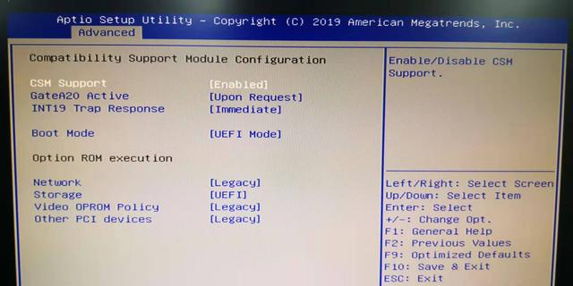

   将Boot Mode 和 storage两个选项默认的Legacy改成UEFI Mode后，保存设置重启。

2. 重启后进入BIOS 里PMC选项进行阵列卡设置，8块硬盘选择7块做RAID 5后返回再选择GLOBAL Hotspares里设置热备盘。

   BIOS-->Advanced-->PMC maxVlew storage Manager-->Scan For Controllers-->Controller #0 PM8060-RAID-->Logical Device Configuration-->Global Hotspares-->ADD

   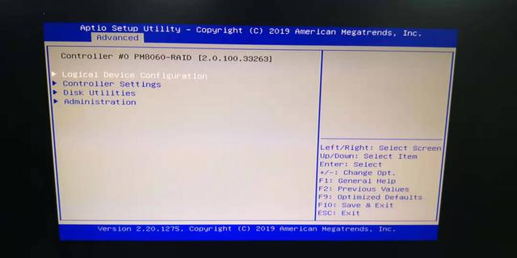

   

   

   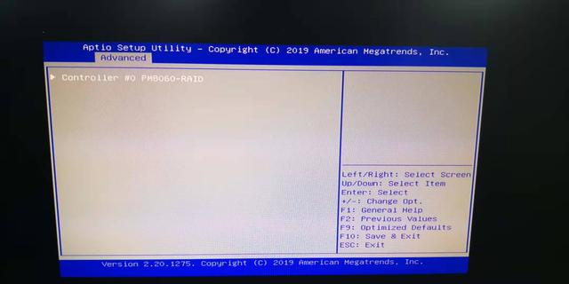

   

   

   在Create Array里创建新的阵列，选择7块硬盘组建RAID 5 完成后再做热备盘设置

   

   选择ADD选项，设置剩下的硬盘为热备盘即可

   设置完成后按F10 保存并退出。

3. 全部配置完后需要再把Boot Mode模式改成Legacy，这样开机自检才能检测到阵列卡，并从阵列卡启动。

   


### RAID 阵列方案解析

#### RAID 介绍

1. RAID是Redundant Array of Independent Disks的缩写，中文简称为独立冗余磁盘阵列
2. 把多块独立的物理硬盘按不同的方式组合起来形成一个硬盘组(逻辑硬盘)，从而提供比单个硬盘更高的存储性能和提供数据备份技术
3. RAID技术分为几种不同的等级，分别可以提供不同的速度，安全性和性价比。根据实际情况选择适当的RAID级别可以满足用户对存储系统可用性、性能和容量的要求
4. 组成磁盘阵列的不同方式称为RAID级别(RAID Levels)
5. 常用的RAID级别：RAID 0，RAID 1，RAID 5，RAID 6，RAID 1+0 等


#### 阵列卡介绍

- 阵列卡是用来实现RAID功能的板卡
- 通常是由I/O处理器、硬盘控制器、硬盘连接器和缓存等一系列组件构成的
- 不同的RAID卡支持的RAID功能不同，例如支持RAID0、 RAID1、 RAID5、 RAID10等
- RAID卡的接口类型 IDE接口、SCSI接口、SATA接口和SAS接口
  - IDE接口（并行接口，价格低廉，兼容性强）
  - SCSI接口（串行接口，是小型计算机系统接口，广泛应用于小型机上的高速数据传输技术，支持热拔插，CPU占用率低，但是价格高）
  - SATA接口（串行接口）
  - SAS接口（新一代scsi接口，向下兼容SATA）

阵列卡的缓存：

- 缓存(Cache)是RAID卡与外部总线交换数据的场所,RAID卡先将数据传送到缓存，再由缓存和外边数据总线交换数据。
- 缓存的大小与速度是直接关系到RAID卡的实际传输速度的重要因素，大缓存可以提高命中率
- 不同的RAID卡出厂时配备的内存容量不同，一般为几兆到数百兆容量不等。

#### 各 RAID 级别介绍

##### RAID 0（条带化存储）

数据存储模型

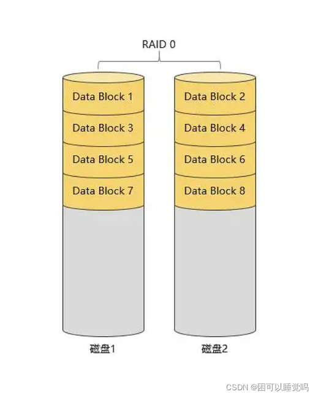

- RAID 0连续以位或字节为单位进行分割数据，将数据分段存储在各个硬盘中，n块硬盘并行读/写数据，因此具有很高的数据传输率，可以达到单个硬盘的N倍，但它没有数据冗余；
- RAID 0只是单纯地提高性能，并没有为数据的可靠性提供保证，而且其中的一个磁盘失效将影响到所有数据，因此并不能算真正的RAID结构；
- RAID 0不能应用于数据安全性要求高的场合。

特点：

（1）最少需要两块磁盘

（2）数据条带分布式

（3）没有冗余，性能最佳（不存储镜像、不校验信息）

（4）不能应用于对数据安全性要求高的场合


##### RAID 1（镜像存储）

数据存储模型

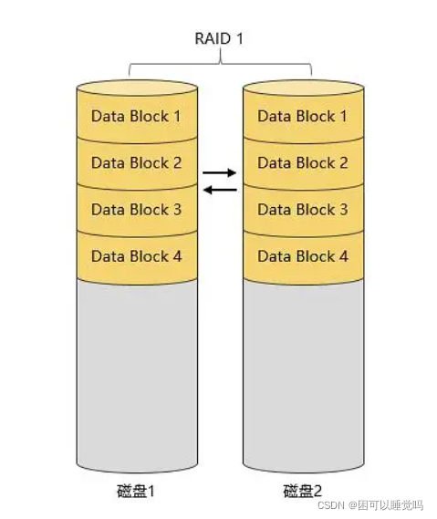

- 通过磁盘数据镜像实现数据冗余，在成对的独立磁盘上产生互为备份的数据
- 当原始数据繁忙时，可直接从镜像拷贝中读取数据,因此RAID1可以提高读取性能
- RAID 1 是磁盘阵列中单位成本最高的，但提供了很高的数据安全性和可用性。当一个磁盘失效时，系统可以自动切换到镜像磁盘上读写,而不需要重组失效的数据
- N（偶数）块硬盘组成镜像，容量为N/2

特点：

（1）最少需要两块磁盘

（2）提供数据冗余（提供备份）

（3）性能好

（4）N（偶数）块硬盘组成镜像，容量为N/2


##### RAID 5（奇偶校验）

数据存储模型

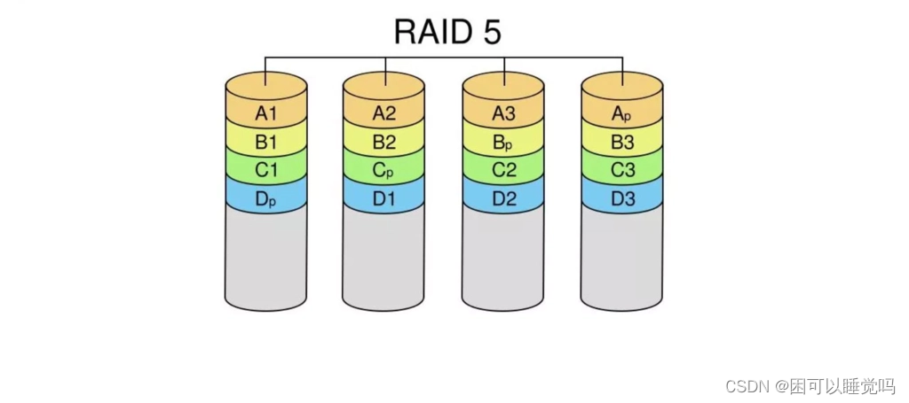

- N (N>=3) 块盘组成阵列，一份数据产生N-1个条带，同时还有1份校验数据,共N份数据在N块盘上循环均衡存储
- N块盘同时读写，读性能很高，但由于有校验机制的问题，写性能相对不高；
- (N-1) /N磁盘利用率（有一块是用来校验的）；
- 可靠性高，允许坏1块盘，不影响所有数据

特点：

（1）最少3块磁盘

（2）数据条带形式分布

（3）以奇偶校验作冗余

（4）适合多读少写的情景，是性能与数据冗余最佳的折中方案


##### RAID 6

数据存储模型

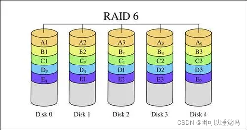

- N（N≥4）块盘组成阵列，(N-2) /N磁盘利用率
- 与RAID 5相比，RAID 6增加了第二个独立的奇偶校验信息块
- 两个独立的奇偶系统使用不同的算法，即使两块磁盘同时失效也不会影响数据的使用
- 相对于RAID 5有更大的"写损失" ，因此写性能较差


##### RAID 1+0 （RAID 10）

先做镜像，再做条带

数据存储模型

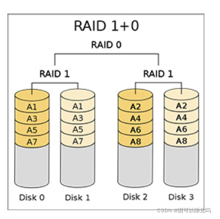

- N (偶数，N>=4)。块盘两两镜像后，再组合成一个RAID 0
- N/2磁盘利用率
- N/2块盘同时写入，N块盘同时读取
- 性能高，可靠性高

特点：

（1）最少4块磁盘

（2）先按RAID 0 分成两组，再分别对两组按RAID 1 方式镜像

（3）兼顾冗余（提供镜像存储）和性能（数据条带形式分布）

（4）在实际应用中较为常用


##### RAID 0+1

先做条带，再做镜像

数据存储模型

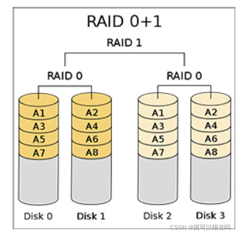

- 读写性能与RAID 1+0相同；
- 安全性低于RAID 1+0；
- 使用较少。


##### 各级别 RAID 对比

| RAID级别 | 硬盘数量    | 硬盘使用率 | 是否有校验 | 保护能力               | 写性能                     |
| -------- | ----------- | ---------- | ---------- | ---------------------- | -------------------------- |
| RAID 0   | N           | N          | 无         | 无                     | 单个硬盘的N倍              |
| RAID 1   | N(偶数)     | N/2        | 无         | 允许一个设备故障       | 需写两对存储设备，互为主备 |
| RAID 5   | N≥3         | (N-1)/N    | 有         | 允许一个设备故障       | 需写计算校验               |
| RAID 6   | N≥4         | (N-2)/N    | 有         | 允许两个设备故障       | 需双重写计算校验           |
| RAID 10  | N≥4（偶数） | N/2        | 无         | 允许两个基组中各坏一个 | N/2块盘同时写入            |


#### RAID 热备盘

##### 热备盘介绍

与CPU系统电连接的硬盘，它能替换下系统中的故障盘。与冷备份的区别是，冷备份盘平时与机器不相连接，硬盘故障时才换下故障盘。

当一个正在使用的磁盘发生故障后，一个空闲、加电并待机的磁盘将马上代替此故障盘，此方法就是热备用。热备用磁盘上不存储任何的用户数据，最多可以有8个磁盘作为热备用磁盘。

一个热备用磁盘可以专属于一个单一的冗余阵列或者它也可以是整个阵列热备用磁盘池中的一部分。而在某个特定的阵列中，只能有一个热备用磁盘。

当磁盘发生故障时，控制器的固件能自动的用热备用磁盘代替故障磁盘，并通过算法把原来储存在故障磁盘上的数据重建到热备用磁盘上。

数据只能从带有冗余的逻辑驱动器上进行重建(除了RAID 0以外)，并且热备用磁盘必须有足够多的容量。

系统管理员可以更换发生故障的磁盘，并把更换后的磁盘指定为新的热备用磁盘。


##### RAID 热备盘工作模式

Local Spare 特定热备：针对某一RAID组，只有该组硬盘出现问题后才启用恢复

Globe Spare 全局热备：针对所有RAID组，只要某一个RAID组出现问题就进行恢复

Enclosure Spare 机框热备：针对盘柜，只会作用于该磁盘所在盘柜，当该磁盘所在盘柜中RIAD组故障才进行恢复


##### 总结

热备盘总是和RAID5阵列对应起来，如果不是RAID5级别(或者以上)的阵列，就没有必要创建热备盘。

因为当别的硬盘损坏、热备盘自动起用时，需要用RAID5阵列中未损坏的硬盘对热备盘进行数据重建。

注意在数据重建过程中不能插拔阵列中的非损坏硬盘!

一旦正常开始数据重建，我们就可以更换损坏的硬盘了，更换后的硬盘会自动成为新的热备盘。

不管是是raid1，raid10，raid5等等都好，他们要不要热备盘都可以的，但是为了更安全稳定，在规划raid方案的时候还是建议你配上热备盘的！


### vmware 虚拟机文件组成探索

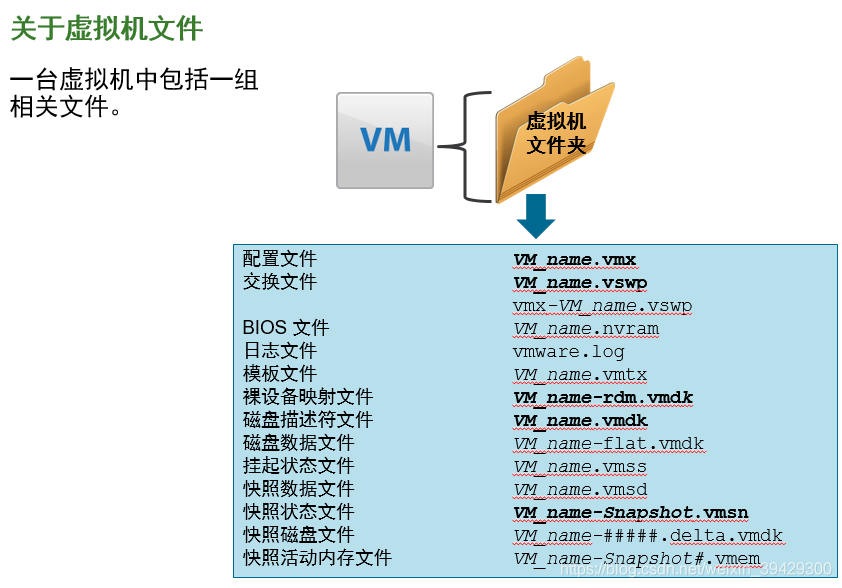

VMware将一台台的虚拟机封装成一个文件夹到数据存储中
在虚拟机完成安装，正常开机，未做快照、挂起等操作时，虚机文件如下：

- 开机状态下

  

  - .vmdk
    该文件是虚拟机的磁盘文件，它储存了虚拟机硬盘驱动器里的信息。
    一台虚拟机可以由一个或多个虚拟磁盘文件组成，如果在新建虚拟机时指定虚拟机磁盘文件为单独一个文件时，系统将只创建一个.vmdk文件，该文件包括了虚拟机磁盘分区信息，以及虚拟机磁盘的所有数据。随着数据写入虚拟磁盘，虚拟磁盘文件将变大，但始终只有这一个磁盘文件。如果在新建虚拟机时指定为每2GB单独创建一个磁盘文件的话，虚拟磁盘总大小就决定了虚拟磁盘文件的数量。系统将创建一个.vmdk文件和多个-s###.vmdk文件（s###为磁盘文件编号），其中.vmdk文件只包括磁盘分区信息，多个-s###.vmdk文件存储磁盘数据信息。随着数据写入某个虚拟磁盘文件，该虚拟磁盘文件将变大，直到文件大小为2GB，然后新的数据将写入到其他s###编号的磁盘文件中。

  - .nvram
    可以理解为是虚拟机的BIOS文件，这个小型文件包括虚拟机启动过程的BIOS信息。它类似于拥有BIOS芯片的物理服务器，能够设置硬件配置选项。一台虚拟机也应该在NVRAM文件里有虚拟BIOS。当虚拟机首次启动时，按F2键可以访问BIOS。不管虚拟机的硬盘配置发生了什么变化，都会保存在NVRAM文件里。如果删除这个文件的话，在虚拟机启动时会自动地重新创建。
    vmx-虚机名-数字串.vswp
    是当前已使用的内存缓存文件，我们可以打开虚拟机查看当前内存，便会发现已使用的内存大小和该文件大小相同

  - .vmx
    虚拟机配置文件，这个文件包括虚拟机所有配置信息与硬件设置。不管对虚拟机的设置作了何种编辑，所有的信息都会以文本形式保存在这个文件里。这个文件包括与虚拟机有关的多种信息，如特殊硬件配置，高级能源与资源设置、VMware工具选项以及能源管理选项。
    可以手动的对此文件进行编辑，在出现故障时，我们也可以通过配置文件与虚拟磁盘vmdk文件，来实现虚拟机的快速恢复。因为我们也可以理解为，vmx和vmdk文件是虚拟机最重要的两个文件。

  - .vmsd
    该文件储存了虚拟机快照的相关信息和元数据，由于虚拟机当前没有快照，所以我们可以看到，该文件大小为0K

  - .vmx.lck
    虚拟机系统锁定文件，防止在虚拟机运行时被其他程序打开造成冲突。

  - .hlog
    启动数据存储迁移任务时，将在目标数据存储上创建基于虚拟机名称哈希的主机日志（.hlog）文件

  - .vmx~
    与.vmxf文件都是辅助虚拟机配置文件，用于虚拟机组的配置。

  - .vswp
    虚拟内存文件，在启动虚拟机时，如果ESXi主机由于过量使用而消耗光其物理内存时，会创建一个内存交换文件代替物理主机内存。这些文件的大小等于分配给虚拟机的内存大小。这些文件通常创建在虚拟机里，不过只有当主机耗尽所有物理内存时才使用。理论上来说，当虚拟机内存足够时，该文件不会被使用，可以被删除，但是通常删除该文件时，会出现如下错误，建议不要删除。

    

    由于虚拟机内存读或写入磁盘没有物理主机RAM快，如果虚拟机开始使用这个文件的话，性能会有所降低。这些文件会占用虚拟存储上非常大的磁盘空间，因此要确保有足够的可用空间，这是因为如果没有足够的空间创建这个文件的话，虚拟机启动不了。
    当虚拟机关闭或暂停时，这些文件将删除，也就是说，仅当虚拟机启动时，才会有子虚拟内存文件。

- 开机做快照后

  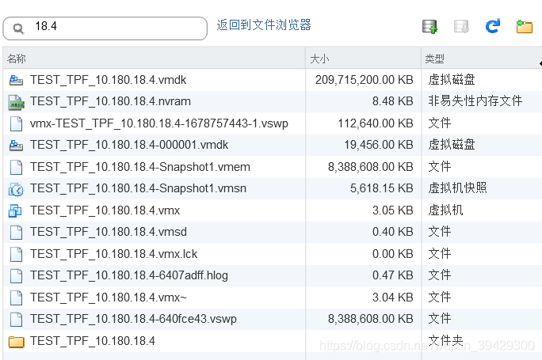

  > 快速保存虚机状态（设置、内存、硬盘）
  > 将原磁盘文件变为只读，生成可读写的张量磁盘
  > 新增文件（在开机状态的基础上）

  - .vmdk
    Vmdk文件中多了一个虚机名-000001.vmdk的磁盘文件，这是拍摄快照后生成的磁盘文件，快照完成后，虚拟机磁盘数据将不再写入原来的Win7.vmdk中，而写入新的快照磁盘中，当该文件达到置备大小（既Win7.vmdk磁盘大小）时，将按照序号递增，生成新的磁盘文件。
  - .vmsn
    这个文件与快照一起使用，用于存储虚拟机在进行快照时的状态。每在虚拟机上创建一个快照就会生成一个.vmsn文件，在删除快照时，文件自动删除。当暂停虚拟机时，如果删除该文件，虚拟机将重新启动并还原到快照前状态。
  - .vmem
    该文件也是虚拟内存文件，用于保存快照前虚拟内存信息，我们可以看到。该文件大小与虚拟内存vswp文件相同，都等于虚拟机分配内存的大小。

- 删除快照后

  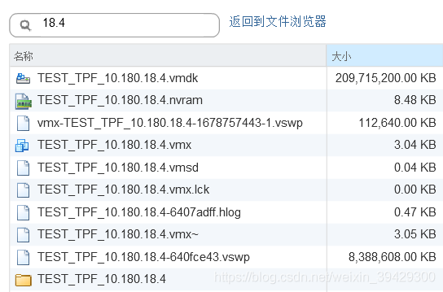

  vmdk文件整合
  .vmem .vmsn释放，快照 .vmdk文件与上一编号.vmdk整合

- 挂起后

  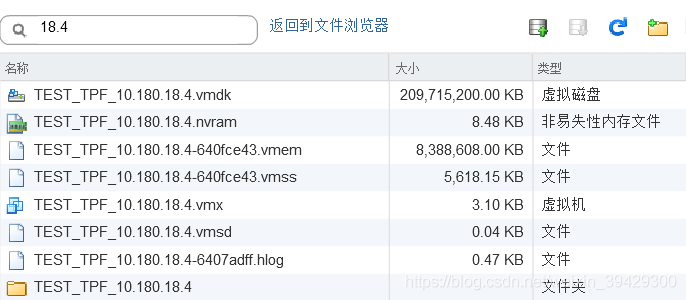

  少了

  - .vswp
  - vmx-虚机名-数字串.vswp
  - .vmx.lck
  - .vmx~

  挂起虚拟机后，虚拟机不再运行，不许使用虚拟内存，所以此时vswp虚拟内存文件被删除。
  新增

  - .vmem
    为了保存挂起前虚拟机虚拟内存使用情况，vmware会生成一个.vmem文件，来记录。
  - .vmss
    这个文件用于虚拟机暂停时，保存虚拟机的存储内容，以便在重新开始时继续运行。当虚拟机再次运行时，这个文件的内容将写回主机服务器的物理内存，不过，这个文件不会自动删除，除非关闭虚拟机。当虚拟机再次暂停时，如果先前的暂停文件存在的话，这个文件将再次使用而不会删除和重新创建。当暂停虚拟机时，这个文件删除的话，那么虚拟机将正常启动，而不是从暂停状态启动。

- 恢复虚拟机后

  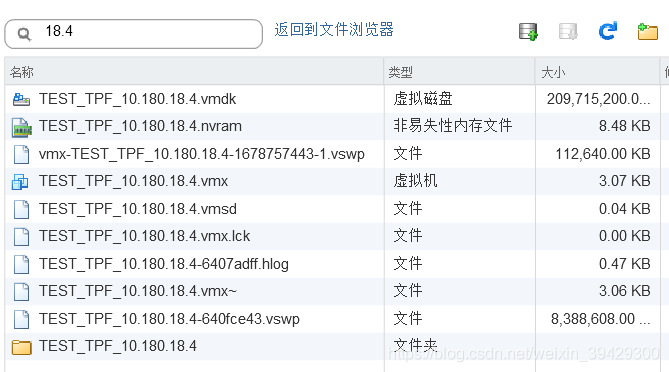

- 关机状态

  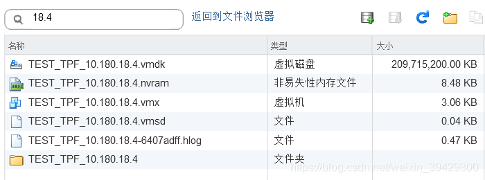

  


## 操作系统

- 查看 Java 程序堆内存使用情况

  ```shell
  jmap -heap <pid>
  ```

- 修改配置文件，将yum安装的rpm自动下载保存

  ```
  vi etc/yum.conf
  将keepcache=0修改为keepcache=1
  保存退出
  这样后面通过yum安装的rpm文件将会自动下载到/var/cache/yum/x86_64/7/*/packages
  项目组可以将packages中rpm文件打包用于现场安装和升级
  ```

- 查看内存槽数、哪些槽位插了内存及内存大小

  ```shell
  dmidecode | grep -P -A5 "Memory\s+Device" | grep Size | grep -v Range
  ```

- 查看最大支持内存数

  ```shell
  dmidecode | grep -P 'Maximum\s+Capacity'
  ```

- 查看槽位上内存的速率，没插的显示 unknown

  ```shell
  dmidecode | grep -A16 "Memory Device" | grep 'Speed'
  ```

- Linux 添加 PATH 环境变量的几种方法（以添加 PYTHONPATH 为例）

  ```
  Linux下设置PYTHONPATH环境变量有三种方法：一种作用于当前终端，一种作用于当前用户，一种作用于所有用户。
  
  1.作用于当前终端，直接当前终端输入命令
    $ export PYTHONPATH=$PYTHONPATH:<你的要加入的路径>
    $ export PYTHONPATH=$PYTHONPATH:/home/hadoop/MyBI
    注1：'/home/hadoop/MyBI'是项目MyBI的项目名
    注2：作用范围当前终端，一旦当前终端关闭或在另一个终端中，则无效。
    注3：这种方式立即生效。
  
  2.作用于当前用户，修改当前用户目录下的'~/.bashrc'文件
    $ vi ~/.bashrc
    加入内容：
    export PYTHONPATH=$PYTHONPATH:/home/hadoop/MyBI
    也可以加入多个路径，用分号分隔
    export PYTHONPATH=$PYTHONPATH:<你的要加入的路径1>:<你的要加入的路径2>:等等
  
    注1：需要执行如下命令后生效（或者注销后重新登陆）
    $ source ~/.bashrc  
  
  3.作用于所有用户（需要root权限修改），修改'/etc/profile'文件
    $ vi /etc/profile
    加入内容：
    export PYTHONPATH=$PYTHONPATH:/home/hadoop/MyBI
    
    注1：需要执行如下命令后生效（或者注销后重新登陆）
    $ source /etc/profile
  ```


### Linux 环境变量

- Linux 环境变量文件

  - 系统环境变量

    **/etc/profile**：这个文件预设了几个重要的变量，例如PATH, USER, LOGNAME, MAIL, INPUTRC, HOSTNAME, HISTSIZE, umask等等

    **/etc/bashrc**：这个文件主要预设umask以及PS1。这个PS1就是我们在敲命令时，前面那串字符了，例如 [root@localhost ~]#,当bash shell被打开时,该文件被读取

  - 用户环境变量

    **.bash_profile**：定义了用户的个人化路径与环境变量的文件名称。每个用户都可使用该文件输入专用于自己使用的shell信息,当用户登录时,该文件仅仅执行一次。（在这个文件中有执行.bashrc的脚本）

    **.bashrc**：该文件包含专用于你的shell的bash信息,当登录时以及每次打开新的shell时,该该文件被读取。例如你可以将用户自定义的alias或者自定义变量写到这个文件中。

    **.bash_history**：记录命令历史用的

    **.bash_logout**：当退出shell时，会执行该文件。可以把一些清理的工作放到这个文件中


### CentOS6 的启动引导过程

1. 内核引导

   当计算机打开电源后，首先是BIOS开机自检，按照BIOS中设置的启动设备（通常是硬盘）来启动。紧接着由启动设备上的grub程序开始引导Linux，当引导程序成功完成引导任务后，Linux从它们手中接管了CPU的控制权，然后CPU就开始执行Linux的核心映象代码，开始了Linux启动过程。也就是所谓的内核引导开始了，在内核引导过程中其实是很复杂的，我们就当它是一个黑匣子，反正是Linux内核做了一系列工作，最后内核调用加载了init程序，至此内核引导的工作就完成了。交给了下一个主角init.

2. 运行init

   init 进程是系统所有进程的起点，你可以把它比拟成系统所有进程的老祖宗，没有这个进程，系统中任何进程都不会启动。init 最主要的功能就是准备软件执行的环境，包括系统的主机名、网络设定、语言、文件系统格式及其他服务的启动等。 而所有的动作都会通过 init的配置文件/etc/inittab来规划，而inittab 内还有一个很重要的设定内容，那就是默认的 runlevel (开机运行级别)。先来看看运行级别Run level,Linux就是通过设定run level来规定系统使用不同的服务来启动，让Linux的使用环境不同。我们来看看这个inittab文件里面的支持级别。

   ```shell
   # inittab is only used by upstart for the default runlevel.
   #
   # ADDING OTHER CONFIGURATION HERE WILL HAVE NO EFFECT ON YOUR SYSTEM.
   #
   # System initialization is started by /etc/init/rcS.conf
   #
   # Individual runlevels are started by /etc/init/rc.conf
   #
   # Ctrl-Alt-Delete is handled by /etc/init/control-alt-delete.conf
   #
   # Terminal gettys are handled by /etc/init/tty.conf and /etc/init/serial.conf,
   # with configuration in /etc/sysconfig/init.
   #
   # For information on how to write upstart event handlers, or how
   # upstart works, see init(5), init(8), and initctl(8).
   #
   # Default runlevel. The runlevels used are:
   #   0 - halt (Do NOT set initdefault to this)
   #   1 - Single user mode
   #   2 - Multiuser, without NFS (The same as 3, if you do not have networking)
   #   3 - Full multiuser mode
   #   4 - unused
   #   5 - X11
   #   6 - reboot (Do NOT set initdefault to this)
   #
   id:3:initdefault:
   ```

   inittab配置文件格式和之前老版本CentOS5或者更老版本比有很大改动。Runlevels共七个级别，0表示关机，1表示单用户，2表示没有网络的命令行级别，3命令行级别（大多服务器都用这个级别），4为保留级别，5为图形化级别，6为重启。这个文件中除了最后一行外，其他都为注释行，也就是说最后一行才是关键，它用来指定服务器跑哪个级别，这里除了可以设置2,3,5外其他级别都不能设置。在该文件的前面部分，可以看到很多行都提及到某个配置文件，而所有配置文件都是在/etc/init/目录下。

3. 系统初始化

   系统初始化，就是去执行/etc/init/下的各个配置文件。inittab配置文件中有这么一行 “System initialization is started by /etc/init/rcS.conf” 也就是说系统初始化会先执行/etc/init/rcS.conf 而该配置文件中又有一行 “exec /etc/rc.d/rc.sysinit” 所以，重心又转移到了这个rc.sysinit文件上，它会做如下工作：激活交换分区，检查磁盘，加载硬件模块以及其它一些需要优先执行任务。当rc.sysinit程序执行完毕后，将返回init继续下一步，又到了/etc/init/rc.conf, 在这个配置文件里，最关键的一行为 “exec /etc/rc.d/rc RUNLEVEL” 而 RUNLEVEL 是在/etc/inittab中定义的(最下面的那一行)，以阿铭的/etc/inittab为例，表示$RUNLEVE=3, 所以此时会执行 “/etc/rc.d/rc 3” 此时实际上是把/etc/rc.d/rc3.d/ 下的脚本都给执行了，随后/etc/rc.d/rc.local也会被执行，通常我们会把开机启动执行的命令放到这个脚本下。服务执行完，系统初始化也就完成了。接下来该建立终端了。

4. 建立终端

   建立终端是由配置文件/etc/init/tty.conf, /etc/init/serial.conf和/etc/sysconfig/init等配置文件来完成的。在2、3、4、5的运行级别中都将以respawn方式运行mingetty程序，mingetty程序能打开终端、设置模式。同时它会显示一个文本登录界面，这个界面就是我们经常看到的登录界面，在这个登录界面中会提示用户输入用户名，而用户输入的用户将作为参数传给login程序来验证用户身份。

5. 用户登录系统

   对于运行级别为5的图形方式用户来说，他们的登录是通过一个图形化的登录界面。登录成功后可以直接进入KDE、Gnome等窗口管理器。而本文主要讲的还是文本方式登录的情况：当我们看到mingetty的登录界面时，我们就可以输入用户名和密码来登录系统了。

   Linux的账号验证程序是login，login会接收mingetty传来的用户名作为用户名参数。然后login会对用户名进行分析：如果用户名不是root，且存在 “/etc/nologin” 文件，login将输出nologin文件的内容，然后退出。这通常用来系统维护时防止非root用户登录。只有 “/etc/securetty” 中登记了的终端才允许root用户登录，如果不存在这个文件，则root可以在任何终端上登录。”/etc/usertty” 文件用于对用户作出附加访问限制，如果不存在这个文件，则没有其他限制。

   在分析完用户名后，login将搜索 “/etc/passwd” 以及 “/etc/shadow” 来验证密码以及设置账户的其它信息，比如：主目录是什么、使用何种shell。如果没有指定主目录，将默认为根目录；如果没有指定shell，将默认为 “/bin/bash”。

   login程序成功后，会向对应的终端在输出最近一次登录的信息(在 “/var/log/lastlog” 中有记录)，并检查用户是否有新邮件(在 “/usr/spool/mail/” 的对应用户名目录下)。然后开始设置各种环境变量：对于bash来说，系统首先寻找 “/etc/profile” 脚本文件，并执行它；然后如果用户的主目录中存在 .bash_profile 文件，就执行它（在这个文件中有执行.bashrc的脚本），在这些文件中又可能调用了其它配置文件，所有的配置文件执行后后，各种环境变量也设好了，这时会出现大家熟悉的命令行提示符，到此整个启动过程就结束了。

**执行顺序：`/etc/profile` -> `~/.bash_profile` -> `~/.bashrc` -> `/etc/bashrc` -> `~/.bash_logout`**


### Linux 标准输出、错误输出、标准输入

| 数字 | 含义         | 标准叫法                 |
| ---- | ------------ | ------------------------ |
| 0    | 标准输入     | stdin = standard input   |
| 1    | 标准输出     | stdout = standard output |
| 2    | 标准错误输出 | stderr = standard error  |

一些重定向的用法

```shell
1.想要把make输出的全部信息，输出到某个文件中，最常见的办法就是：
make xxx > build_output.txt
此时默认情况是没有改变2=stderr的输出方式，还是屏幕，所以，如果有错误信息，还是可以在屏幕上看到的。

2.只需要把make输出中的错误（及警告）信息输出到文件中ing，可以用：
make xxx 2> build_output.txt
相应地，由于1=stdout没有变，还是屏幕，所以，那些命令执行时候输出的正常信息，还是会输出到屏幕上，你还是可以在屏幕上看到的。

3.只需要把make输出中的正常（非错误，非警告）的信息输出到文件中，可以用：
make xxx 1> build_output.txt
相应地，由于2=stderr没有变，还是屏幕，所以，那些命令执行时候输出的错误信息，还是会输出到屏幕上，你还是可以在屏幕上看到的。

4.想要把正常输出信息和错误信息输出到分别的文件中，可以用：
make xxx 1> build_output_normal.txt 2>build_output_error.txt
即联合使用了1和2，正常信息和错误信息，都输出到对应文件中了。

5. 所有的信息都输出到同一个文件中：
make xxx > build_output_all.txt 2>&1
其中的2>&1表示错误信息输出到&1中，而&1，指的是前面的那个文件：build_output_all.txt 。
注意：上面所有的1,2等数字，后面紧跟着大于号'>' ，中间不能有空格
```


### vm.overcommit_memory & vm.overcommit_ratio

overcommit_memory: 有三个值可以配置
- 0: 用户申请内存的时候，系统会判断剩余的内存多少，如果不够的话那么就会失败
- 1: 用户申请内存的时候，系统不进行任何检查任务内存足够用，直到使用内存超过可用内存
- 2: 用户一次申请的内存大小不允许超过可用内存的大小

overcommit_ratio: 仅当 overcommit_memory 为 2 时，该参数才会生效，这个参数决定了系统可用内存的大小

计算公式:

```
(Physical-RAM-Size）* ratio / 100 + (Swap-Size)
  Physical-RAM-Size: 物理内存大小，具体为 free 命令回显中 Mem 行 Total 列的值
  Swap-Size: swap 内存大小，具体为 free 命令回显中 Swap 行 Total 列的值
  ratio: 即 overcommit_ratio 参数的配置值
```


### shell 异常处理的几个方法

1. 判断命令返回值

   ```shell
   #!/bin/sh
   cd /home/xxxx/
   if [ "$?"= "0" ]; then
      rm -rf *
   else
      echo "cannot change directory" 1>&2
      exit 1
   fi 
   ```

2. && 和 ||

   &&: 只有在shell1返回0（即正常）时，shell2才会执行，否则shell2根本就不执行

   ||: 在shell1执行失败时，shell2才会执行，否则shell2是不执行的

   ```shell
   cd /home/xxxx/ && rm -rf *
   cd /home/xxxx || error_exit "Cannot change directory"
   rm -rf *
   
   -------
   function error_exit {
     echo "$1" 1>&2
     exit 1
   }
   ```

3. trap


### Linux 内存管理之 RSS 和 VSZ

**RSS**( Resident Set Size )：常驻内存集合大小。表示相应进程在 RAM 中占用了多少内存，并不包含在 SWAP 中占用的虚拟内存。即使是在内存中的使用了共享库的内存大小也一并计算在内，包含了完整在 stack 和 heap 中的内存

**VSZ**( Virtual Memory Size)：虚拟内存大小。表明了该进程可以访问的所有内存，包括被交换的内存和共享库内存。

eg. 如果进程A的二进制文件大小为500KB，并且链接到了2500KB的共享库，有200KB的stack/heap大小，这200KB中又有100KB位于内存中，100KB位于SWAP空间中，并且加载了1000KB的共享库和400KB的自身二进制文件。则

​	RSS：400K + 1000K + 100K = 1500K

​	VSZ：500K + 2500K + 200K = 3200K


### ps 命令详解

> Linux ps （英文全拼：process status）命令用于显示当前进程的状态，类似于 windows 的任务管理器。

#### 基本内容

- 语法

  ```
  ps [options] [--help]
  ```

- 参数

  - ps 的参数非常多, 在此仅列出几个常用的参数并大略介绍含义
  - -A 列出所有的进程
  - -w 显示加宽可以显示较多的资讯
  - -au 显示较详细的资讯
  - -aux 显示所有包含其他使用者的进程

#### ps -aux

- au(x) 输出格式

  ```
  USER PID %CPU %MEM VSZ RSS TTY STAT START TIME COMMAND
  ```

  - USER: 进程拥有者
  - PID: 进程ID，进程的唯一标识符
  - %CPU: 占用的 CPU 使用率
  - %MEM: 占用的内存使用率
  - VSZ: 占用的虚拟内存大小(表示如果一个程序完全驻留在内存的话需要占用多少内存空间)
  - RSS: 占用的内存大小(常驻集大小)
  - TTY: 终端的次要装置号码 (minor device number of tty)
  - STAT: 该进程的状态:
    - D: 不可中断 Uninterruptible（usually IO）,不可被喚醒的睡眠狀態，通常這个程序可能在等待I/O的情況(ex>列印)
    - R: 运行，正在运行或在运行队列中等待
    - S: 进程处在睡眠状态(idle)，但可以被喚醒(signal)，表明这些进程在等待某些事件发生–可能是用户输入或者系统资源的可用性
    - T: 停止狀態(stop)，可能是在工作控制(背景暫停)或除錯 (traced) 狀態
    - Z: 僵死 ，进程已终止, 但进程描述符存在, 直到父进程调用wait4()系统调用后释放
    - W: 进入内存交换（从内核2.6开始无效）
    - <: 高优先序的行程
    - N: 低优先序的行程
    - L: 有些页被锁进内存 (实时系统或捱A I/O)
    - X: 死掉的进程
    - <: 高优先级
    - n: 低优先级
    - s: 包含子进程
    - +: 位于后台的进程组；
    - l: 多线程，克隆线程multi-threaded (using CLONE_THREAD, like NPTL pthreads do)
    - WCHAH: 正在等待的进程资源
  - START: 行程开始时间
  - TIME: 执行的时间
  - COMMAND:所执行的指令


#### ps -ef

- -e 显示所有进程
- -f 全格式
- -h 不显示标题
- -l 长格式
- r 只显示正在运行的进程
- x 显示没有控制终端的进程
- a 显示终端上的所有进程，包括其他用户的进程

ps -ef 命令输出格式

```shell
UID       PID       PPID      C     STIME    TTY       TIME         CMD
zzw      14124   13991      0     00:38      pts/0      00:00:00    grep --color=auto dae
```

- UID   ：程序被该 UID 所拥有

- PID   ：就是这个程序的 ID

- PPID  ：则是其上级父程序的ID

- C     ：CPU使用的资源百分比

- STIME ：系统启动时间

- TTY   ：登入者的终端机位置

- TIME  ：使用掉的CPU时间。

- CMD  ：所下达的是什么指令


#### 实例

查找指定进程格式：

```
ps -ef | grep 进程关键字
```

显示所有进程信息，连同命令行

```
ps -ef
```

显示进程信息：

```
ps -A 
```

显示指定用户信息

```
ps -u root //显示root进程用户信息
```


 


### sed 命令

- sed 递归替换当前目录下所有文件，将 x 替换为 y

  ```shell
  find . -type f -print0 | xargs -0 sed -i "s/x/y/g"
  ```


### iconv 命令详解

- 功能

  对于给定文件，把它的内容从一种编码转换成另一种编码

- 描述

  -f encoding :把字符从encoding编码开始转换。 

  -t encoding :把字符转换到encoding编码。 

  -l :列出已知的编码字符集合 

  -o file :指定输出文件 

  -c :忽略输出的非法字符 

  -s :禁止警告信息，但不是错误信息 

  --verbose :显示进度信息 

  -f和-t所能指定的合法字符在-l选项的命令里面都列出来了。 

- 举例

  列出当前支持的字符编码：

  ```shell
  iconv -l
  ```

  将文件file1转码,转后文件输出到fil2中： 

  ```shell
  iconv  -f EUC-JP-MS -t UTF-8 file1 -o file2   //没-o那么会输出到标准输出.
  ```

  实际需求，从hive中取出的数据是utf8的，要load到mysql中，gbk编码。所以在load之前要先对文件进行转码。

  ```shell
  mysql_cmd = "iconv -c -f utf-8 -t gbk ./data/al_ver_" + yesterday_time + ".xls -o ./data/GBK_al_ver_" + yesterday_time + ".xls "
  print(mysql_cmd)
  os.system(mysql_cmd)
   
  mysql_cmd = "mysql -h60.28.200.78 -uroot -pyeelion -A LogStat_RT  -e \"load data local  infile \'./data/GBK_al_ver_" + yesterday_time + ".xls ' into table HiveData_508\""
  print(mysql_cmd)
  os.system(mysql_cmd)
  ```


### Linux 查看分区文件系统信息的几种方法

- **df -T**

  这个是最简单的命令，文件系统类型在Type列输出。只可以查看已经挂载的分区和文件系统类型。如下所示：

  ```shell
  [root@mylnx008 ~]# df -T /dev/sdb
  
  Filesystem     Type 1K-blocks    Used Available Use% Mounted on
  
  /dev/sdb       xfs  315467264 4356404 311110860   2% /mysql
  
  
  [root@mylnx008 ~]# df -T
  
  Filesystem     Type     1K-blocks     Used Available Use% Mounted on
  
  /dev/sda2      xfs       30929148 22455300   8473848  73% /
  
  devtmpfs       devtmpfs   1746644        0   1746644   0% /dev
  
  tmpfs          tmpfs      1757220        0   1757220   0% /dev/shm
  
  tmpfs          tmpfs      1757220    24868   1732352   2% /run
  
  tmpfs          tmpfs      1757220        0   1757220   0% /sys/fs/cgroup
  
  /dev/sda1      xfs         508580    63024    445556  13% /boot
  
  /dev/sdc1      ext4     139203080  8699072 123409840   7% /mnt/resource
  
  tmpfs          tmpfs       351448        0    351448   0% /run/user/1000
  
  /dev/sdb       xfs      315467264  4356404 311110860   2% /mysql
  
  ```

- **parted -l**

  如下所示，parted -l 命令会输出文件系统类型（File system）， 其中参数l表示列出所有设备的分区信息。

  ```shell
  [root@DB-Server ~]# parted -l
  
  Model: ATA ST500DM002-1BD14 (scsi)
  
  Disk /dev/sda: 500GB
  
  Sector size (logical/physical): 512B/512B
  
  Partition Table: msdos
  
   
  
  Number  Start   End    Size   Type     File system  Flags
  
  1      32.3kB  107MB  107MB  primary  ext3         boot
  
  2      107MB   500GB  500GB  primary               lvm
  ```

- **blkid**

  查看已格式化分区的UUID和文件系统。使用blkid可以输出分区或分区的文件系统类型，查看TYPE字段输出。

  ```shell
  [root@DB-Server ~]# blkid
  
  /dev/mapper/VolGroup00-LogVol01: TYPE="swap"
  
  /dev/mapper/VolGroup00-LogVol00: UUID="1c0d5470-1503-4a18-b184-53483466d948" TYPE="ext3"
  
  /dev/sda1: LABEL="/boot" UUID="582b189c-396c-4da8-a7a3-1effaa3e4000" TYPE="ext3"
  
  /dev/VolGroup00/LogVol00: UUID="1c0d5470-1503-4a18-b184-53483466d948" TYPE="ext3"
  
  /dev/VolGroup00/LogVol01: TYPE="swap"
  
  /dev/mapper/VolGroup00-LogVol03: UUID="f037ba1e-77a1-439a-8a10-b78c3cca68ec" SEC_TYPE="ext2" TYPE="ext3"
  
  [root@DB-Server ~]# blkid  /dev/sda1
  
  /dev/sda1: LABEL="/boot" UUID="582b189c-396c-4da8-a7a3-1effaa3e4000" TYPE="ext3"
  ```

- lsblk -f

  有些系统可能没有这个命令，需要安装。注意：lsblk -f也可以查看未挂载的文件系统类型

  ```shell
  [root@mylnx008 ~]# lsblk -f
  
  NAME   FSTYPE LABEL UUID                                 MOUNTPOINT
  
  fd0
  
  sda
  
  ├─sda1 xfs          b98659b2-5f8c-493e-9304-658905ef1391 /boot
  
  └─sda2 xfs          b7559ac5-b3a4-4b00-b98a-a2a2611806d0 /
  
  sdb    xfs          6fcc5417-3c1b-4c71-aac7-344bac7654a4 /mysql
  
  sdc
  
  └─sdc1 ext4         1ad7da45-2366-4c4f-acd4-484600c4153a /mnt/resource
  
  ```

  

### Shell特殊变量

Shell 特殊变量及其含义

| 变量      | 含义                                                         |
| :-------- | :----------------------------------------------------------- |
| $0        | 当前脚本的文件名。                                           |
| $n（n≥1） | 传递给脚本或函数的参数。n 是一个数字，表示第几个参数。例如，第一个参数是 $1，第二个参数是 $2。 |
| $#        | 传递给脚本或函数的参数个数。                                 |
| $*        | 传递给脚本或函数的所有参数。                                 |
| $@        | 传递给脚本或函数的所有参数。当被双引号" "包含时，$@ 与 $* 稍有不同，在下方小节详解 |
| $?        | 上个命令的退出状态，或函数的返回值，我们将在《Shell $?》一节中详细讲解。 |
| $$        | 当前 Shell 进程 ID。对于 Shell 脚本，就是这些脚本所在的进程 ID。 |

演示示例：

1. 给脚本文件传递参数

   编写下面的代码，并保存为 [test.sh](http://test.sh)：

   ```bash
   #!/bin/bash
   echo "Process ID: $$"
   echo "File Name: $0"
   echo "First Parameter : $1"
   echo "Second Parameter : $2"
   echo "All parameters 1: $@"
   echo "All parameters 2: $*"
   echo "Total: $#"
   ```

   运行 [test.sh](http://test.sh)，并附带参数：

   ```bash
   [mozhiyan@localhost demo]$ . ./test.sh Shell Linux
   Process ID: 5943
   File Name: bash
   First Parameter : Shell
   Second Parameter : Linux
   All parameters 1: Shell Linux
   All parameters 2: Shell Linux
   Total: 2
   ```

2. 给函数传递参数

   编写下面的代码，并保存为 test.sh：

   ```shell
   #!/bin/bash
   #定义函数
   function func(){
     echo "Language: $1"
     echo "URL: $2"
     echo "First Parameter : $1"
     echo "Second Parameter : $2"
     echo "All parameters 1: $@"
     echo "All parameters 2: $*"
     echo "Total: $#"
   }
   #调用函数
   func Java http://c.biancheng.net/java/
   ```

   运行结果为：

   ```
   Language: Java
   URL: http://c.biancheng.net/java/
   First Parameter : Java
   Second Parameter : http://c.biancheng.net/java/
   All parameters 1: Java http://c.biancheng.net/java/
   All parameters 2: Java http://c.biancheng.net/java/
   Total: 2
   ```


#### \$* 和 \$@ 之间的区别

当 \$* 和 \$@ 不被双引号" "包围时，它们之间没有任何区别，都是将接收到的每个参数看做一份数据，彼此之间以空格来分隔。

但是当它们被双引号" "包含时，就会有区别了：

- "∗"会将所有的参数从整体上看做一份数据，而不是把每个参数都看做一份数据。
- "@"仍然将每个参数都看作一份数据，彼此之间是独立的。

如下示例

如果使用 echo 直接输出"∗ " 和 " *"和"∗"和"@"做对比，是看不出区别的；但如果使用 for 循环来逐个输出数据，立即就能看出区别来。

```shell
#!/bin/bash
 
echo "-- \$* 演示 ---"
for i in "$*"; do
 echo $i
done
 
echo "-- \$@ 演示 ---"
for i in "$@"; do
 echo $i
done
```

执行脚本，输出结果如下所示：

```shell
$ chmod +x test.sh
$ ./test.sh 1 2 3
-- $* 演示 ---
1 2 3
-- $@ 演示 ---
1
2
3
```


#### \$? 变量详解

$? 是一个特殊变量，用来获取上一个命令的退出状态，或者上一个函数的返回值。

所谓退出状态，就是上一个命令执行后的返回结果。退出状态是一个数字，一般情况下，大部分命令执行成功会返回 0，失败返回 1，这和C语言的 main() 函数是类似的。

不过，也有一些命令返回其他值，表示不同类型的错误。

1. 获取上一个命令的退出状态

   编写下面的代码，并保存为 test.sh：

   ```shell
   #!/bin/bash
   if [ "$1" == 100 ]
   then
     exit 0 #参数正确，退出状态为0
   else
     exit 1 #参数错误，退出状态1
   fi
   ```

   exit表示退出当前 Shell 进程，我们必须在新进程中运行 test.sh，否则当前 Shell 会话（终端窗口）会被关闭，我们就无法取得它的退出状态了。

   例如，运行 test.sh 时传递参数 100：

   ```shell
   [mozhiyan@localhost ~]$ cd demo
   [mozhiyan@localhost demo]$ bash ./test.sh 100 #作为一个新进程运行
   [mozhiyan@localhost demo]$ echo $?
   0
   ```

   再如，运行 test.sh 时传递参数 89：

   ```shell
   [mozhiyan@localhost demo]$ bash ./test.sh 89 #作为一个新进程运行
   [mozhiyan@localhost demo]$ echo $?
   1
   ```

2. 获取函数返回值

   编写下面的代码，并保存为 test.sh：

   ```shell
   #!/bin/bash
   #得到两个数相加的和
   function add(){
     return `expr $1 + $2`
   }
   add 23 50 #调用函数
   echo $? #获取函数返回值
   
   === 运行结果 ===
   73
   ```

   > 有 C++、C#、Java 等编程经验的读者请注意：严格来说，Shell 函数中的 return 关键字用来表示函数的退出状态，而不是函数的返回值；Shell 不像其它编程语言，没有专门处理返回值的关键字。


### Shell 退出状态

每一条 Shell 命令，不管是 Bash 内置命令（例如 cd、echo），还是外部的 Linux 命令（例如 ls、awk），还是自定义的 Shell 函数，当它退出（运行结束）时，都会返回一个比较小的整数值给调用（使用）它的程序，这就是命令的退出状态（exit statu）。

很多 Linux 命令其实就是一个C语言程序，熟悉C语言的读者都知道，main() 函数的最后都有一个return 0，如果程序想在中间退出，还可以使用exit 0，这其实就是C语言程序的退出状态。当有其它程序调用这个程序时，就可以捕获这个退出状态。

if 语句的判断条件，从本质上讲，判断的就是命令的退出状态。

按照惯例来说，退出状态为 0 表示“成功”；也就是说，程序执行完成并且没有遇到任何问题。除 0 以外的其它任何退出状态都为“失败”。

之所以说这是“惯例”而非“规定”，是因为也会有例外，比如 diff 命令用来比较两个文件的不同，对于“没有差别”的文件返回 0，对于“找到差别”的文件返回 1，对无效文件名返回 2。

有编程经验的读者请注意，Shell 的这个部分与你所熟悉的其它编程语言正好相反：在C语言、C++、Java、Python 中，0 表示“假”，其它值表示“真”。

在 Shell 中，有多种方式取得命令的退出状态，其中 $? 是最常见的一种。

Shell 中运行的命令会使用0-255之间的整数值，作为退出状态码,并以此来告知shell该命令执行的状态。通常情况下，约定0代表命令成功结束，非0代表程序非正常退出。

典型退出状态码及其含义：

| 退出状态码 | 含义                 |
| ---------- | -------------------- |
| 0          | 命令运行成功         |
| 1          | 通知未知错误         |
| 2          | 误用shell命令        |
| 126        | 命令不可执行         |
| 127        | 没有找到命令         |
| 128        | 无效退出参数         |
| 128+x      | linux信号x的严重错误 |
| 130        | 命令通过Ctrl+C终止   |
| 255        | 退出状态码越界       |

Shell退出状态码：

1、 假如没有指定返回值，那么会用脚本的最后一个命令的执行状态，作为退出的状态码，支持用exit命令指定退出码。退出的状态码范围是0~255，如果自定义的退出码不在范围内，会对其执行取模运算；

2、 假如执行的是一个有返回值的函数或者程序，那么执行结束的返回值会被当做当前函数或程序的退出状态值。


### Linux 系统负载高的问题排查思路与解决方法

Load 就是对计算机干活多少的度量，Load Average 就是一段时间（1分钟、5分钟、15分钟）内平均Load。

 linux服务器出现高负载的情况下，一般都有一些具体的症状，比如cpu、内存等被耗尽，磁盘IO或者网络等出现问题，下面通过具体命令去分析解决高负载的问题

`htop`命令：实时更新占用cpu、内存等资源的进程，可以通过分析排名最前的进程来定位问题

`iotop`命令：实时监测磁盘IO使用情况，系统高负载一般也有可能是大量的小文件的读写引起的

`vmstat`命令：实时查看虚拟内存swap、cache等使用情况，一般系统高负载的情况下 cache可能会被耗尽

#### 1、工具

> htop collectl iotop vmstat

- htop

  ```
  yum -y install htop
  ```

  命令行输入htop，这个是实时更新占用cpu、内存等资源的进程，可以通过分析排名最前的进程来定位问题

- collectl

  ```
  yum insatll -y collectl
  ```

  直接运行collectl命令，collectl命令可以实时监测网卡的进出口流量，系统的高负载一般与网卡流量有很大关系

- iotop

  通过iotop命令实时监测磁盘IO使用情况，系统高负载一般也有可能是大量的小文件的读写引起的

- vmstat

  通过vmstat命令实时查看虚拟内存swpd、cache等使用情况，一般系统高负载的情况下 cache可能会被耗尽

  同时，也可以通过该命令从操作系统维度查看 CPU 资源的使用情况

  ```shell
  # 表示结果一秒刷新一次
  vmstat -n 1 -n 1
  
  [root@k8s-10 ~]# vmstat -n 1
  procs -----------memory---------- ---swap-- -----io---- -system-- ------cpu-----
   r  b   swpd   free   buff  cache     si   so    bi    bo   in    cs us sy id wa st
   1  1      0 2798000   2076 6375040    0    0    10    76   10    49  6  2 91  1  0
   0  0      0 2798232   2076 6375128    0    0     0   207 7965 12525  7  2 90  2  0
  ```

  返回结果中的主要数据列说明：

  **r**： 表示系统中 CPU 等待处理的线程。由于 CPU 每次只能处理一个线程，所以，该数值越大，通常表示系统运行越慢。

  **b**： 表示阻塞的进程,这个不多说，进程阻塞，大家懂的。

  **us**： 用户CPU时间，我曾经在一个做加密解密很频繁的服务器上，可以看到us接近100,r运行队列达到80(机器在做压力测试，性能表现不佳)。

  **sy**： 系统CPU时间，如果太高，表示系统调用时间长，例如是IO操作频繁。

  **wa**：IO 等待消耗的 CPU 时间百分比。该值较高时，说明 IO 等待比较严重，这可能磁盘大量作随机访问造成的，也可能是磁盘性能出现了瓶颈。

  **id**：处于空闲状态的 CPU 时间百分比。如果该值持续为 0，同时 sy 是 us 的两倍，则通常说明系统则面临着 CPU 资源的短缺。

  **常见问题及解决方法：**

  如果r经常大于4，且id经常少于40，表示cpu的负荷很重。

  如果pi，po长期不等于0，表示内存不足。

  如果disk经常不等于0，且在b中的队列大于3，表示io性能不好

- top

  可以通过 top 从进程维度来查看其 CPU、内存等资源的使用情况。

  ```shell
  [root@k8s-10 ~]# top -c
  top - 19:53:49 up 2 days,  7:57,  3 users,  load average: 0.76, 0.79, 0.58
  Tasks: 282 total,   2 running, 280 sleeping,   0 stopped,   0 zombie
  %Cpu(s):  2.4 us,  1.4 sy,  0.0 ni, 95.0 id,  1.2 wa,  0.0 hi,  0.0 si,  0.0 st
  KiB Mem : 12304204 total,  2800864 free,  3119064 used,  6384276 buff/cache
  KiB Swap:        0 total,        0 free,        0 used.  8164632 avail Mem
  
    PID USER      PR  NI    VIRT    RES    SHR S  %CPU %MEM     TIME+ COMMAND
  29884 root      20   0 5346580 929332  14556 S   0.0  7.6   6:19.19 /opt/jdk1.8.0_144/bin/java +
    875 root      20   0  729524 563424  38612 S   3.1  4.6  93:22.70 kube-apiserver --authorizat+
   3870 nfsnobo+  20   0  910376 317248  22812 S   1.6  2.6  42:29.59 /bin/prometheus --config.fi+
  ```

  默认界面上第三行会显示当前 CPU 资源的总体使用情况，下方会显示各个进程的资源占用情况。

  可以直接在界面输入大小字母 P，来使监控结果按 CPU 使用率倒序排列，进而定位系统中占用 CPU 较高的进程。最后，根据系统日志和程序自身相关日志，对相应进程做进一步排查分析，以判断其占用过高 CPU 的原因。

  

#### 2、Load 分析

- CPU高、Load高

  ```
      通过top命令查找占用CPU最高的进程PID；
      通过top -Hp PID查找占用CPU最高的线程TID;
      对于java程序，使用jstack打印线程堆栈信息（可联系业务进行排查定位）；
      通过printf %x tid打印出最消耗CPU线程的十六进制；
      在堆栈信息中查看该线程的堆栈信息；
  ```

- CPU低、Load高

  Linux 系统没有业务程序运行，通过 top 观察，类似如下图所示，CPU 很空闲，但是 load average 却非常高：

  load average 是对 CPU 负载的评估，其值越高，说明其任务队列越长，处于等待执行的任务越多。

  出现此种情况时，可能是由于僵死进程导致的。可以通过指令`ps -axjf`查看是否存在 D 状态进程。

  D 状态是指不可中断的睡眠状态。该状态的进程无法被 kill，也无法自行退出。只能通过恢复其依赖的资源或者重启系统来解决。

  ```shell
  等待I/O的进程通过处于uninterruptible sleep或D状态；通过给出这些信息我们就可以简单的查找出处在wait状态的进程
  ps -eo state,pid,cmd | grep "^D"; echo "----"
  通过top命令查看CPU等待IO时间，即%wa；
  通过iostat -d -x -m 1 10查看磁盘IO情况；(安装命令 yum install -y sysstat)
  通过sar -n DEV 1 10查看网络IO情况；
  通过如下命令查找占用IO的程序:
  ps -e -L h o state,cmd  | awk '{if($1=="R"||$1=="D"){print $0}}' | sort | uniq -c | sort -k 1nr
  ```

    

### 网卡 bond

#### 1、什么是 bond

  网卡bond是通过多张网卡绑定为一个逻辑网卡，实现本地网卡的冗余，带宽扩容和负载均衡，在生产场景中是一种常用的技术。Kernels 2.4.12及以后的版本均供bonding模块，以前的版本可以通过patch实现。可以通过以下命令确定内核是否支持 bonding：

```shell
cat /boot/config-2.6.32-573.el6.x86_64 |grep -i bonding
```

#### 2、bond 的模式

bond的模式常用的有两种：

- mode=0（balance-rr）

  表示负载分担round-robin，并且是轮询的方式比如第一个包走eth0，第二个包走eth1，直到数据包发送完毕。

  优点：流量提高一倍

  缺点：需要接入交换机做端口聚合，否则可能无法使用

- mode=1（active-backup）

  表示主备模式，即同时只有1块网卡在工作。

  优点：冗余性高

  缺点：链路利用率低，两块网卡只有1块在工作

- bond其他模式：

  - mode=2(balance-xor)(平衡策略)

    表示XOR Hash负载分担，和交换机的聚合强制不协商方式配合。（需要xmit_hash_policy，需要交换机配置port channel）

    特点：基于指定的传输HASH策略传输数据包。缺省的策略是：(源MAC地址 XOR 目标MAC地址) % slave数量。其他的传输策略可以通过xmit_hash_policy选项指定，此模式提供负载平衡和容错能力

  - mode=3(broadcast)(广播策略)

    表示所有包从所有网络接口发出，这个不均衡，只有冗余机制，但过于浪费资源。此模式适用于金融行业，因为他们需要高可靠性的网络，不允许出现任何问题。需要和交换机的聚合强制不协商方式配合。

    特点：在每个slave接口上传输每个数据包，此模式提供了容错能力

  - mode=4(802.3ad)(IEEE 802.3ad 动态链接聚合)

    表示支持802.3ad协议，和交换机的聚合LACP方式配合（需要xmit_hash_policy）.标准要求所有设备在聚合操作时，要在同样的速率和双工模式，而且，和除了balance-rr模式外的其它bonding负载均衡模式一样，任何连接都不能使用多于一个接口的带宽。

    特点：创建一个聚合组，它们共享同样的速率和双工设定。根据802.3ad规范将多个slave工作在同一个激活的聚合体下。外出流量的slave选举是基于传输hash策略，该策略可以通过xmit_hash_policy选项从缺省的XOR策略改变到其他策略。需要注意的是，并不是所有的传输策略都是802.3ad适应的，尤其考虑到在802.3ad标准43.2.4章节提及的包乱序问题。不同的实现可能会有不同的适应性。

    必要条件：

    - 条件1：ethtool支持获取每个slave的速率和双工设定
    - 条件2：switch(交换机)支持IEEE802.3ad Dynamic link aggregation
    - 条件3：大多数switch(交换机)需要经过特定配置才能支持802.3ad模式

  - mode=5(balance-tlb)(适配器传输负载均衡)

    是根据每个slave的负载情况选择slave进行发送，接收时使用当前轮到的slave。该模式要求slave接口的网络设备驱动有某种ethtool支持；而且ARP监控不可用。

    特点：不需要任何特别的switch(交换机)支持的通道bonding。在每个slave上根据当前的负载（根据速度计算）分配外出流量。如果正在接受数据的slave出故障了，另一个slave接管失败的slave的MAC地址。

    必要条件：

    - ethtool支持获取每个slave的速率

  - mode=6(balance-alb)(适配器适应性负载均衡)

    在5的tlb基础上增加了rlb(接收负载均衡receiveload balance).不需要任何switch(交换机)的支持。接收负载均衡是通过ARP协商实现的.

    特点：该模式包含了balance-tlb模式，同时加上针对IPV4流量的接收负载均衡(receiveload balance, rlb)，而且不需要任何switch(交换机)的支持。接收负载均衡是通过ARP协商实现的。bonding驱动截获本机发送的ARP应答，并把源硬件地址改写为bond中某个slave的唯一硬件地址，从而使得不同的对端使用不同的硬件地址进行通信。来自服务器端的接收流量也会被均衡。当本机发送ARP请求时，bonding驱动把对端的IP信息从ARP包中复制并保存下来。当ARP应答从对端到达时，bonding驱动把它的硬件地址提取出来，并发起一个ARP应答给bond中的某个slave。使用ARP协商进行负载均衡的一个问题是：每次广播 ARP请求时都会使用bond的硬件地址，因此对端学习到这个硬件地址后，接收流量将会全部流向当前的slave。这个问题可以通过给所有的对端发送更新（ARP应答）来解决，应答中包含他们独一无二的硬件地址，从而导致流量重新分布。当新的slave加入到bond中时，或者某个未激活的slave重新激活时，接收流量也要重新分布。接收的负载被顺序地分布（round robin）在bond中最高速的slave上当某个链路被重新接上，或者一个新的slave加入到bond中，接收流量在所有当前激活的slave中全部重新分配，通过使用指定的MAC地址给每个 client发起ARP应答。下面介绍的updelay参数必须被设置为某个大于等于switch(交换机)转发延时的值，从而保证发往对端的ARP应答不会被switch(交换机)阻截。

#### 3、配置bond

> 基于 CentOS7

- 通过命令确定内核是否支持 bonding

  ```shell
  cat /boot/config-2.6.32-573.el6.x86_64 |grep -i bonding
  ```

- 先做bond0内网网卡

  - 第一块网卡配置

    

  - 第二块网卡配置

    

  - bond0的配置文件信息

    

- 再做bond1外网网卡

  - 第三块网卡配置

    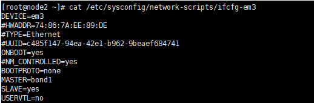

  - 第四块网卡配置

    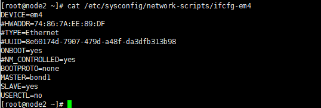

  - bond1的配置文件信息

    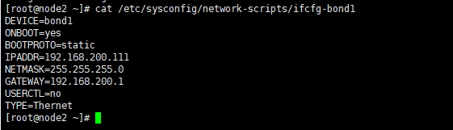

- 都配置完后，重启网卡

  ```shell
  service network restart
  ```

- 创建加载模块，让系统支持bonding

  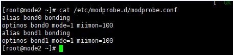

- 加载bond module

  

- 查看是否有bond0和bond1这两块网卡信息

  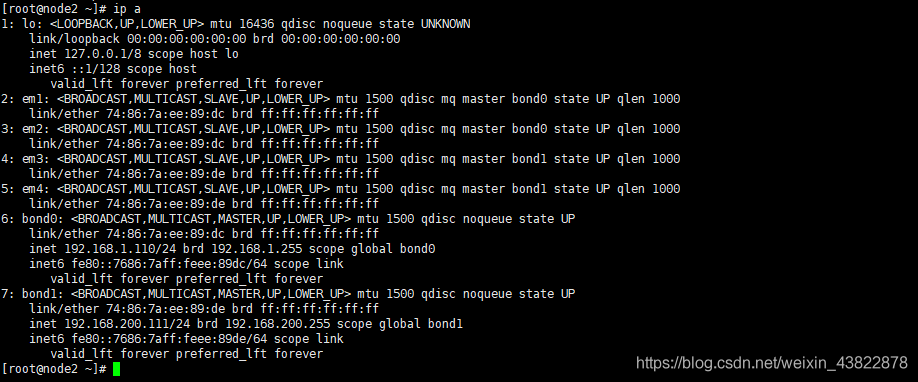

- 查看绑定结果

  - bond0网卡信息

    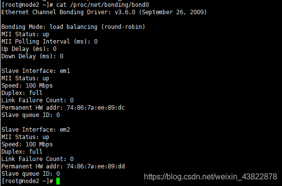

  - bond1网卡信息

    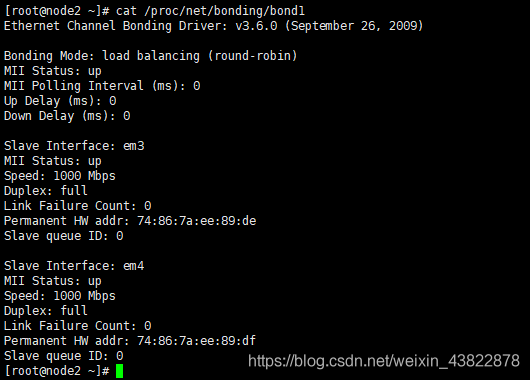


### `/etc/security/limits.conf` 配置文件说明

linux资源限制配置文件是/etc/security/limits.conf；限制用户进程的数量对于linux系统的稳定性非常重要。 limits.conf文件限制着用户可以使用的最大文件数，最大线程，最大内存等资源使用量。

```shell
* soft nofile 655350  #任何用户可以打开的最大的文件描述符数量，默认1024，这里的数值会限制tcp连接
* hard nofile 655350
* soft nproc  655350  #任何用户可以打开的最大进程数
* hard nproc  650000

@student hard nofile 65535
@student soft nofile 4096
@student hard nproc 50  #学生组中的任何人不能拥有超过50个进程，并且会在拥有30个进程时发出警告
@student soft nproc 30
```

> hard和soft两个值都代表什么意思呢？ soft是一个警告值，而hard则是一个真正意义的阀值，超过就会报错

- 所有用户创建的进程数

  ```shell
  $ ps h -Led -o user | sort | uniq -c | sort -n
        2 shtermuser
       11 zabbix
      206 elasticsearch
      490 root
  ```

- 系统最大打开文件描述符数

  查看

  ```shell
  $ cat /proc/sys/fs/file-max
  6553600
  ```

  设置

  ```shell
  $ vim /etc/sysctl.conf
  fs.file-max = 6553600
  ```

- 进程最大打开文件描述符数

  - 查看

    ulimit -n默认查看的是soft limit

  ```shell
  $ ulimit -n
  170000
  ```

  - 查看hard limit

  ```shell
  $ ulimit -Hn
  170000
  ```

  - 临时设置

    ```shell
    #通过ulimit -Sn设置最大打开文件描述符数的soft limit，注意soft limit必须小于hard limit
    $ ulimit -Sn 160000
    
    #同时设置soft limit和hard limit。对于非root用户只能设置比原来小的hard limit。
    $ ulimit -n 180000
    ```

  - 永久设置

    ```shell
    #root权限下，在/etc/security/limits.conf中添加如下两行，表示所有用户最大打开文件描述符数的soft limit为102400，hard limit为104800。重启生效
    * soft nofile 102400
    * hard nofile 104800
    ```

  - 注意：设置nofile的hard limit还有一点要注意的就是hard limit不能大于/proc/sys/fs/nr_open，假如hard limit大于nr_open，注销后将无法正常登录。

- 查看当前系统使用的打开文件描述符数

  ```shell
  $ cat /proc/sys/fs/file-nr
  5664        0        186405
  ```

  其中第一个数表示当前系统已分配使用的打开文件描述符数，第二个数为分配后已释放的（目前已不再使用），第三个数等于file-max。

- 知道了/etc/security/limits.conf中的参数含义之后，那么如何配置nofile，确定nofile的最大值呢。

  解答：使用ulimt -n命令进行测试，如果小于系统允许的最大值，设置成功，大于最大值，系统会报错提示。

  ```shell
  $ ulimit -n 1100000
  -bash: ulimit: open files: cannot modify limit: Operation not permitted
  $ ulimit -n 1048576
  $ ulimit -n 1048577
  -bash: ulimit: open files: cannot modify limit: Operation not permitted
  $ ulimit -n 1048575
  $ ulimit -n 1048576
  ```

- ulimit -a/n/H/S 都有什么含义

  ```shell
   ulimit -a   显示当前所有的资源限制
   ulimit -H    设置硬件资源限制
   ulimit -S    设置软件资源限制
   ulimit -n    设置进程最大打开文件描述符数
   ulimit -u  <程序数目> 　用户最多可开启的程序数目
  ```

- 总结

  >  a. 所有进程打开的文件描述符数不能超过/proc/sys/fs/file-max
  >
  > b. 单个进程打开的文件描述符数不能超过user limit中nofile的soft limit
  >
  > c. nofile的soft limit不能超过其hard limit
  >
  > d. nofile的hard limit不能超过/proc/sys/fs/nr_open

  

### top 命令

> Top命令类似于Windows系统的任务管理器工具。它对于所有正在运行的进行和系统负荷提供不断更新的概览信息，包括系统负载、CPU利用分布情况、内存使用、每个进程的内容使用情况等信息。

#### 1、Top 命令基本回显解析

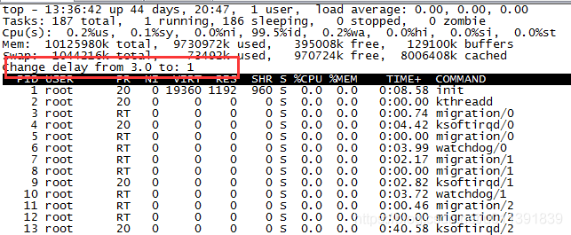

- 系统状态

  

  | 参数                           | 解析                                                         |
  | ------------------------------ | ------------------------------------------------------------ |
  | top - 17:25:29                 | 系统当前时间                                                 |
  | up 43 days,41 min              | 系统到目前为止已运行的时间                                   |
  | 1 user                         | 当前登录系统的用户数量                                       |
  | load average: 0.20, 0.05, 0.01 | 系统负载（任务队列的平均长度），3个数值分别为1分钟、5分钟、15分钟前到现在的平均值 |

  > top给出的系统运行时间，反应了当前系统存活多久，对于某些应用而言，系统需要保证7*24小时的高可用性，这个字段信息就能很好的衡量系统的高可用性。

- Task 进程状态信息

  

  显示的是进程状态信息的汇总，分别对应：**所有启动的进程数、正在运行的进程数、挂起的进程数、停止的进程数、僵尸进程数**。

  在linux操作系统中，一般有以下5种状态的进程信息：D：不可中断睡眠态（通常出现在IO阻塞）、R：运行态、S：睡眠态、T：已停止、z：僵尸态

- CPU

  

  | 参数    | 解析                                          | 重要性   |
  | ------- | --------------------------------------------- | -------- |
  | 0.2%us  | 用户空间占用CPU百分比                         | 重点关注 |
  | 0.1%sy  | 内核空间占用CPU百分比                         | 重点关注 |
  | 0.0%ni  | 用户进程空间内改变过优先级的进程占用CPU百分比 |          |
  | 99.6%id | 空闲CPU百分比                                 | 重点关注 |
  | 0.1%wa  | 等待输入输入的CPU百分比                       | 重点关注 |
  | 0.0%hi  | 硬中断占用CPU百分比                           | 重点关注 |
  | 0.0%si  | 软中断CPU百分比                               | 重点关注 |
  | 0.0%st  | 虚拟CPU等待实际CPU的时间的百分比。            |          |

  一般我们关注多的是us、sy、id、wa、hi、wi这个6个数值，在这里我们需要注意的指标如下：

  **CPU(s)：**表示当前CPU的平均值，默认top命令配置显示的是平均的CPU使用情况，如果按下键盘1可以显示各颗逻辑CPU的使用情况，如下图所示：

  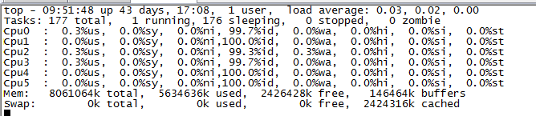

  - 统计空闲的CPU利用率我们直接统计%id的计数即可，当id持续过低的时候，表示系统迫切需要解决CPU资源问题。
  - 统计使用的是CPU需要用1-%id获取。或者us+sy+si.
  - wa：使用率过高的时候，我们需要考虑IO的性能是否有瓶颈，可以在使用iostat、sar等命令做进一步分析；
  - hi:使用率过高时，表示当前硬件中断占用很大的百分比。一般硬件中断我们可以分析文件/proc/interrupts、/proc/irq/pid/smp_affinity、服务irqbalance是否配置，以及CPU的频率设置，通过这些可以帮系统打散优化系统的硬件中断。
  - si：Linux kernel通过用一种软件的方法（可延迟函数）来模拟硬件的中断模式，通常叫做软中断。常见的软件中断一般都是和网络有关。从网卡到IP层的数据报文收发都是si处理的，长时间写日志也可能产生软件中断。
  - 当软中断出现瓶颈的时候，系统有个进行叫ksoftirqd，每个CPU都有自己对应的ksoftirqd/n（n为CPU的逻辑ID），每个ksoftirqd的内核线程都会去运行对应的ksoftirqd（函数）来处理自己的中断队列上的软件中断。所以，当网络出现阻塞的时候，软件中断程序ksoftirqd肯定会出现瓶颈。此时我们可以通过ps aux|grep ksoftirqd查看ksoftirqd的瓶颈。

  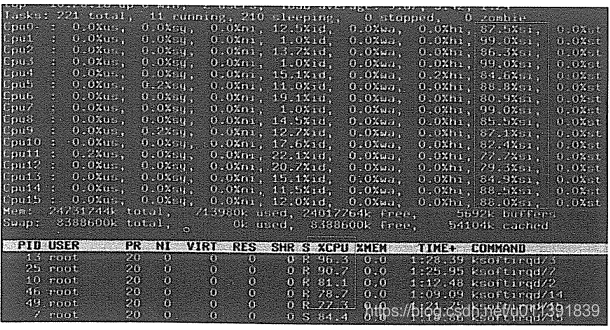

  Ni：优先级（priority）为操作系统用来决定CPU分类的参数，Linux使用（round-robin）的算法来做CPU排程，优先序越高，有可能获得的CPU时间就越多。但是我们可以通过nice命令以更改过的优先序来执行程序，如果未制定程序，则会打印出目前的排程优先序，内定的adjustment为10，范围为-20（最高优先序）到19（最低优先序）。

- Mem 内存信息（物理内存）

  

  物理内存总量、已经使用的物理内存、空闲物理内存、内核缓存内存量。

- Swap 交换内存（虚拟内存）

  

  交换区总量、已使用交互区总量、空闲交换区总量、缓冲的交换区总量。

  > 有以下结论可以帮助内存分析
  >
  > 1. buffer和cache的作用是所用I/O系统调用的时间，比如读写等。一般一个系统而言，如果cache的值很大，说明cache住的文件多。如果频繁访问文件都能被命中，很明显会比读取磁盘调用快，磁盘的IO必定会减小。
  >
  >    注意：cache的命中率很关键，如果频繁访问的文件不能被命中，对于cache而言是个比较的大的资源浪费，此时应考虑drop cache并提升对应的cache的命中率。
  >
  > 2. 从字段的意义上来说mem.free表示的是空闲内存总量，但是需要注意的是，虽然buffer/cache会占用一定的物理内存，但是当系统需要内存的时候，这些内存立即释放出来，也就是说buffer/cache可以看成可用内存。
  >
  >    

- 进程信息

  

  | 参数    | 解析                                                     |
  | ------- | -------------------------------------------------------- |
  | PID     | 进程ID                                                   |
  | USER    | 进程所有者                                               |
  | PR      | 优先级                                                   |
  | NI      | nice值，负值表示高优先级，正值表示低优先级               |
  | VIRT    | 进程使用的虚拟内存总量,单位kb,VIRT=SWAP+RES              |
  | RES     | 进程使用的、未被换出的物理内存大小，单位kb,RES=CODE+DATA |
  | SHR     | 共享内存大小，单位kb                                     |
  | %CPU    | 上传更新到现在的CPU时间占用百分比                        |
  | %MEM    | 进程使用的物理内存百分比                                 |
  | TIME+   | 进程使用的CPU时间总计，单位1/100秒                       |
  | COMMAND | 命令名/命令行                                            |

  > 注意如下：
  >
  > 1. 在top命令中，第六、七行显示的是所有进程相关的信息，它默认显示的是进程的信息，如果要显示线程级的信息，可以通过ps命令获取。
  > 2. 进程实际使用的内容可以看RES那一列的信息，VIRT表示进程使用的是虚拟内存数据，SHR表示共享内存的数据。
  > 3. TIME+表示是进程使用的CPU时间总计，而非进程的存活时间。且TIME+默认精确到1/100秒。由于TIME+显示的是CPU时间，所以可能存在TIME+大于程序运行时间，也可能小于程序运行时间，这两没有必然的关系，无安全取决于该程序所能分配到的CPU时间而定。
  > 4. %CPU标识进程所占CPU的百分比，通过这个可以得出CPU利用率；
  > 5. 默认情况下系统不会显示进程分布在哪几颗逻辑CPU上，如果想分析各颗CPU对应的应用程序，可以修改top的默认配置，添加字段Last used CPU 即可。


#### 2、Top 命令详解

- top 命令参数

  d 指定每两次屏幕信息刷新之间的时间间隔。当然用户可以使用s交互命令来改变之。 

  p 通过指定监控进程ID来仅仅监控某个进程的状态。 

  q 该选项将使top没有任何延迟的进行刷新。如果调用程序有超级用户权限，那么top将以尽可能高的优先级运行。

  S 指定累计模式 

  s 使top命令在安全模式中运行。这将去除交互命令所带来的潜在危险。 

  i 使top不显示任何闲置或者僵死进程。 

  c 显示整个命令行而不只是显示命令名 

- top 命令交互参数（在命令执行期间可以使用的一些交互命令）

  Ctrl+L 擦除并且重写屏幕。 

  h或者? 显示帮助画面，给出一些简短的命令总结说明。 

  k 终止一个进程。系统将提示用户输入需要终止的进程PID，以及需要发送给该进程什么样的信号。一般的终止进程可以使用15信号；如果不能正常结束那就使用信号9强制结束该进程。默认值是信号15。在安全模式中此命令被屏蔽。 

  i 忽略闲置和僵死进程。这是一个开关式命令。 

  q 退出程序。 

  r 重新安排一个进程的优先级别。系统提示用户输入需要改变的进程PID以及需要设置的进程优先级值。输入一个正值将使优先级降低，反之则可以使该进程拥有更高的优先权。默认值是10。 

  S 切换到累计模式。 

  s 改变两次刷新之间的延迟时间。系统将提示用户输入新的时间，单位为s。如果有小数，就换算成m s。输入0值则系统将不断刷新，默认值是5 s。需要注意的是如果设置太小的时间，很可能会引起不断刷新，从而根本来不及看清显示的情况，而且系统负载也会大大增加。 

  f 或者F 从当前显示中添加或者删除项目。 

  o 或者O 改变显示项目的顺序。 

  l 切换显示平均负载和启动时间信息。 

  m 切换显示内存信息，关闭或开启第一部分第四行 Mem 和 第五行 Swap 信息的表示。 

  t 切换显示进程和CPU状态信息，关闭或开启第一部分第二行 Tasks 和第三行 Cpus 信息的表示。 

  c 切换显示命令名称和完整命令行。 

  M 根据驻留内存大小进行排序。 

  P 根据CPU使用百分比大小进行排序。 

  T 根据时间/累计时间进行排序。 

  W 将当前设置写入~/.toprc文件中。这是写top配置文件的推荐方法。

  E 切换顶部内存显示单位，每次切换转换率为1000，切换的单位为 k,m,g,t,p

  e 切换进程显示部分的内存显示单位，每次切换转换率为1000，切换的单位为 k,m,g,t,p

  n 设置在进程列表所显示进程的数量

  

- 进程列表可展示的参数详解

  | 序号 | 列名  | 含义           |
  | ---- | ----- | -------------- |
  | a    | PID   | 进程id         |
  | b    | PPID  | 父进程id       |
  | c    | RUSER | Real user name |
  | d | UID | 进程所有者的用户id |
  | e | USER | 进程所有者的用户名 |
  | f | GROUP | 进程所有者的组名 |
  | g | TTY | 启动进程的终端名。不是从终端启动的进程则显示为 ? |
  | h | PR | 优先级 |
  | i | NI | nice值。负值表示高优先级，正值表示低优先级 |
  | j | P | 最后使用的CPU，仅在多CPU环境下有意义 |
  | k | %CPU | 上次更新到现在的CPU时间占用百分比 |
  | l | TIME | 进程使用的CPU时间总计，单位秒 |
  | m | TIME+ | 进程使用的CPU时间总计，单位1/100秒 |
  | n | %MEM | 进程使用的物理内存百分比 |
  | o | VIRT | 进程使用的虚拟内存总量，单位kb。VIRT=SWAP+RES |
  | p | SWAP | 进程使用的虚拟内存中，被换出的大小，单位kb。 |
  | q | RES | 进程使用的、未被换出的物理内存大小，单位kb。RES=CODE+DATA |
  | r | CODE | 可执行代码占用的物理内存大小，单位kb |
  | s | DATA | 可执行代码以外的部分(数据段+栈)占用的物理内存大小，单位kb |
  | t | SHR | 共享内存大小，单位kb |
  | u | nFLT | 页面错误次数 |
  | v | nDRT | 最后一次写入到现在，被修改过的页面数。 |
  | w | S | 进程状态(D=不可中断的睡眠状态,R=运行,S=睡眠,T=跟踪/停止,Z=僵尸进程) |
  | x | COMMAND | 命令名/命令行 |
  | y | WCHAN | 若该进程在睡眠，则显示睡眠中的系统函数名 |
  | z | Flags | 任务标志，参考 sched.h |


#### 3、top 命名常用操作示例

```shell
top //每隔5秒显式所有进程的资源占用情况
top -d 2 //每隔2秒显式所有进程的资源占用情况
top -c //每隔5秒显式进程的资源占用情况，并显示进程的命令行参数(默认只有进程名)
top -p 12345 -p 6789//每隔5秒显示pid是12345和pid是6789的两个进程的资源占用情况
top -d 2 -c -p 123456 //每隔2秒显示pid是12345的进程的资源使用情况，并显式该进程启动的命令行参数
```


#### 4、Top 命令进阶操作：自定义配置

默认的top命令配置并不能满足我们的日常需求时，我们可以自定义一些top配置，来更好的分析系统。用户输入top命令后，按下H键可以看到一应的top配置帮助页面：

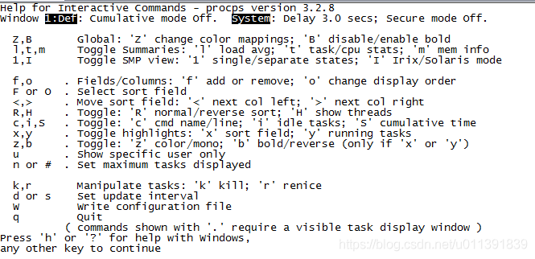

常用的top修改配置如下：修改刷新间隔时间，添加字段、删除字段、排序、保存等：

- **Top间隔刷新**：在top命令后，按下d键盘进入间隔刷新配置，输入间隔秒数即可。

  

- **添加进程字段显示列**：输入完top命令后，按下字母f,进入列配置页面

  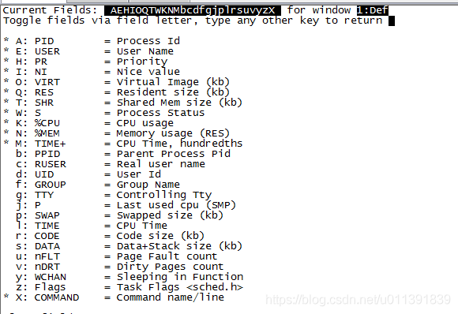

  选择前面对应的字母，如d,则会增加一列UID；变成大写字母表示显示，小写字母表示没有选择不显示：

  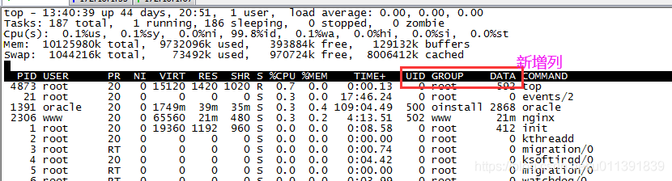

- **显示平均/各颗CPU的利用率信息**：进入top命令后，输入数字1；再次按下数字1后，又恢复原来的平均的CPU信息。

  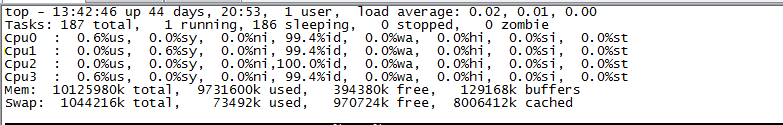

> 需要注意的是，上面几种技巧因为没有加W保存，所以当用户退出top交互界面后，下次登录又会重新加载，如果需要则输入W保存。


### yum 命令

#### yum 常用命令

```shell
yum常用命令
删除软件：yum remove AAA-x.x.x.rpm或者yum erase foo-x.x.x.rpm
升级软件：yum upgrade AAA或者yum update AAA
查询信息：yum info AAA
搜索软件（以包含foo字段为例）：yum search AAA
显示软件包依赖关系：yum deplist AAA
 
　　 -q 静默执行 
　　 -t 忽略错误
　　-R[分钟] 设置等待时间
　　-y 自动应答yes
　　--skip-broken 忽略依赖问题
　　--nogpgcheck 忽略GPG验证
 
　　check-update 检查可更新的包
　　clean all    清除全部[缓存]
　　clean packages 清除临时包文件（/var/cache/yum 下文件）
　　clean headers  清除rpm头文件
　　clean oldheaders 清除旧的rpm头文件
　　deplist 列出包的依赖
　　list 可安装和可更新的RPM包
　　list installed 已安装的包
　　list extras 已安装且不在资源库的包
　　info 可安装和可更新的RPM包 信息
　　info installed 已安装包的信息(-qa 参数相似)
　　install[RPM包] 安装包
　　localinstall 安装本地的 RPM包
　　update[RPM包] 更新包
　　upgrade 升级系统
　　search[关键词] 搜索包
　　provides[关键词] 搜索特定包文件名
　　reinstall[RPM包] 重新安装包
　　repolist 显示资源库的配置
　　resolvedep 指定依赖
　　remove[RPM包] 卸载包
    makecache  生成缓存
```


#### 修改 yum 源为国内镜像

```shell
centos7 修改yum源为阿里源
首先是到yum源设置文件夹里
1. 查看yum源信息:
    yum repolist
2. 安装base reop源
     cd /etc/yum.repos.d
3. 接着备份旧的配置文件
   sudo mv CentOS-Base.repo CentOS-Base.repo.bak
4. 下载阿里源的文件
  sudo wget -O /etc/yum.repos.d/epel.repo http÷://mirrors.aliyun.com/repo/Centos-7.repo
---------------------------红帽版本一样的安装------------------------------
# 安装epel repo源：
epel(RHEL 7) 红帽7
   wget -O /etc/yum.repos.d/epel.repo http://mirrors.aliyun.com/repo/epel-7.repo
epel(RHEL 6) 红帽6
    wget -O /etc/yum.repos.d/epel.repo http://mirrors.aliyun.com/repo/epel-6.repo
epel(RHEL 5) 红帽5
    wget -O /etc/yum.repos.d/epel.repo http://mirrors.aliyun.com/repo/epel-5.repo
------------------------------------------------------------------------------    
5.清理缓存
    yum clean all
6.重新生成缓存
    yum makecache
7. 再次查看yum源信息
   yum repolist
```


### Linux 定时任务

#### 原理与 crond 进程

在LINUX中，周期执行的任务一般由 cron 这个守护进程来处理 `[ps -ef|grep cron]`。cron 读取一个或多个配置文件，这些配置文件中包含了命令行及其调用时间。

cron的配置文件称为“crontab”，是“cron table”的简写。

1. cron在3个地方查找配置文件：

   1. /var/spool/cron/ 这个目录下存放的是每个用户包括root的crontab任务，每个任务以创建者的名字命名，比如tom建的crontab任务对应的文件就是/var/spool/cron/tom。
      一般一个用户最多只有一个crontab文件。
   2. /etc/crontab 这个文件负责安排由系统管理员制定的维护系统以及其他任务的crontab。
   3. /etc/cron.d/ 这个目录用来存放任何要执行的crontab文件或脚本。

2. 权限
   crontab权限问题到/var/adm/cron/下一看，文件cron.allow和cron.deny是否存在
   用法如下： 
   1、如果两个文件都不存在，则只有root用户才能使用crontab命令。 
   2、如果cron.allow存在但cron.deny不存在，则只有列在cron.allow文件里的用户才能使用crontab命令，如果root用户也不在里面，则root用户也不能使用crontab。 
   3、如果cron.allow不存在, cron.deny存在，则只有列在cron.deny文件里面的用户不能使用crontab命令，其它用户都能使用。 
   4、如果两个文件都存在，则列在cron.allow文件中而且没有列在cron.deny中的用户可以使用crontab，如果两个文件中都有同一个用户，
   以cron.allow文件里面是否有该用户为准，如果cron.allow中有该用户，则可以使用crontab命令。

3. cron服务
   cron是一个**linux**下 的定时执行工具，可以在无需人工干预的情况下运行作业。

   ```shell
   /sbin/service crond start  //启动服务
   /sbin/service crond stop   //关闭服务
   /sbin/service crond restart //重启服务
   /sbin/service crond reload  //重新载入配置
   /sbin/service crond status  //查看服务状态 
   ```

4. 每次编辑完某个用户的cron设置后，cron自动在/var/spool/cron下生成一个与此用户同名的文件，此用户的cron信息都记录在这　个文件中，这个文件是不可以直接编辑的，只可以用crontab -e　来编辑。cron启动后每过一份钟读一次这个文件，检查是否要执行里面的命令。因此此文件修改后不需要重新启动cron服务。

5. 查看crontab 执行的日志，可以在/var/log/cron* 查看，或者 0 3 * * * /root/mysqlbak.sh >/var/log/mysqlbak.log 2>&1 把日志定向出来查看。


#### crontab 命令

```shell
# 查看当前用户所有定时任务
crontab -l
# 编辑当前用户定时任务列表
crontab -e
# 删除当前用户下的定时任务
crontab -r
# 指定用户
crontab -u   // crontab -u user -r/-e/-l
```


#### crontab 定时配置方法解析

```shell
0    12   *   *   *   COMMAND
分   时   日   月  周  COMMAND
```

| 代表意义 | 分钟 | 小时 | 日期 | 月份 | 周   |
| -------- | ---- | ---- | ---- | ---- | ---- |
| 数字范围 | 0~59 | 0~23 | 1~31 | 1~12 | 0~7  |

常见辅助字符解析：

| 特殊字符 | 代表意义                                                     |
| -------- | ------------------------------------------------------------ |
| *(星号)  | 代表任何时刻都接受的意思。举例来说，范例一内那个日、月、周都是*，就代表着不论何月、何日的礼拜几的12：00都执行后续命令的意思。 |
| ,(逗号)  | 代表分隔时段的意思。举例来说，如果要执行的工作是3：00与6：00时，就会是：0 3,6 * * * command，时间还是有五列，不过第二列是 3,6 ，代表3与6都适用 |
| -(减号)  | 代表一段时间范围内，举例来说，8点到12点之间的每小时的20分都进行一项工作：20 8-12 * * * command，仔细看到第二列变成8-12.代表 8,9,10,11,12 都适用的意思 |
| /n(斜线) | 那个n代表数字，即是每隔n单位间隔的意思，例如每五分钟进行一次，则：*/5 * * * * command，用*与/5来搭配，也可以写成0-59/5，意思相同 |


#### crontab 高级特性

- 用户所建立的Crontab文件存于 /var/spool/cron 中，其文件名与用户名一致

- Linux 定时任务日志解析

  -  /var/log/cron 记录了是否执行了某些计划的脚本

  - 具体执行是否正确以及脚本执行过程中的一些信息则linux会每次都发邮件到该用户下，如 root 用户的定时任务执行日志会存放到 /var/spool/mail/root 文件中，有crontab执行日志的记录，用tail -f /var/spool/mail/root 即可查看最近的 crontab 执行情况
  
- /etc/crontab 文件

  用 crontab 配置是针对某个用户的，而编辑 /etc/crontab 是针对系统的任务。此文件的格式是：

  ```shell
  SHELL=/bin/bash  
  PATH=/sbin:/bin:/usr/sbin:/usr/bin 
  MAILTO=root //如果出现错误，或者有数据输出，数据作为邮件发给这个帐号  
  HOME=/ //使用者运行的路径,这里是根目录
  # run-parts
  01   *   *   *   *     root run-parts /etc/cron.hourly         //每小时执行/etc/cron.hourly内的脚本  
  02   4   *   *   *     root run-parts /etc/cron.daily           //每天执行/etc/cron.daily内的脚本  
  22   4   *   *   0     root run-parts /etc/cron.weekly       　　//每星期执行 /etc/cron.weekly内的脚本  
  42   4   1   *   *     root run-parts /etc/cron.monthly     　　//每月去执行/etc/cron.monthly内的脚本
  ```

  需要注意”run-parts”这个参数，如果去掉这个参数的话，后面就可以写要运行的某个脚本名，而不是文件夹名了
  也可以通过直接编辑 /etc/crontab 文件，添加相应任务(不建议)

  ```shell
  11 2 21 10 * rm -rf /mnt/fb  
  ```


### Linux 查询网卡 UUID

某个网卡的UUID改错了或者删除了，重新配置的时候需要UUID怎么办

在Linux或CentOS中，可以通过如下命令获取网卡的uuid信息：

```shell
[root@ligle2 ~]# uuidgen eth1
07d07031-eb0f-4691-8606-befb46645433
```

获取到eth1网卡的uuid，即可完成对ifcfg-eth1配置文件的修改，最后通过service network restart命令重启网卡，OK。


### df -h 执行卡死与 strace 命令

1、首先使用strace ls命令跟踪查看执行到哪一步卡死

```shell
strace ls /…
lgetxattr(“/MegaSAS.log”, “system.posix_acl_default”, 0x0, 0) = -1 ENODATA (No data available) lstat(“/net”, {st_mode=S_IFDIR|0755, st_size=0, …}) = 0
lgetxattr(“/net”, “security.selinux”, 0x258f850, 255) = -1 EOPNOTSUPP (Operation not supported) lstat(“/net”, {st_mode=S_IFDIR|0755, st_size=0, …}) = 0
lgetxattr(“/net”, “system.posix_acl_access”, 0x0, 0) = -1 EOPNOTSUPP (Operation not supported) lstat(“/chaichuan_test”, {st_mode=S_IFDIR|0755, st_size=4096, …}) = 0
lgetxattr(“/chaichuan_test”, “security.selinux”, 0x258f850, 255) = -1 ENODATA (No data available) lstat(“/chaichuan_test”, {st_mode=S_IFDIR|0755, st_size=4096, …}) = 0
lgetxattr(“/chaichuan_test”, “system.posix_acl_access”, 0x0, 0) = -1 ENODATA (No data available)
lgetxattr(“/chaichuan_test”, “system.posix_acl_default”, 0x0, 0) = -1 ENODATA (No data available) lstat(“/mnt”, {st_mode=S_IFDIR|0775, st_size=4096, …}) = 0
lgetxattr(“/mnt”,
```

可以看到,命令执行到 /mnt这个目录时,停止不动了

也可以使用cat /proc/mounts 查看当前mount状态,发现确实有对mnt目录的记录

2、fuser查看问题目录进程

问题定位/mnt目录,使用fuser 查看此目录占用进程

fuser -m /mnt 无法获取 /proc/4110/fd/255 的文件状态: 失效文件句柄

无法获取 /proc/9492/fd/255 的文件状态: 失效文件句柄

无法获取 /proc/29965/fd/255 的文件状态: 失效文件句柄

3、kill命令解决

找到进程号直接kill

> strace命令是一个集诊断、调试、统计与一体的工具，我们可以使用strace对应用的系统调用和信号传递的跟踪结果来对应用进行分析，以达到解决问题或者是了解应用工作过程的目的, 具体使用可以查看帮助。


### SFTP

> sFTP（安全文件传输程序）是一种安全的交互式文件传输程序，其工作方式与 FTP（文件传输协议）类似。 然而，sFTP 比 FTP 更安全；它通过加密 SSH 传输处理所有操作。
>
> 它可以配置使用几个有用的 SSH 功能，如公钥认证和压缩。 它连接并登录到指定的远程机器，然后切换到交互式命令模式，在该模式下用户可以执行各种命令。

#### 常用操作

- SFTP 登录使用类似于 SSH 的密码方式，同时，为了安全并简化连接操作，也可以创建和使用 SSH 无密码登录

- 为了防止用户访问远程主机上的整个文件系统，出于安全原因，你可以使用 chroot Jail将 sFTP 用户限制到其主目录中。

- 常用命令

  ```shell
  # 登录命令
  sftp user@ip
  # 基本文件操作
  sftp> ls            #list directory 
  sftp> pwd           #print working directory on remote host 
  sftp> lpwd          #print working directory on local host 
  sftp> mkdir uploads     #create a new directory
  # 上传文件夹，需要注意：上传时，需提前在远程主机上新建同名文件夹，否则上传会报错
  sftp> put -r fold_name 
  # 要保留修改时间、访问时间以及被传输的文件的模式，需添加 -p 参数
  sftp> put -pr fold_name
  # 下载文件夹
  sftp> get -r fold_name
  # 退出 sftp
  sftp> bye  或  sftp> exit
  ```


#### FTP 默认 21 和 20 端口号的区别

> ftp端口号20和21的区别是：一个是数据端口，一个是控制端口，控制端口一般为21，而数据端口不一定是20，这和FTP的应用模式有关，如果是主动模式，应该为20，如果为被动模式，由服务器端和客户端协商而定。


#### FTP Port模式和FTP Passive模式(主动与被动模式)

> FTP是仅基于TCP的服务，不支持UDP。 与众不同的是FTP使用2个端口，一个数 据端口和一个命令端口（也可叫做控制端口）。通常来说这两个端口是21（命令端 口）和20（数据端口）。但FTP工作方式的不同，数据端口并不总是20。这就是主 动与被动FTP的最大不同之处。

- **FTP主动模式工作流程**

  主动方式的FTP是这样的：

  客户端从一个任意的非特权端口N（N>1024）连接到FTP服务器的命令端口，也就是21端口。然后客户端开始 监听端口N+1，并发送FTP命令“port N+1”到FTP服务器。接着服务器会从它自己的数据端口（20）连接到客户端指定的数据端口（N+1）。

  针对FTP服务器前面的防火墙来说，必须允许以下通讯才能支持主动方式FTP：
  1. 任何大于1024的端口到FTP服务器的21端口。（客户端初始化的连接）
  2. FTP服务器的21端口到大于1024的端口。 （服务器响应客户端的控制端口）
  3. FTP服务器的20端口到大于1024的端口。（服务器端初始化数据连接到客户端的数据端口）
  4. 大于1024端口到FTP服务器的20端口（客户端发送ACK响应到服务器的数据端口）

  - **简明概括：**
    PORT（主动）方式的连接过程是：客户端向服务器的FTP端口（默认是21）发送连接请求，服务器接受连接，建立一条命令链路。当需要传送数据时，客户端在命令链路上用PORT命令告诉服务器：“我打开了XXXX端口，你过来连接我”。于是服务器从20端口向客户端的XXXX端口发送连接请求，建立一条数据链路来传送数据。

  - **开启主动模式：**
    pasv_enable=no
    若设置为YES，则使用PASV工作模式；若设置为NO，则使用PORT模式。默认值为YES，即使用PASV工作模式。

  - **主动模式下：**
    SecureFX工具去连接ftp，客户没有允许开放端口，服务器没法与客户端相连接，关闭客户端防火墙

- **FTP被动模式**

  为了解决服务器发起到客户的连接的问题，人们开发了一种不同的FTP连接方式。这就是所谓的被动方式，或者叫做PASV，当客户端通知服务器它处于被动模式时才启用。

  在被动方式FTP中，命令连接和数据连接都由客户端发起，这样就可以解决从服务器到客户端的数据端口的入方向连接被防火墙过滤掉的问题。

  当开启一个 FTP连接时，客户端打开两个任意的非特权本地端口（N > 1024和N+1）。第一个端口连接服务器的21端口，但与主动方式的FTP不同，客户端不会提交PORT命令并允许服务器来回连它的数据端口，而是提交 PASV命令。这样做的结果是服务器会开启一个任意的非特权端口（P > 1024），并发送PORT P命令给客户端。然后客户端发起从本地端口N+1到服务器的端口P的连接用来传送数据。

  对于服务器端的防火墙来说，必须允许下面的通讯才能支持被动方式的FTP:
  1. 从任何大于1024的端口到服务器的21端口 （客户端初始化的连接）
  2. 服务器的21端口到任何大于1024的端口 （服务器响应到客户端的控制端口的连接）
  3. 从任何大于1024端口到服务器的大于1024端口 （客户端初始化数据连接到服务器指定的任意端口）
  4. 服务器的大于1024端口到远程的大于1024的端口（服务器发送ACK响应和数据到客户端的数据端口）

  - **简明概括：**
    PASV（被动）方式的连接过程是：客户端向服务器的FTP端口（默认是21）发送连接请求，服务器接受连接，建立一条命令链路。当需要传送数据时，服务器在命令链路上用PASV命令告诉客户端：“我打开了XXXX端口，你过来连接我”。于是客户端向服务器的XXXX端口发送连接请求，建立一条数据链路来传送数据。

  - **开启被动模式**

    ```shell
    默认是开启的，但是要指定一个端口范围，打开vsftpd.conf文件，在后面加上
    pasv_enable=yes
    若设置为YES，则使用PASV工作模式；若设置为NO，则使用PORT模式。默认值为YES，即使用PASV工作模式。
    pasv_min_port=30000
    在PASV工作模式下，数据连接可以使用的端口范围的最大端口，0 表示任意端口。默认值为0。
    pasv_max_port=30999
    在PASV工作模式下，数据连接可以使用的端口范围的最小端口，0 表示任意端口。默认值为0。
    ```

  表示端口范围为30000~30999，这个可以随意改。改完重启一下vsftpd由于指定这段端口范围，iptables也要相应的开启这个范围，所以像上面那样打开iptables文件。

  也是在21上下面另起一行，更那行差不多，只是把21 改为30000:30999,然后:wq保存，重启下iptables。这样就搞定了。

- **主动与被动FTP优缺点：**

  主动FTP对FTP服务器的管理有利，但对客户端的管理不利。因为FTP服务器企图与客户端的高位随机端口建立连接，而这个端口很有可能被客户端的防火墙阻塞掉。

  被动FTP对FTP客户端的管理有利，但对服务器端的管理不利。因为客户端要与服务器端建立两个连接，其中一个连到一个高位随机端
  口，而这 个端口很有可能被服务器端的防火墙阻塞掉。

  幸运的是，有折衷的办法。既然FTP服务器的管理员需要他们的服务器有最多的客户连接，那么必须得支持被动FTP。我们可以通过为FTP服务器指定一个有限的端口范围来减小服务器高位端口的暴露。这样，不在这个范围的任何端口会被服务器的防火墙阻塞。虽然这没有消除所有针对服务器的危险，但它大大减少了危险。

  

  - **简而言之：**
    主动模式（PORT）和被动模式（PASV）。主动模式是从服务器端向客户端发起连接；被动模式是客户端向服务器端发起连接。两者的共同点是都使
    用21端口进行用户验证及管理，差别在于传送数据的方式不同，PORT模式的FTP服务器数据端口固定在20，而PASV模式则在1025-65535之间随机。

  - **常见的FTP客户端软件的PASV方式的关闭方法**
    大部分FTP客户端默认使用PASV方式。IE默认使用PORT方式。 在大部分FTP客户端的设置里，常见到的字眼都是“PASV”或“被动模式”，
    极少见到“PORT”或“主动模式”等字眼。因为FTP的登录方式只有两种：PORT和PASV，取消PASV方式，就意味着使用PORT方式。
    （1）IE：工具 -> Internet选项 -> 高级 -> “使用被动FTP”（需要IE6.0以上才支持）。
    （2）CuteFTP：Edit -> Setting -> Connection -> Firewall -> “PASV Mode” 或File -> Site Manager，在左边选中站
    点 -> Edit -> “Use PASV mode” 。
    （3）FlashGet：工具 -> 选项 -> 代理服务器 -> 直接连接 -> 编辑 -> “PASV模式”。
    （4）FlashFXP：选项 -> 参数选择 -> 代理/防火墙/标识 -> “使用被动模式” 或 站点管理 -> 对应站点 -> 选项 -> 
    “使用被动模式”或快速连接 -> 切换 -> “使用被动模式”。

- **主动模式配置实操**

  ```shell
  主动模式
  Port_enable=YES               开启主动模式
  Connect_from_port_20=YES      当主动模式开启的时候 是否启用默认的20端口监听
  Ftp_date_port=%portnumber%    上一选项使用NO参数是 指定数据传输端口
  ```

- **被动模式配置实操**

  ```shell
  被动模式
  PASV_enable=YES   开启被动模式
  PASV_min_port=%number% 被动模式最低端口
  PASV_max_port=%number% 被动模式最高端口
  iptables中开放这段端口
  service iptables start 打开防火墙
  iptables -I INPUT  -p tcp  --dport 10020:10040  -j ACCEPT
  iptables -A INPUT -p tcp -m tcp --dport 21 -j ACCEPT
  
  在被动模式，服务器做了NAT，例如云主机，这时候我们用特定的IP访问机器，其实还转了一层。FTP客户端访问机器可能会没响应。具体情况为登录成功，但是list目录和文件的时候卡住。
  这时候我们用lsof -i:21
  vsftpd   22411   nobody    0u  IPv4  68905      0t0  TCP 10.140.41.65:ftp->10.10.10.98:43380 (ESTABLISHED)
  vsftpd   22411   nobody    1u  IPv4  68905      0t0  TCP 10.140.41.65:ftp->10.10.10.98:43380 (ESTABLISHED)
  这时候可以看到机器的真正IP。
  我们需要设置
  pasv_address=本机ip【就是我们能访问的外网IP】
  pasv_addr_resolve=yes
  这样ftp客户端就可以解析IP，访问成功
  ```

- **总结**

  1. 被动模式

     第二次请求过程中，客户端跟服务端建立数据通道； 

     服务端被动将数据响应给客户端。

     第二次请求数据传输，会随机生成一个服务端口。被防火墙禁用。 

  2. 主动模式

     服务端主动向客户端发送数据，会被客户端的防火墙禁掉。 

     多数客户端不支持主动模式，不安全。


#### CentOS7 vsftpd 服务配置解析

- 安装 vsftpd

  ```shell
  yum install -y vsftpd
  ```

- /etc/vsftpd/vsftpd.conf 配置文件解析

  ```shell
  不允许匿名访问
  anonymous_enable=NO
  
  本地用户登录ftp后的根目录
  local_root=/var/ftp
  
  本地ftp用户权限
  file_open_mode=0755
  
  解决新版本vsftpd本地用户主目录如果有写权限时，无法登录的问题
  allow_writeable_chroot=YES
  
  登录用户是否有写入的权限
  write_enable=YES
  
  锁定登录用户不能访问主目录的上级目录
  chroot_local_user=YES
  
  ftp数据传输使用的接口
  ftp_data_port=20
  
  启用被动传输模式
  pasv_enable=YES
  
  被动模式传输时开始的端口号
  pasv_min_port=40000
  
  被动模式传输时结束的端口号
  pasv_max_port=40100
  ```

- 创建一个ftp本地账户

  useradd ftpuser -s /sbin/nologin 添加账户

  passwd ftpuser 设置密码

- 把根目录的权限设置为此用户可以写入删除

  chmod o+w+r /var/ftp/

- 在防火墙中添加被动传输的端口

  ```shell
  firewall-cmd --zone=public --add-port=20-21/tcp --permanent
  firewall-cmd --zone=public --add-port=40000-40100/tcp --permanent
  firewall-cmd --reload
  ```

- 查看selinux配置是否正常（允许用户登录）或关闭 selinux

  ```
  sestatus -b | grep ftp
  如果全部都是off，则根据需求进行打开，比如：
  （setsebool -P ftpd_full_access on systemctl restart vsftpd #重启vsftpd）
  ```

- 把服务设置成开机启动 

  ```shell
  systemctl enable sshd.service
  ```


#### vsftpd 开启 SSL/TLS 证书加密

> 基于 Ubuntu 系统

生成证书

```shell
openssl req -x509 -nodes -keyout /etc/ssl/private/vsftpd.key -out /etc/ssl/private/vsftpd.pem -days 365 -newkey rsa:2048
```

会提示你配置相关信息，提供参考

```shell
Country Name (2 letter code) [XX]:IN
State or Province Name (full name) []:Lower Parel
Locality Name (eg, city) [Default City]:Mumbai
Organization Name (eg, company) [Default Company Ltd]: mi-di.cn
Organizational Unit Name (eg, section) []:midi
Common Name (eg, your name or your server's hostname) []:midi
Email Address []:1076735024@qq.com
```

接下来配置防火墙，放通TLS连接证书的通信端口（下面命令以 Ubuntu 为例，其他发行版本按情况修改命令）

```shell
sudo ufw allow 990/tcp
```

打开vsftpd配置文件

```shell
vi /etc/vsftpd.conf
```

进行下面的配置

```shell
rsa_cert_file=/etc/ssl/private/vsftpd.pem 
rsa_private_key_file=/etc/ssl/private/vsftpd.key 

ssl_enable=YES 
ssl_tlsv1=YES 
ssl_sslv2=NO 
ssl_sslv3=NO

allow_anon_ssl=NO 
force_local_data_ssl=YES 
force_local_logins_ssl=YES 

require_ssl_reuse=NO 
ssl_ciphers=HIGH  
debug_ssl=YES 
```

开启了DEBUG，其中出了什么问题可以去/var/log/vsftpd.log下进行查看

重启服务

```shell
systemctl restart vsftpd 
```

记得使用支持SSL/TLS加密的FTP软件哦，有一些是不支持的，所以连不上该服务器，推荐使用FileZilla


### Linux 常用服务安装管理

#### CentOS 7.5 环境开启 Samba 服务

> 环境说明：
>
> 两台 CentOS 7.5 的服务器节点，需要将一台服务器的目录共享给另外一台。
>
> 挂载端：即需要被共享的目录所在的节点，也就是需要开启 Smb 服务的节点，假设 IP：172.168.1.100，需要共享的目录为：/home/aaa/output，该目录用户属组为：aaa:users
>
> 被挂载端：即需要执行挂载命令的节点。假设IP：172.168.1.101，被挂载的目录为：/home/bbb/input，该目录的用户属组为：bbb:users
>
> 难点：两个节点的共享及被共享目录均非 root 用户，且不允许讲相关共享目录权限修改为 root，这就要求对 Samba 挂载的权限有足够的了解，否则即使挂载成功，也很可能出现无权限读写的问题

##### 一、挂载端操作【被挂载端的 root 用户下执行】

修改 Samba 服务配置

```shell
vim /etc/samba/smb.conf
======== 确认如下内容 =========
[global] 配置组的：security 配置项，值为：user，如果不是，请修改

======== 添加如下内容 =========
[share]    
        comment = All users
        path = /home/aaa/output
        read only = no
        inherit acls = Yes
        veto files = /aquota.user/groups/shares/
======== 部分配置说明 =========
[share]：共享配置别名，可根据需要修改，该别名会在执行 mount 命令时用到
path：要共享的目录路径，请填写绝对路径
read only：是否只读，配置为 no，表示可读可写
```

重启 Samba 服务

```shell
systemctl restart smb.service
```

确认服务已运行

```shell
systemctl status smb.service
```

确认共享目录读取正常

```shell
testparm
======== 如果有返回如下内容，即表示读取正常 ========
Processing section "[share]"
Loaded services file OK.
```

将共享目录的所属用户，添加为 Samba 用户（如果有多个不同用户属组的目录需要共享，则请添加多个 Samba 用户）

```shell
smbpasswd -a aaa
# 根据提示，输入两遍密码即可，这个密码可以与操作系统的用户密码相同，也可以不同，建议设置相同的密码
======== 如果最后返回如下内容，即表示添加成功 ========
Added user aaa.
```


##### 二、被挂载端操作【在挂载端 root 用户下执行】

> 首先必须确保被挂载端节点能正常通过网络访问挂载端节点

查看 `bbb` 用户的 `uid` 及 `gid`

```shell
id bbb
========= 会返回如下内容，我们主要取 uid 和 gid 两项 ========
uid=1013(bbb) gid=100(users) groups=100(users)
```

执行命令，进行挂载

```shell
mount -t cifs //172.168.1.100/share /home/bbb/input/ -orw,uid=1013,gid=100,username=aaa,password=aaa

========= 命令参数解析 ========
mount -t cifs //[remote_ip]/[samba_share_name] [local_path] -orw,uid=[local_user_id],gid=[local_group_id],username=[remote_username],password=[remote_user_password]
[remote_ip]：远端节点 IP，即挂载端节点的 IP，我们这里是：172.168.1.100
[samba_share_name]：samba 共享目录别名，即我们在第一节，修改/etc/samba/smb.conf时，添加的那个别名，我们这里是：share
[local_path]：本地目录路径，即被挂载的目录路径，我们这里是：/home/bbb/input/
-orw：表示给予读写权限
[local_user_id]：本地用户的 uid，即我们前一步查询的用户 uid，我们这里是：1013
[local_group_id]：本地用户的 gid，即我们前一步查询的用户 gid，我们这里是：100
[remote_username]：远端共享目录用户名，即我们在第一节最后，使用 smbpasswd 命令添加的用户名
[remote_user_password]：远端共享目录用户密码，即我们在第一节最后，使用 smbpasswd 命令设置的用户密码
```

检查挂载是否成功

```shell
df -h
```


##### 三、检查用户权限是否有问题

分别登录挂载端的 `aaa` 用户，以及被挂载端的 `bbb` 用户，在挂载的目录下，执行文件/文件夹的增删改等操作，确认是否可以正常执行，如果可以正常执行，即表示权限没有问题


#### CentOS 7.5 下安装 Python 3

> Python 版本：3.10.0
>
> 环境介绍：操作系统：CentOS 7.5，已存在 Python2.7 环境，要求 2.7 与 3.10 共存

##### 上传版本包

获取 `Python-3.10.0.tgz` 、`openssl-1.1.1k.tar.gz` 安装包，并上传到 `/home/package` 用户下解压

```shell
tar zxvf Python-3.10.0.tgz
tar zxvf openssl-1.1.1k.tar.gz
```


##### 安装依赖环境

```shell
yum install -y openssl-devel bzip2-devel expat-devel gdbm-devel readline-devel zlib-devel libffi-devel
```


##### 安装 OpenSSL 依赖环境

Python 3.10 需要 1.1.1 及以上版本的 OpenSSL 版本，默认 CentOS 7.5 的 OpenSSL 版本为 1.0.1，需要手动安装升级。如果不确定自己环境的 OpenSSL 版本，可以执行命令查询

```shell
openssl version
```

编译安装

```shell
cd openssl-1.1.1k/
./config --prefix=/usr/local/openssl
make
make install
```

替换默认 openssl 环境

```shell
mv /usr/bin/openssl /usr/bin/openssl_bak
mv /usr/include/openssl/ /usr/include/openssl_bak
ln -s /usr/local/openssl/include/openssl/ /usr/include/openssl
ln -s /usr/local/openssl/lib/libssl.so.1.1 /usr/local/lib64/libssl.so
ln -s /usr/local/openssl/bin/openssl /usr/bin/openssl
echo "/usr/local/openssl/lib" >> /etc/ld.so.conf
ldconfig -v
```

最后验证 OpenSSL 版本

```shell
openssl version
```


##### 安装 Python

```
cd Python-3.10.0
./configure --prefix=/usr/local/ --with-openssl=/usr/local/openssl
make
make install
```

验证版本

```shell
python3 --version
whereis python3
```

> 由于需要 python2 和 3 共存，因此不需要对 python 命令的默认软链接进行修改。


### 记一次 CentOS 7 系统盘分区调整

有一台服务器因为安装人员的失误，导致 `root`根目录只分配了 50G，而`/home` 目录分配了 10T+，这明显是非常不合理的，因此，需要把 `home` 的容量抠出来，给 `root` 使用

```
lvremove /dev/mapper/centos-home 
lvextend -L +1024G /dev/mapper/centos-root 
lvcreate -L 1024G -n home centos
mkfs.xfs /dev/mapper/centos-home 
xfs_growfs /dev/mapper/centos-root 
vim /etc/fstab
mount /dev/mapper/centos-home 
df -h
```


### 两台服务器之间偶现网络连接异常的问题排查记录

> 均为标准服务器，均使用 CentOS7.5


#### 背景

某项目在执行机房搬迁时，更换了 IP，但在启动上层业务时，频繁报 `拒绝连接` 的错误，但又不是每次都报，有时可以正常运行。


#### 排查过程

1. 在初步排查时，发现上层业务报拒绝连接时，ssh 也无法正常连接，报`connect refused`，但可以 ping 通。

2. 深入排查发现这种情况仅限于服务器节点 A，当时有四个节点，A | B | C | D，BCD直接可以互相通信，没有任何问题，但诡异在，A和B之间无法连接，但A和CD之间可以正常访问。

   此时，就可以确定一些问题结果，缩小问题范围：

   - A 节点的 ssh 服务没有问题，否则不会是这种偶现，且不全面的无法连接，但为了确保，还是检查了相关内容文件，没有发现问题

     ```
     cat /etc/ssh/ssh_config
     systemctl status ssh
     ```

     

   - A 节点的 IP 和 hosts 配置没有问题，但也检查了这两部分

     ```shell
     ifconfig
     cat /etc/sysconfig/network-scripts/ifcfg-xxxxxxx
     cat /etc/hosts
     ```

     

   - 物理连接，即网线网口这些也不太可能，虽然网线松动可能会导致偶现的连接问题，但同一时间所有节点的连接应该是都连接不上，事实是不仅时间上偶现，空间上也偶现

     

   - 机房网络配置问题，比如防火墙，信任清单等，正常情况下，这类配置也应该是全阻断的，不会出现偶现的情况，但就以前的经验，确实会存在一些奇葩的安全防护产品，会出现这种问题

     

3. 为了进一步缩小问题原因，决定抓包，在 A B 服务器之间抓包

   ```shell
   # 在 A、B 服务器上起抓包命令
   tcpdump -i 网卡名 -w A.pcap
   tcpdump -i 网卡名 -w B.pcap
   
   # 然后 A ssh B，再 B ssh A
   
   # 最后停掉 A、B 上的抓包命令，获取两个抓包文件，通过 wireshark 分析
   ```

   

4. 通过分析抓包结果，发现 B 在 ssh A 时，B发送的 mac 地址并非 A 的网卡 mac 地址，这时基本确定了问题原因是 IP 冲突

   ```shell
   # 查看本机 mac 的命令
   ifconfig
   ```

   

5. 接着，查看各节点的 arp 表，确认 A 节点的 IP Mac 对应是否正确

   ```shell
   # 查看本机所有 arp 表信息
   arp -a
   ```

   发现在 B 节点上，A 节点的 arp 信息确实不对，此时，确认了问题原因系 IP 冲突

   

6. 于是，通过在 B 节点上，绑定 A 节点的 arp 信息，来临时解决该问题

   ```shell
   # 方法一
       # 新增 IP Mac 对应关系文件
       vim /etc/ip-mac
       ===== 添加如下内容 =====
       1.1.1.1 aa:aa:aa:aa:aa
       # 激活这个文件
       arp -f /etc/ip-mac
       
   # 方法二
   	arp -s 1.1.1.1 aa:aa:aa:aa:aa
   	
   # 手动绑定的 arp 信息，在服务器重启后，就会丢失，因此，如果无法解决 IP 冲突的问题，必须要手动绑定 arp，则可以通过以下命令添加到开机自启动
   	# 方法一对应的操作
   	echo 'arp -f /etc/ip-mac' /etc/rc.local
   	# 方法二对应的操作
   	echo 'arp -s 1.1.1.1 aa:aa:aa:aa:aa' /etc/rc.local
   ```

   > arp 相关拓展：http://blog.sina.com.cn/s/blog_809ff62a0102wzau.html   |   https://blog.csdn.net/weixin_39620984/article/details/116615225
   >
   > arp 的注意事项：如果因 IP 冲突而需要添加 arp，则建议将此方法作为一个临时解决方法，正式的解决方法是排除掉重复的 IP，手动添加 arp 会导致该目的节点的 arp 信息不再会自动学习，一旦目的节点的网卡更换，更新了 mac，则会因为 arp 无法自动更新，导致连接再次异常


#### 总结

实际上，整个过程中，抓包和查看 arp 最终实锤了 IP 冲突的问题。

但仅就问题现象上，也可以基本推断出 IP 冲突的可能性：**时间偶现和空间偶现，即同一时间不同节点出现部分节点连接正常，部分连接异常；同一对节点，有时连得上，有时连不上**，以后出现这种现象，大概率是 IP 冲突，可以优先使用 arp 命令进行实锤或排除。

但也不排除有其他可能性，比如上文说到的“奇怪的安全策略”。


### Windows 与 Linux 平台配置端口转发

通常服务器会有许多块网卡，因此也可能会连接到不同的网络，在隔离的网络中，某些服务可能会需要进行通信，此时服务器经过配置就可以承担起了转发数据包的功能。

#### Windows下实现端口映射

1. 查询端口映射情况

   ```shell
   netsh interface portproxy show v4tov4
   ```

2. 查询某一个IP的所有端口映射情况

   ```shell
   netsh interface portproxy show v4tov4 | find "[IP]"
   例：netsh interface portproxy show v4tov4 | find "192.168.1.1"
   ```

3. 增加一个端口映射

   ```shell
   netsh interface portproxy add v4tov4 listenaddress=[外网IP] listenport=[外网端口] connectaddress=[内网IP] connectport=[内网端口]
   例：netsh interface portproxy add v4tov4 listenaddress=2.2.2.2 listenport=8080 connectaddress=192.168.1.50 connectport=80
   ```

4. 删除一个端口映射

   ```shell
   netsh interface portproxy delete v4tov4 listenaddress=[外网IP] listenport=[外网端口]
   例：netsh interface portproxy delete v4tov4 listenaddress=2.2.2.2 listenport=8080
   ```

   

#### Linux下端口映射

1. 允许数据包转发

   ```shell
   echo 1 >/proc/sys/net/ipv4/ip_forwardiptables -t nat -A POSTROUTING -j MASQUERADEiptables -A FORWARD -i [内网网卡名称] -j ACCEPTiptables -t nat -A POSTROUTING -s [内网网段] -o [外网网卡名称] -j MASQUERADE 
   例：echo 1 >/proc/sys/net/ipv4/ip_forwardiptables -t nat -A POSTROUTING -j MASQUERADEiptables -A FORWARD -i ens33 -j ACCEPTiptables -t nat -A POSTROUTING -s 192.168.50.0/24 -o ens37 -j MASQUERADE
   ```

2. 设置端口映射

   ```shell
   iptables -t nat -A PREROUTING -p tcp -m tcp --dport [外网端口] -j DNAT --to-destination [内网地址]:[内网端口]
   例：iptables -t nat -A PREROUTING -p tcp -m tcp --dport 6080 -j DNAT --to-destination 10.0.0.100:6090
   ```


## MySQL

### varchar 格式长度设置详解

- varchar 存储规则

  4.0 版本以下，varchar(20)，指的是20字节，如果存放 UTF8 汉字时，只能存6个（每个汉字3字节）

  5.0 版本以上，varchar(20)，指的是20字符，无论存放的是数字、字母还是 UTF8 汉字（每个汉字3字节），都可以存放20个，最大大小是 65532 字节

- MySQL 中 varchar 最大长度是多少

  最大长度并不是固定的，有以下限制规则

  1. 存储限制

     varchar 字段是将实际内容单独存储在聚簇索引之外，内容开头⽤1到2个字节表⽰实际长度（长度超过255时需要2个字节），因此最⼤长度不能超过65535

  2. 编码长度限制

     字符类型若为 gbk，每个字符最多占 2 个字节，最大长度不能超过 32766

     > 32766 = (65535 - 1 - 2) / 2
     >
     > 减 1 的原因是实际行存储从第二个字节开始
     > 减 2 的原因是 varchar 头部的 2 个字节表示长度
     > 除 2 的原因是字符编码是 GBK

     字符类型若为 utf8，每个字符最多占 3 个字节，最大长度不能超过 21844

     > 21844 = (65535 - 1 - 2) / 3
     >
     > 减 1 减 2 的原因同上
     > 除 3 的原因是字符编码是 UTF8
     
     若定义的时候超过上述限制，则 varchar 字段会被强制转换为 text 类型，并产生 warning
     
  3. 行长度限制
  
     导致实际应⽤中varchar长度限制最大值的另一个因素是⾏定义的长度。 MySQL要求⼀个⾏的定义长度不能超过65535。若定义的表长度超过这个值，则提⽰
  
     ```
     ERROR 1118 (42000): Row size too large. The maximum row size for the used table type, not counting BLOBs, is 65535. You have to change some columns to TEXT or BLOBs
     ```
  
     此处举例说明该点
     
     ```sql
     create table t4(c int, c2 char(30), c3 varchar(N)) charset=utf8;
     ```
     此处N的最⼤值为 $(65535-1-2-4-30*3)/3=21812$
     > 减 1 减 2 和除 3 的原因 与上例相同;
     > 减 4 的原因是 int 类型的 c 占 4 个字节;
     > 减 30*3 的原因是char(30)占⽤ 90 个字节，编码是utf8。


## Ambari

### Ambari Rest Api 记录

- 组件配置信息

  ```
  ambari-url/api/v1/clusters/[clustername]/configurations/service_config_versions?service_name.in(service1,service2,...)&is_current=true&fields=*
  ```

- 获取所有服务列表

  ```
  ambari-url/api/v1/clusters/[clustername]/services/
  ```

- 获取服务基本信息和组件列表

  ```
  ambari-url/api/v1/clusters/[clustername]/services/[server_name]
  ```

- 获取组件基础信息（包括组件 IP 分布）

  ```
  ambari-url/api/v1/clusters/[clustername]/services/[server_name]/components/[component_name]
  ```

- 获取集群节点列表（包括集群名称）

  ```
  ambari-url/api/v1/hosts
  ```

- 获取集群认证信息

  ```
  ambari-url/api/v1/clusters/[clustername]?fields=Clusters/security_type
  ```

  


## ElasticSearch

- ES 查询可检索的内容

  ```
  curl 172.168.1.1:9200/_cat/
  ```

- ES 查询未分配的分片

  ```shell
  curl 172.168.1.1:9200/_cat/shards | grep 'UNASSIGNED'
  ```

- ES 查询集群健康状态

  ```shell
  curl 172.168.1.1:9200/_cluster/health?pretty
  ```

- 修改Es分片备份数：

  ```shell
  curl -XPUT 'http://ip:9200/_settings' -H 'Content-Type:application/json' -d '{"index":{"number_of_replicas":0}}'
  ```

- 修改每分钟编译次数

  ```shell
  curl -XPUT 'http://172.168.1.1:9200/_cluster/settings' -H 'Content-Type:application/json' -d '
  {
      "transient" : {
          "script.max_compilations_rate" : "2000/1m"
      }
  }'
  ```

- EsMaster 数量配置

  ```shell
  discovery_zen_minimum_master_nodes
  # 配置为 ES 节点数 / 2 + 1，例如：4 个 ES 节点，则备选举的节点数=4/2+1=3
  ```

  


## YARN

- 下载某个 Yarn 任务的日志

  ```shell
  yarn logs -applicationId <id>
  ```

  


## HBase


## Hive

- Hive 后台登录命令

  ```shell
  beeline -u jdbc:hive2://172.168.1.1:10000 -n hive -p hive
  ```

- Hive 删除数据库

  ```
  drop database if exists [database] cascade;
  # 删除完成后，需要同步删除 HDFS 上的目录
  ```

  


## GP

### GP 常用命令

- GP 后台登录命令

  ```shell
  psql -h [ip] -p [port] [database] [username]
  ```

- GP服务启停

  ```shell
  # 正常启动
  gpstart
  # 正常关闭
  gpstop
  # 快速关闭
  gpstop -M fast
  # 重启
  gpstop –r
  # 重新加载配置文件
  gpstop –u
  ```

- 集群恢复

  ```shell
  命令     参数   作用
  gprecoverseg -a => 快速恢复
  gprecoverseg -i => 指定恢复文件
  gprecoverseg -d => 指定数据目录
  gprecoverseg -l => 指定日志文件
  gprecoverseg -r => 平衡数据
  gprecoverseg -s => 指定配置空间文件
  gprecoverseg -o => 指定恢复配置文件
  gprecoverseg -p => 指定额外的备用机
  gprecoverseg -S => 指定输出配置空间文件
  ```

- 激活备库流程

  ```shell
    命令     参数   作用
    gpactivatestandby -d 路径 | 使用数据目录绝对路径，默认：$MASTER_DATA_DIRECTORY
    gpactivatestandby -f | 强制激活备份主机
    gpactivatestandby -v | 显示此版本信息
  ```

- 初始化备 Master

  ```shell
    命令     参数   作用
    gpinitstandby -s 备库名称 => 指定新备库
    gpinitstandby -D => debug 模式
    gpinitstandby -r => 移除备用机
  ```

  

### GP 命令详解

- gpstate 命令详解

  ```shell
  # 查看状态
  gpstate
  # 查看mirror的状态
  gpstate -e
  # 查看 standby master 的状态
  gpstate -f
  # 查看整个 GP 群集的状态
  gpstate -s
  # 查看 GP 的版本
  gpstate -i
  # 帮助文档，可以查看gpstate更多用法
  gpstate --help
  # 其他 gpstatus 命令参数
  gpstate -b => 显示简要状态
  gpstate -c => 显示主镜像映射
  gpstart -d => 指定数据目录（默认值：$MASTER_DATA_DIRECTORY）
  gpstate -e => 显示具有镜像状态问题的片段
  gpstate -f => 显示备用主机详细信息
  gpstate -i => 显示GRIPLUM数据库版本
  gpstate -m => 显示镜像实例同步状态
  gpstate -p => 显示使用端口
  gpstate -Q => 快速检查主机状态
  gpstate -s => 显示集群详细信息
  gpstate -v => 显示详细信息
  ```

- gpconfig 命令详解

  ```shell
  命令    参数                              作用
  gpconfig -c => --change param_name  通过在postgresql.conf 文件的底部添加新的设置来改变配置参数的设置。
  gpconfig -v => --value value 用于由-c选项指定的配置参数的值。默认情况下，此值将应用于所有Segment及其镜像、Master和后备Master。
  gpconfig -m => --mastervalue master_value 用于由-c 选项指定的配置参数的Master值。如果指定，则该值仅适用于Master和后备Master。该选项只能与-v一起使用。
  gpconfig -masteronly =>当被指定时，gpconfig 将仅编辑Master的postgresql.conf文件。
  gpconfig -r => --remove param_name 通过注释掉postgresql.conf文件中的项删除配置参数。
  gpconfig -l => --list 列出所有被gpconfig工具支持的配置参数。
  gpconfig -s => --show param_name 显示在Greenplum数据库系统中所有实例（Master和Segment）上使用的配置参数的值。如果实例中参数值存在差异，则工具将显示错误消息。使用-s=>选项运行gpconfig将直接从数据库中读取参数值，而不是从postgresql.conf文件中读取。如果用户使用gpconfig 在所有Segment中设置配置参数，然后运行gpconfig -s来验证更改，用户仍可能会看到以前的（旧）值。用户必须重新加载配置文件（gpstop -u）或重新启动系统（gpstop -r）以使更改生效。
  gpconfig --file => 对于配置参数，显示在Greenplum数据库系统中的所有Segment（Master和Segment）上的postgresql.conf文件中的值。如果实例中的参数值存在差异，则工具会显示一个消息。必须与-s选项一起指定。
  gpconfig --file-compare 对于配置参数，将当前Greenplum数据库值与主机（Master和Segment）上postgresql.conf文件中的值进行比较。
  gpconfig --skipvalidation 覆盖gpconfig的系统验证检查，并允许用户对任何服务器配置参数进行操作，包括隐藏参数和gpconfig无法更改的受限参数。当与-l选项（列表）一起使用时，它显示受限参数的列表。 警告： 使用此选项设置配置参数时要格外小心。
  gpconfig --verbose 在gpconfig命令执行期间显示额外的日志信息。
  gpconfig --debug 设置日志输出级别为调试级别。
  gpconfig -? | -h | --help 显示在线帮助。
  ```

- gpstart 命令详解

  ```shell
  命令     参数   作用
  gpstart -a => 快速启动|
  gpstart -d => 指定数据目录（默认值：$MASTER_DATA_DIRECTORY）
  gpstart -q => 在安静模式下运行。命令输出不显示在屏幕，但仍然写入日志文件。
  gpstart -m => 以维护模式连接到Master进行目录维护。例如：$ PGOPTIONS='-c gp_session_role=utility' psql postgres
  gpstart -R => 管理员连接
  gpstart -v => 显示详细启动信息
  ```

- gpstop 命令详解

  ```shell
  命令     参数   作用
  gpstop -a => 快速停止
  gpstop -d => 指定数据目录（默认值：$MASTER_DATA_DIRECTORY）
  gpstop -m => 维护模式
  gpstop -q => 在安静模式下运行。命令输出不显示在屏幕，但仍然写入日志文件。
  gpstop -r => 停止所有实例，然后重启系统
  gpstop -u => 重新加载配置文件 postgresql.conf 和 pg_hba.conf
  gpstop -v => 显示详细启动信息
  gpstop -M fast          => 快速关闭。正在进行的任何事务都被中断。然后滚回去。
  gpstop -M immediate     => 立即关闭。正在进行的任何事务都被中止。不推荐这种关闭模式，并且在某些情况下可能导致数据库损坏需要手动恢复。
  gpstop -M smart         => 智能关闭。如果存在活动连接，则此命令在警告时失败。这是默认的关机模式。
  gpstop --host hostname  => 停用segments数据节点，不能与-m、-r、-u、-y同时使用
  ```

  

### GP 常用 SQL

- GP 删除数据库

  ```sql
  drop database [database];
  ```

- PSQL 快捷指令

  ```shell
  \l    列举数据库
  \c    选择/切换数据库
  \dt   查看某个库中的所有表
  \d    查看表结构
  \q    退出 psql
  ```

- 建表

  ```sql
  create table test004(id int ,name varchar(128)) distributed randomly;
  ```

- 查询

  ```
  select id,name from testOOl order by id;
  ```

  

### GP 实用 SQL

- GP 查询数据库连接

  ```sql
  select * from pg_stat_activity where DATNAME = '[database]';
  ```

- GP 解除数据库所有连接

  ```sql
  select pg_terminate_backend(procpid) from pg_stat_activity where DATNAME = '[database]';
  ```

- GP 查看 segment 信息

  ```sql
  SELECT * from gp_segment_configuration  order by status,role;
  ```

- 快速导出单表数据

  ```sql
  copy 表名 to ‘/tmp/1.csv’ with ‘csv’;
  ```

- 快速导入单表数据

  ```sql
  copy 表名 from ‘/tmp/1.csv’ with ‘csv’;
  ```

- 将本地文件拷贝到库表中

  ```shell
  psql -h$gphost -U$gpuser -p$gpport -d $gpdatabase -c "\copy $gptable from '$1/$file'"
  ```

- 其他

  ```shell
  # gp 添加分区: 
  alter table 表名 add partition d20190611 values('20190611') ;
  
  # gp 添加字段:
  alter table 表名 add column update_flag varchar(255);
  
  # gp 重命名:
  alter table 表名 rename column old_column_name to new_column_name;  
  
  # gp 删除字段:
  ALTER TABLE 表名 DROP COLUMN rt_gather_price_remark;
  
  # gp 修改字段的类型:
  alter table 表名 alter column rt_gather_price_remark varchar(200) text; 
  
  # gp 删除表:
  drop table if exists 表名;
  
  # gp 删除分区:
  alter table 表名 DROP partition d20190729;
  
  # gp 清空分区数据:
  alter table 表名 truncate partition d20191010;
  
  # gp 删除进程:
  select pg_cancel_backend(407367);
  
  # gp 查看表结构:
  SELECT a.attnum,a.attname AS field,t.typname AS type,a.attlen AS length,a 
  .atttypmod AS lengthvar,a.attnotnull AS notnull from pg_class c,pg_attribute a,pg_type t where 
  c.relname='表名' and a.attnum>0 and a.attrelid=c.oid and a.atttypid=t.oid order by attnum;
  
  #创建用户
  create role dbdream password 'dbdream' createdb login;
  #查看用户
  select * from pg_user;
  #查看权限
  select * from information_schema.table_privileges;
  #修改文件允许远程登陆
  pg_hba.conf
  host    all     dbdream         10.9.15.20/32   md5
  gpstop –u
  #通过pg_roles字典开查看数据库的用户信息
  select rolname,oid from pg_roles;
  #查看表空间
  SELECT oid,* from pg_tablespace;
  #查看表空间及对应文件目录
  WITH spc AS (SELECT * FROM  gp_tablespace_location(24589))
  SELECT seg.role, spc.gp_segment_id as seg_id, seg.hostname, seg.datadir, tblspc_loc 
  FROM spc, gp_segment_configuration AS seg 
  WHERE spc.gp_segment_id = seg.content ORDER BY seg_id;
  
  #查看表、索引、视图对应的物理文件
  select oid,relfilenode,relname from pg_class where relname = 't2';
  #查看表oid
  SELECT a.oid,
  a.relname AS name,
  b.description AS comment
  FROM pg_class a
  LEFT OUTER JOIN pg_description b ON b.objsubid=0 AND a.oid = b.objoid
  WHERE a.relnamespace = (SELECT oid FROM pg_namespace WHERE nspname=‘public’) --用户表一般存储在public模式下
  AND a.relkind=‘r’
  ORDER BY a.relname;
  #查看当前postgresql有几个数据库
  SELECT datname FROM pg_database
  # 查看所有数据库大小
  select datname,pg_size_pretty(pg_database_size(datname)) from pg_database;
  #查看数据库大小
  select pg_size_pretty(pg_database_size(‘gpdw’));
  #查看表空间大小
  select pg_size_pretty(pg_tablespace_size(‘pg_default’));
  #查看索引大小
  select pg_size_pretty(pg_indexes_size(‘t1’));
  select pg_size_pretty(pg_total_relation_size('gp_test'));
  #查看表大小
  select pg_size_pretty(pg_table_size(‘t2’));
  select pg_size_pretty(pg_relation_size('gp_test'));
  # 查看数据分布情况和磁盘空间
  select gp_segment_id,count(*) from gp_test group by gp_segment_id order by 1;
  select dfhostname, dfspace,dfdevice from gp_toolkit.gp_disk_free order by dfhostname;
  #查看表索引
  select
  relname, indexrelname, idx_scan, idx_tup_read, idx_tup_fetch
  from
  pg_stat_user_indexes
  order by
  idx_scan asc, idx_tup_read asc, idx_tup_fetch asc;
  #查看指定schema 里所有的表大小，按从大到小的顺序排列
  select relname, pg_size_pretty(pg_relation_size(relid)) from pg_stat_user_tables where schemaname=‘public’ order by pg_relation_size(relid) desc;
  #查看表定义
  SELECT a.attnum,
  a.attname AS field,
  t.typname AS type,
  a.attlen AS length,
  a.atttypmod AS lengthvar,
  a.attnotnull AS notnull,
  b.description AS comment
  FROM pg_class c,
  pg_attribute a
  LEFT OUTER JOIN pg_description b ON a.attrelid=b.objoid AND a.attnum = b.objsubid,
  pg_type t
  WHERE c.relname = ‘t2’
  and a.attnum > 0
  and a.attrelid = c.oid
  and a.atttypid = t.oid
  ORDER BY a.attnum;
  ```

### GP 高级操作

```sql
   1、表膨胀相关查询
  -- 该视图显示了那些膨胀的（在磁盘上实际的页数超过了根据表统计信息得到预期的页数）正规的堆存储的表。
  select * from gp_toolkit.gp_bloat_diag;

  -- 所有对象的膨胀明细
  select * from gp_toolkit.gp_bloat_expected_pages;


  2、表倾斜的相关信息
  -- 该视图通过计算存储在每个Segment上的数据的变异系数（CV）来显示数据分布倾斜。
  select * from gp_toolkit.gp_skew_coefficients;

  -- 该视图通过计算在表扫描过程中系统空闲的百分比来显示数据分布倾斜，这是一种数据处理倾斜的指示器。
  select * from gp_toolkit.gp_skew_idle_fractions;


  3、锁查询相关的信息
  -- 该视图显示了当前所有表上持有锁，以及查询关联的锁的相关联的会话信息。
  select * from gp_toolkit.gp_locks_on_relation;

  -- 该视图显示当前被一个资源队列持有的所有的锁，以及查询关联的锁的相关联的会话信息。
  select * from gp_toolkit.gp_locks_on_resqueue;


  4、日志查询相关的信息
  -- 该视图使用一个外部表来读取来自整个Greenplum（Master、Segment、镜像）的服务器日志文件并且列出所有的日志项。
  select * from gp_toolkit.gp_log_system;

  -- 该视图用一个外部表来读取在主机上的日志文件同时报告在数据库会话中SQL命令的执行时间
  select * from gp_toolkit.gp_log_command_timings;

  -- 该视图使用一个外部表来读取整个Greenplum系统（主机，段，镜像）的服务器日志文件和列出与当前数据库关联的日志的入口。
  select * from gp_toolkit.gp_log_database;

  -- 该视图使用一个外部表读取来自Master日志文件中日志域的一个子集。
  select * from gp_toolkit.gp_log_master_concise;


  5、资源队列相关查询信息
  -- gp_toolkit.gp_resgroup_config视图允许管理员查看资源组的当前CPU、内存和并发限制
  select * from gp_toolkit.gp_resgroup_config;

  -- gp_toolkit.gp_resgroup_status视图允许管理员查看资源组的状态和活动
  select * from gp_toolkit.gp_resgroup_status;

  -- 该视图允许管理员查看到一个负载管理资源队列的状态和活动。
  select * from gp_toolkit.gp_resqueue_status;

  -- 对于那些有活动负载的资源队列，该视图为每一个通过资源队列提交的活动语句显示一行。
  select * from gp_toolkit.gp_resq_activity;

  -- 对于有活动负载的资源队列，该视图显示了队列活动的总览。
  select * from gp_toolkit.gp_resq_activity_by_queue;

  -- 资源队列的执行优先级
  select * from gp_toolkit.gp_resq_priority_backend;

  -- 该视图为当前运行在Greenplum数据库系统上的所有语句显示资源队列优先级、会话ID以及其他信息
  select * from gp_toolkit.gp_resq_priority_statement;

  -- 该视图显示与角色相关的资源队列。
  select * from gp_toolkit.gp_resq_role;


  6、查看磁盘上(database,schema,table,indexs,view)等的占用大小的相关信息
  -- 外部表在活动Segment主机上运行df（磁盘空闲）并且报告返回的结果
  select * from gp_toolkit.gp_disk_free;

  -- 该视图显示数据库的总大小。
  select * from gp_toolkit.gp_size_of_database;

  -- 该视图显示当前数据库中schema在数据中的大小
  select * from gp_toolkit.gp_size_of_schema_disk;

  -- 该视图显示一个表在磁盘上的大小。
  select * from gp_toolkit.gp_size_of_table_disk;

  -- 该视图查看表的索引
  select * from gp_toolkit.gp_table_indexes;

  -- 该视图显示了一个表上所有索引的总大小。
  select * from gp_toolkit.gp_size_of_all_table_indexes;

  -- 该视图显示分区子表及其索引在磁盘上的大小。
  select * from gp_toolkit.gp_size_of_partition_and_indexes_disk;

  -- 该视图显示表及其索引在磁盘上的大小。
  select * from gp_toolkit.gp_size_of_table_and_indexes_disk;

  -- 该视图显示表及其索引的总大小
  select * from gp_toolkit.gp_size_of_table_and_indexes_licensing;

  -- 该视图显示追加优化（AO）表没有压缩时的大小。
  select * from gp_toolkit.gp_size_of_table_uncompressed;

  7、用户使用的工作空间大小信息
  -- 该视图为当前在Segment上使用磁盘空间作为工作文件的操作符包含一行。
  select * from gp_toolkit.gp_workfile_entries;

  -- GP工作文件管理器使用的磁盘空间
  select * from gp_toolkit.gp_workfile_mgr_used_diskspace;

  -- 每个查询的GP工作文件使用情况
  select * from gp_toolkit.gp_workfile_usage_per_query;

  -- 每个segment在GP工作文件中的使用量
  select * from gp_toolkit.gp_workfile_usage_per_segment;


  8、查看用户创建的信息(数据库,schema,表,索引,函数,视图)等信息
  -- gp 中所有的名字(索引、表、视图、函数)等的名字
  select * from gp_toolkit."__gp_fullname";
  -- gp 中AO表的名字
  select * from gp_toolkit."__gp_is_append_only";
  -- gp 中segment的个数
  select * from gp_toolkit."__gp_number_of_segments";
  -- gp 中用户表的个数
  select * from gp_toolkit."__gp_user_data_tables";
  -- GP用户数据表可读
  select * from gp_toolkit."__gp_user_data_tables_readable";
  -- 用户自己创建的schema信息
  select * from gp_toolkit."__gp_user_namespaces";
  -- 用户自己创建的表信息
  select * from gp_toolkit."__gp_user_tables";


  9、系统中维护的ID信息
  -- gp  本地维护的ID
  select * from gp_toolkit."__gp_localid";

  -- gp master外部的log信息
  select * from gp_toolkit."__gp_log_master_ext";

  -- gp segment外部的log信息
  select * from gp_toolkit."__gp_log_segment_ext";

  -- gp master 的id信息
  select * from gp_toolkit."__gp_masterid";


  10、系统查用的查询信息
  -- 该视图显示那些没有统计信息的表，因此可能需要在表上执行ANALYZE命令。
  select * from gp_toolkit.gp_stats_missing;

  -- 该视图显示系统目录中被标记为down的Segment的信息。
  select * from gp_toolkit.gp_pgdatabase_invalid;

  -- 那些被分类为本地（local）（表示每个Segment从其自己的postgresql.conf文件中获取参数值）的服务器配置参数，应该在所有Segment上做相同的设置。
  select * from gp_toolkit.gp_param_settings_seg_value_diffs;

  -- 该视图显示系统中所有的角色以及指派给它们的成员（如果该角色同时也是一个组角色）。
  select * from gp_toolkit.gp_roles_assigned;

  11、系统中常用查询的函数
   
  select * from gp_toolkit.gp_param_settings();
  select * from gp_toolkit.gp_skew_details(oid);
  select * from gp_toolkit."__gp_aocsseg"(IN  oid);
  select * from gp_toolkit."__gp_aovisimap"(IN  oid);
  select * from gp_toolkit.gp_param_setting(varchar);
  select * from gp_toolkit."__gp_skew_coefficients"();
  select * from gp_toolkit."__gp_workfile_entries_f"();
  select * from gp_toolkit."__gp_skew_idle_fractions"();
  select * from gp_toolkit."__gp_aocsseg_name"(IN  text);
  select * from gp_toolkit."__gp_aovisimap_name"(IN  text);
  select * from gp_toolkit."__gp_aocsseg_history"(IN  oid);
  select * from gp_toolkit."__gp_aovisimap_entry"(IN  oid);
  select * from gp_toolkit."__gp_aovisimap_hidden_typed"(oid);
  select * from gp_toolkit."__gp_param_local_setting"(varchar);
  select * from gp_toolkit."__gp_aovisimap_entry_name"(IN  text);
  select * from gp_toolkit."__gp_aovisimap_hidden_info"(IN  oid);
  select * from gp_toolkit."__gp_workfile_mgr_used_diskspace_f"();
  select * from gp_toolkit."__gp_aovisimap_hidden_info_name"(IN  text);
  select * from gp_toolkit.gp_skew_coefficient(IN targetoid oid, OUT skcoid oid, OUT skccoeff numeric);
  select * from gp_toolkit.gp_skew_idle_fraction(IN targetoid oid, OUT sifoid oid, OUT siffraction numeric);
  select * from gp_toolkit.gp_bloat_diag(IN btdrelpages int4, IN btdexppages numeric, IN aotable bool, OUT bltidx int4, OUT bltdiag text);
  select * from gp_toolkit."__gp_aovisimap_compaction_info"(IN ao_oid oid, OUT content int4, OUT datafile int4, OUT compaction_possible bool, OUT hidden_tupcount int8, OUT total_tupcount int8, OUT percent_hidden numeric);

  --查询某schema下所有函数的属主
  SELECT n.nspname AS "Schema",p.proname AS "Name",pg_catalog.pg_get_userbyid(p.proowner) AS "Owner" 
  FROM pg_catalog.pg_proc p 
  LEFT JOIN pg_catalog.pg_namespace n ON n.oid = p.pronamespace 
  WHERE n.nspname='dwbi02' ORDER BY 2;

  --查询某schema下所有函数的详细信息
  SELECT n.nspname, p.proname, pg_catalog.pg_get_userbyid(p.proowner) AS "Owner",
   CASE WHEN proallargtypes IS NOT NULL THEN
pg_catalog.array_to_string(ARRAY(
  SELECT
    CASE
      WHEN p.proargmodes[s.i] = 'i' THEN ''
      WHEN p.proargmodes[s.i] = 'o' THEN 'OUT '
      WHEN p.proargmodes[s.i] = 'b' THEN 'INOUT '
      WHEN p.proargmodes[s.i] = 'v' THEN 'VARIADIC '
    END ||
    CASE
      WHEN COALESCE(p.proargnames[s.i], '') = '' THEN ''
      ELSE p.proargnames[s.i] || ' ' 
    END ||
    pg_catalog.format_type(p.proallargtypes[s.i], NULL)
  FROM
    pg_catalog.generate_series(1, pg_catalog.array_upper(p.proallargtypes, 1)) AS s(i)
), ', ')
ELSE
pg_catalog.array_to_string(ARRAY(
SELECT
CASE
WHEN COALESCE(p.proargnames[s.i+1], ‘’) = ‘’ THEN ‘’
ELSE p.proargnames[s.i+1] || ’ ’
END ||
pg_catalog.format_type(p.proargtypes[s.i], NULL)
FROM
pg_catalog.generate_series(0, pg_catalog.array_upper(p.proargtypes, 1)) AS s(i)
), ', ')
END AS “data_types”
FROM pg_catalog.pg_proc p
LEFT JOIN pg_catalog.pg_namespace n ON n.oid = p.pronamespace
WHERE 1=1
AND n.nspname <> ‘pg_catalog’
AND n.nspname <> ‘information_schema’
AND n.nspname = ‘dmc’ order by 2,3;

  --某schema下，表数量统计（正则过滤分区表子分区）
  SELECT count(*) FROM pg_tables WHERE tablename !~ '.*_1+_prt_.*$'AND schemaname = 'ctl';

  --查询一个库下各schema占用的空间
  SELECT pg_size_pretty(cast( sum(pg_total_relation_size( schemaname  || '.' || tablename)) AS bigint)), schemaname
  FROM pg_tables t INNER JOIN pg_namespace d ON t.schemaname=d.nspname  GROUP BY schemaname;

  SELECT pg_size_pretty(cast( sum(pg_total_relation_size( schemaname  || '.' || tablename)) AS bigint)), schemaname
  FROM pg_tables t INNER JOIN pg_namespace d ON t.schemaname=d.nspname  WHERE schemaname in ('mad','mad_ods','dwbi_ods','coupon_ods') GROUP BY schemaname;

  SELECT pg_size_pretty(cast( sum(pg_total_relation_size( schemaname  || '.' || tablename)) AS bigint)), schemaname
  FROM pg_tables t INNER JOIN pg_namespace d ON t.schemaname=d.nspname  WHERE schemaname = 'mad' GROUP BY schemaname;

  --统计某张表的分区数量
  SELECT p.schemaname, p.tablename, count(*) prt_count
  FROM pg_partitions p
  WHERE p.tablename='表名（不含schema名称）' 
  GROUP BY 1,2
  ORDER BY 2;

  --统计AO分区表数量（不含子表）
  SELECT count(*) FROM pg_class c 
  LEFT JOIN pg_namespace n 
  ON c.relnamespace = n.oid 
  WHERE relstorage IN ('c','a') 
  AND c.oid NOT IN(SELECT parchildrelid FROM pg_partition_rule);

  --统计AO表分区数量
  SELECT count(*) FROM pg_class c 
  LEFT JOIN pg_namespace n 
  ON c.relnamespace = n.oid 
  WHERE relstorage IN ('c','a') 
  AND c.oid IN(SELECT parchildrelid FROM pg_partition_rule);

  --查询分区数量大于100的AO表
  SELECT * FROM
  (
  SELECT n.nspname, c.relname, count(*) part_count FROM pg_class c 
  LEFT JOIN pg_namespace n 
  ON c.relnamespace = n.oid 
  INNER JOIN pg_partitions p
  ON p.tablename=c.relname
  AND p.schemaname=n.nspname 
  WHERE c.relstorage IN ('c','a') 
  AND c.oid NOT IN(SELECT parchildrelid FROM pg_partition_rule) 
  GROUP BY n.nspname, c.relname 
  ) a
  WHERE part_count >= 100
  ORDER BY 3 DESC;

  --统计分区表大小（不含索引）
  SELECT p.schemaname,p.tablename,sum(sotdsize) 
  FROM pg_partitions p LEFT JOIN  (SELECT autnspname, autrelname, sotdsize  FROM gp_toolkit.__gp_user_tables a, gp_toolkit.gp_size_of_table_disk b  
  WHERE a.autoid = b.sotdoid) b on p.partitionschemaname = b.autnspname AND p.partitiontablename = b.autrelname 
  GROUP BY 1,2 
  ORDER BY 1,2;

  --统计某分区表大小（含索引）
  SELECT p.schemaname, p.tablename, round(sum(pg_total_relation_size(p.schemaname || '.' || p.partitiontablename))/1024/1024) "MB"
  FROM pg_partitions p
  WHERE p.tablename='employee_daily' 
  GROUP BY 1,2
  ORDER BY 2;

  --统计某schema下各分区表大小（含索引）
  SELECT p.schemaname, p.tablename, round(sum(pg_total_relation_size(p.schemaname || '.' || p.partitiontablename))/1024/1024) "MB"
  FROM pg_partitions p
  WHERE p.schemaname ='mad' 
  GROUP BY 1,2 
 ORDER BY 2;

  --查询所有非分区表名
  SELECT t.schemaname, t.tablename 
  FROM pg_tables t, pg_partitions p 
  WHERE t.tablename <> p.tablename AND t.tablename <> p.partitiontablename AND t.schemaname='mad' 
  GROUP BY 1,2
  ORDER BY 2;

  --查询所有表名（不含分区表子表）
  SELECT n.nspname,c.relname 
  FROM pg_class c, pg_namespace n 
  WHERE c.relnamespace = n.oid AND n.nspname NOT LIKE 'pg_%' AND n.nspname NOT LIKE 'gp_%' 
  AND n.nspname <> 'information_schema' AND relkind IN('r') AND relstorage <> 'x' 
  AND c.oid NOT IN(SELECT parchildrelid FROM pg_partition_rule);

  --Greenplum查询争用（表锁）
  SELECT l.locktype, l.database, c.relname, l.relation, l.transactionid, l.pid, l.mode, l.granted,a.current_query 
  FROM pg_locks l, pg_class c, pg_stat_activity a WHERE l.relation=c.oid AND l.pid=a.procpid ORDER BY c.relname;

  --用函数杀SQL
  -------------------------------------
  --一般查询SQL
  SELECT pg_cancel_backend(procpid);

  --其他SQL
  SELECT pg_terminate_backend(procpid);
  -------------------------------------

  --查询某张表的数据分布均衡性
  SELECT gp_segment_id,count(*) FROM schemaname.tablename GROUP BY gp_segment_id ORDER BY count(*) DESC;

  --查询数据分布均匀性
  SELECT * FROM gp_toolkit.gp_skew_idle_fractions; --siffraction字段值大于0.1的需要重新选择分布键

  --保证全库统计信息是最新的情况下，查询表膨胀情况
  SELECT * FROM gp_toolkit.gp_bloat_diag; --bdidiag字段内容显示膨胀程度

  --查询用户情况
  SELECT rolname,rolsuper,rolinherit,rolcreaterole,rolcanlogin,rolconnlimit,rolresqueue,oid FROM pg_roles ORDER BY 8;

  --查询所有外部表
  SELECT n.nspname,c.relname 
  FROM pg_class c, pg_namespace n 
  WHERE c.relnamespace = n.oid AND n.nspname NOT LIKE 'pg_%' AND n.nspname NOT LIKE 'gp_%' 
  AND n.nspname <> 'information_schema' AND relkind IN('r') AND relstorage = 'x' 
  AND c.oid NOT IN(SELECT parchildrelid FROM pg_partition_rule);

  --重组表 消除膨胀
  \d+ dwbi01_ods.boh__bohrscsales
  ALTER TABLE dwbi01_ods.boh__bohrscsales SET WITH (REORGANIZE=TRUE) DISTRIBUTED RANDOMLY;
  ALTER TABLE dwbi01_ods.boh__bohrscsales SET WITH (REORGANIZE=TRUE) DISTRIBUTED BY (transaction_code);
  ANALYZE dwbi01_ods.boh__bohrscsales;

  --检测字段是否适合用作分布键
  select COUNT(bizdate), gp_segment_id from dwbi01_ods.boh__bohrscsales group by 2;

  --查询角色配置情况（使用资源组时）
  SELECT rolname, rolsuper, rolinherit, rolcreaterole, rolcanlogin, rsgname FROM pg_roles, pg_resgroup WHERE pg_roles.rolresgroup=pg_resgroup.oid;


  --查询膨胀率大于20的AO表
  SELECT nspname, relname, AVG(percent_hidden)
  FROM
  (
    SELECT n.nspname, c.relname, (gp_toolkit.__gp_aovisimap_compaction_info(c.oid)).percent_hidden percent_hidden
    FROM pg_class c, pg_namespace n
    WHERE c.relnamespace = n.oid
    AND relstorage IN (‘c’,‘a’)
    AND c.oid NOT IN(SELECT parchildrelid FROM pg_partition_rule)
    ) t
    WHERE t.percent_hidden > 20
    GROUP BY nspname, relname
    ORDER BY 3 DESC;

       --查询溢出文件大小（详细）
        select * from gp_toolkit.gp_workfile_entries;

  --查询溢出文件大小
  select * from gp_toolkit.gp_workfile_usage_per_query;

  --查询每个Segment上的溢出文件大小
  select * from gp_toolkit.gp_workfile_usage_per_segment;

  --查询表的分布键
  SELECT att.nspname,att.relname,string_agg (a.attname, ',') attby 
  FROM 
  (
   SELECT c.oid,n.nspname,c.relname,regexp_split_to_table (array_to_string (d.attrnums, ','),',')::int as attnu
   FROM gp_distribution_policy d 
   LEFT JOIN pg_class c ON c.oid = d.localoid 
   LEFT JOIN pg_namespace n ON n.oid = c.relnamespace  
   WHERE c.oid = 'ods.oracletest'::regclass
  ) att
  LEFT JOIN pg_attribute a ON a.attrelid = att.oid
  WHERE att.attnu = a.attnum
  GROUP BY 1,2;

  --查询前20张大表
  SELECT tabs.nspname AS schema_name,
   COALESCE(parts.tablename, tabs.relname) AS table_name,
   ROUND(SUM(sotaidtablesize) / 1024 / 1024, 3) AS table_MB,
   ROUND(SUM(sotaidtablesize) / 1024 / 1024 / 1024, 3) AS table_GB,
   ROUND(SUM(sotaididxsize) / 1024 / 1024 / 1024, 3) AS index_GB,
   ROUND(SUM(sotaididxsize) / 1024 / 1024, 3) AS index_MB
  FROM gp_toolkit.gp_size_of_table_and_indexes_disk sotd,
(
SELECT c.oid, c.relname, n.nspname
FROM pg_class c, pg_namespace n
WHERE n.oid = c.relnamespace
AND c.relname NOT LIKE '%_err'
) tabs
  LEFT JOIN pg_partitions parts 
  ON tabs.nspname = parts.schemaname
  AND tabs.relname = parts.partitiontablename
  WHERE sotd .sotaidoid = tabs.oid
  GROUP BY tabs.nspname, COALESCE(parts.tablename, tabs.relname)
  ORDER BY 4 DESC
  LIMIT 20;

  --资源队列属性视图
  SELECT * FROM pg_catalog.pg_resqueue_attributes;


  --查询Filespace和Locating
  SELECT a.dbid,a.content,a.role,a.port,a.hostname,b.fsname,c.fselocation FROM gp_segment_configuration a,pg_filespace b,pg_filespace_entry c WHERE a.dbid=c.fsedbid AND b.oid=c.fsefsoid ORDER BY 2,6;

  --日期计算：
  riqi::date + interval '1 month' --"riqi"增加1月
  riqi::date - interval '1 day'   --"riqi"减去1天

  1.最后分析或真空或创建表或等...
     Select * from pg_stat_operations where schemaname='SCHEMA NAME '
   and actionname in ('ANALYZE','VACUUM') order by statime; 

  2.长时间查询空闲：
    Select * from pg_stat_activity order by query_start,backend_start;


  gpdb=# Select * from pg_stat_activity order by query_start,backend_start;
   datid |  datname  | procpid | sess_id | usesysid | usename |
current_query                            | waiting |          query_start
| backend_start | client_addr | client_port | application_name
| xact_start | waiting_reason | rsgid | rsgname | rsgqueueduratio
n
-------±----------±--------±--------±---------±--------±----------------------
---------------------------------------------±--------±---------------------------
—±------------------------------±--------------±------------±-----------------
±------------------------------±---------------±------±--------±---------------
| gpperfmon | 31604 | 2822 | 16558 | gpmon |
| f | 2019-03-20 21:19:40.079557-
| 2019-03-19 05:45:25.082823-04 | 192.168.0.221 | 62596 | gpcc
| | | 0 | unknown |
| gpperfmon | 7652 | 207 | 16558 | gpmon |
| f | 2019-03-20 21:19:45.883945-
| 2019-03-19 01:52:55.080215-04 | 192.168.0.221 | 45824 | gpcc
| | | 0 | unknown |
| gpdb | 6961 | 27890 | 10 | gpadmin | Select * from pg_stat_
activity order by query_start,backend_start; | f | 2019-03-20 21:19:47.667488-
| 2019-03-20 21:19:20.171974-04 | | -1 | psql
| 2019-03-20 21:19:47.667488-04 | | 0 | unknown |
(3 rows)

3.如何在数据库中找到最大的表？
     SELECT relname, relpages FROM pg_class ORDER BY relpages DESC;

  gpdb=#  SELECT relname, relpages FROM pg_class ORDER BY relpages DESC;
                        relname                             | relpages
----------------------------------------------------------------±---------
test_1 | 1672
test_index_1 | 1672
test99 | 1000
gp_disk_free | 1000
__gp_log_segment_ext | 1000
t1 | 1000
__gp_localid | 1000
__gp_masterid | 1000
__gp_log_master_ext | 1000
test_index_1_idx | 56
pg_proc | 20
pg_rewrite | 19
pg_attribute | 14
pg_depend | 14
pg_depend_reference_index | 13
pg_depend_depender_index | 13
pg_proc_proname_args_nsp_index | 9
test66 | 8
pg_statistic | 6
gp_persistent_relation_node | 6
pg_description | 6
pg_attribute_relid_attnam_index | 6
pg_attribute_relid_attnum_index | 5
pg_description_o_c_o_index | 5
test1 | 5
pg_proc_oid_index | 5
test2 | 4
test110 | 4
pg_operator | 4
gpcrondump_history | 3
pg_type | 3

 4.数据库中的前5个最大表
     SELECT relname, relpages FROM pg_class ORDER BY relpages DESC limit 5; 
  gpdb=# SELECT relname, relpages FROM pg_class ORDER BY relpages DESC limit 5;
   relname       | relpages
---------------------±---------
test_index_1 | 1672
test_1 | 1672
__gp_localid | 1000
__gp_masterid | 1000
__gp_log_master_ext | 1000
(5 rows)
   relname– 关系/表的名称. 
   relpages - 关系页面（页数，默认情况下页面为8kb）
   pg_class– 系统表，维护关系的细节 
   limit 5 – 限制输出只显示5行。
   
5.如何计算磁盘中的数据库大小？
    SELECT pg_database_size('Database Name' );
    SELECT pg_size_pretty(pg_database_size( 'Database Name' ));
gpdb=# SELECT pg_database_size(‘gpdb’ );
pg_database_size
(1 row)
gpdb=# SELECT pg_database_size(‘postgres’ );
pg_database_size
(1 row)
gpdb=# SELECT pg_size_pretty(pg_database_size( ‘gpdb’ ));
pg_size_pretty
MB
(1 row)
gpdb=# SELECT pg_size_pretty(pg_database_size( ‘postgres’ ));
pg_size_pretty
MB
(1 row)

  6.如何计算磁盘中的表大小？
    SELECT pg_size_pretty(pg_total_relation_size('public.test1'));
gpdb=# SELECT pg_size_pretty(pg_total_relation_size(‘public.test1’));
pg_size_pretty
kB
(1 row)

  8.如何生成一系列数字并将其插入表格中？
    INSERT INTO test2  (id) VALUES ( generate_series(1,1000));

14.显示已关闭的segments。
  Select * from gp_segment_configuration where status='d';
15.查找当前用户：
  SELECT SESSION_USER, CURRENT_USER;
16.检查活动会话（工作负载）：
 SELECT * FROM pg_stat_activity;
17.正在队列中等待的查询
 SELECT * FROM gp_tookit.gp_resqueue_status; 
18.查看数据库列表
  SELECT datname from pg_database;
  
12.时区设置：
  gpdb=# BEGIN; 
  gpdb=# SELECT NOW(); 
  gpdb=# SET timezone TO '-8';                               
  gpdb=# SELECT NOW();

```


### GreenPlum 检查并修复失败的 Segment 全过程

> Greenplum集群中，很可能出现网络、主机故障，造成的primary mirror切换。这是一种高可用机制，保证Greenplum的正常平稳运行。切换后，一个主机上会有多个segment执行，造成资源非均衡，并且耗费更多的系统资源。所以，及时恢复失败的segment，把所有segment恢复成原有的角色是非常必要的工作。


#### 一、检查失败的 segment

- **方式1：查询失败的segment，status='d'表示该segment不能用，u表示up。**

  ```shell
  $ psql -c "SELECT * FROM gp_segment_configuration WHERE status='d';"
   dbid | content | role | preferred_role | mode | status | port  | hostname | address | replication_port | san_mounts 
  ------+---------+------+----------------+------+--------+-------+----------+---------+------------------+------------
      4 |       2 | m    | p              | s    | d      | 40000 | gp-s3    | gp-s3   |            41000 | 
  (1 row)
  ```

- **方式2：gpstat -e命令，Change Tracking表名对应的mirror已经失败，这里gp-s1的mirror gp-s3已经失败。**

  >$ gpstate -e
  >20160118:13:49:49:023607 gpstate:gp-master:gpadmin-[INFO]:-Starting gpstate with args: -e
  >20160118:13:49:49:023607 gpstate:gp-master:gpadmin-[INFO]:-local Greenplum Version: 'postgres (Greenplum Database) 4.3.6.2 build 1'
  >20160118:13:49:49:023607 gpstate:gp-master:gpadmin-[INFO]:-master Greenplum Version: 'PostgreSQL 8.2.15 (Greenplum Database 4.3.6.2 build 1) on x86_64-unknown-linux-gnu, compiled by GCC gcc (GCC) 4.4.2 compiled on Nov 12 2015 23:50:28'
  >20160118:13:49:49:023607 gpstate:gp-master:gpadmin-[INFO]:-Obtaining Segment details from master...
  >20160118:13:49:49:023607 gpstate:gp-master:gpadmin-[INFO]:-Gathering data from segments...
  >. 
  >20160118:13:49:50:023607 gpstate:gp-master:gpadmin-[INFO]:-----------------------------------------------------
  >20160118:13:49:50:023607 gpstate:gp-master:gpadmin-[INFO]:-Segment Mirroring Status Report
  >20160118:13:49:50:023607 gpstate:gp-master:gpadmin-[INFO]:-----------------------------------------------------
  >20160118:13:49:50:023607 gpstate:gp-master:gpadmin-[INFO]:-Segments with Primary and Mirror Roles Switched
  >20160118:13:49:50:023607 gpstate:gp-master:gpadmin-[INFO]:-   Current Primary   Port    Mirror   Port
  >20160118:13:49:50:023607 gpstate:gp-master:gpadmin-[INFO]:-   gp-s1             50000   gp-s3    40000
  >20160118:13:49:50:023607 gpstate:gp-master:gpadmin-[INFO]:-----------------------------------------------------
  >**20160118:13:49:50:023607 gpstate:gp-master:gpadmin-[INFO]:-Primaries in Change Tracking**
  >**20160118:13:49:50:023607 gpstate:gp-master:gpadmin-[INFO]:-   Current Primary   Port    Change tracking size   Mirror   Port**
  >**20160118:13:49:50:023607 gpstate:gp-master:gpadmin-[INFO]:-   gp-s1             50000   101 MB                 gp-s3    40000**

  gpstat -m命令可以看到详细

  > $ gpstate -m
  > 20160118:13:56:59:024354 gpstate:gp-master:gpadmin-[INFO]:-Starting gpstate with args: -m
  > 20160118:13:56:59:024354 gpstate:gp-master:gpadmin-[INFO]:-local Greenplum Version: 'postgres (Greenplum Database) 4.3.6.2 build 1'
  > 20160118:13:56:59:024354 gpstate:gp-master:gpadmin-[INFO]:-master Greenplum Version: 'PostgreSQL 8.2.15 (Greenplum Database 4.3.6.2 build 1) on x86_64-unknown-linux-gnu, compiled by GCC gcc (GCC) 4.4.2 compiled on Nov 12 2015 23:50:28'
  > 20160118:13:56:59:024354 gpstate:gp-master:gpadmin-[INFO]:-Obtaining Segment details from master...
  > 20160118:13:56:59:024354 gpstate:gp-master:gpadmin-[INFO]:--------------------------------------------------------------
  > 20160118:13:56:59:024354 gpstate:gp-master:gpadmin-[INFO]:--Current GPDB mirror list and status
  > 20160118:13:56:59:024354 gpstate:gp-master:gpadmin-[INFO]:--Type = Spread
  > 20160118:13:56:59:024354 gpstate:gp-master:gpadmin-[INFO]:--------------------------------------------------------------
  > 20160118:13:56:59:024354 gpstate:gp-master:gpadmin-[INFO]:-   Mirror   Datadir                       Port    Status              Data Status       
  > 20160118:13:56:59:024354 gpstate:gp-master:gpadmin-[INFO]:-   gp-s2    /home/gpadmin/mirror/gpseg0   50000   Passive             Synchronized
  > 20160118:13:56:59:024354 gpstate:gp-master:gpadmin-[INFO]:-   gp-s3    /home/gpadmin/mirror/gpseg1   50000   Passive             Synchronized
  > 20160118:13:56:59:024354 gpstate:gp-master:gpadmin-[INFO]:-   gp-s1    /home/gpadmin/mirror/gpseg2   50000   Acting as Primary   Change Tracking
  > 20160118:13:56:59:024354 gpstate:gp-master:gpadmin-[INFO]:--------------------------------------------------------------
  > **20160118:13:56:59:024354 gpstate:gp-master:gpadmin-[WARNING]:-1 segment(s) configured as mirror(s) are acting as primaries**
  > **20160118:13:56:59:024354 gpstate:gp-master:gpadmin-[WARNING]:-1 mirror segment(s) acting as primaries are in change tracking**


#### 二、修复失败的 segment

1. **检查原失败segment恢复正常**

   - 主机可以访问
   - instance已启动
   - instance的数据目录正常可用

2. **修复失败segment**

   > $ gprecoverseg 
   >
   > 20160118:14:08:37:025645 gprecoverseg:gp-master:gpadmin-[INFO]:-Starting gprecoverseg with args: 
   >
   > 20160118:14:08:37:025645 gprecoverseg:gp-master:gpadmin-[INFO]:-local Greenplum Version: 'postgres (Greenplum Database) 4.3.6.2 build 1'
   >
   > 20160118:14:08:37:025645 gprecoverseg:gp-master:gpadmin-[INFO]:-master Greenplum Version: 'PostgreSQL 8.2.15 (Greenplum Database 4.3.6.2 build 1) on x86_64-unknown-linux-gnu, compiled by GCC gcc (GCC) 4.4.2 compiled on Nov 12 2015 23:50:28'
   >
   > 20160118:14:08:37:025645 gprecoverseg:gp-master:gpadmin-[INFO]:-Checking if segments are ready
   >
   > 20160118:14:08:37:025645 gprecoverseg:gp-master:gpadmin-[INFO]:-Obtaining Segment details from master...
   >
   > 20160118:14:08:37:025645 gprecoverseg:gp-master:gpadmin-[INFO]:-Obtaining Segment details from master...
   >
   > 20160118:14:08:38:025645 gprecoverseg:gp-master:gpadmin-[INFO]:-Greenplum instance recovery parameters
   >
   > 20160118:14:08:38:025645 gprecoverseg:gp-master:gpadmin-[INFO]:----------------------------------------------------------
   >
   > 20160118:14:08:38:025645 gprecoverseg:gp-master:gpadmin-[INFO]:-Recovery type        = Standard
   >
   > 20160118:14:08:38:025645 gprecoverseg:gp-master:gpadmin-[INFO]:----------------------------------------------------------
   >
   > 20160118:14:08:38:025645 gprecoverseg:gp-master:gpadmin-[INFO]:-Recovery 1 of 1
   >
   > **20160118:14:08:38:025645 gprecoverseg:gp-master:gpadmin-[INFO]:----------------------------------------------------------**
   >
   > **20160118:14:08:38:025645 gprecoverseg:gp-master:gpadmin-[INFO]:-  Synchronization mode             = Incremental**
   >
   > **20160118:14:08:38:025645 gprecoverseg:gp-master:gpadmin-[INFO]:-  Failed instance host             = gp-s3**
   >
   > **20160118:14:08:38:025645 gprecoverseg:gp-master:gpadmin-[INFO]:-  Failed instance address           = gp-s3**
   >
   > **20160118:14:08:38:025645 gprecoverseg:gp-master:gpadmin-[INFO]:-  Failed instance directory          = /home/gpadmin/primary/gpseg2**
   >
   > **20160118:14:08:38:025645 gprecoverseg:gp-master:gpadmin-[INFO]:-  Failed instance port             = 40000**
   >
   > **20160118:14:08:38:025645 gprecoverseg:gp-master:gpadmin-[INFO]:-  Failed instance replication port       = 41000**
   >
   > **20160118:14:08:38:025645 gprecoverseg:gp-master:gpadmin-[INFO]:-  Recovery Source instance host        = gp-s1**
   >
   > **20160118:14:08:38:025645 gprecoverseg:gp-master:gpadmin-[INFO]:-  Recovery Source instance address       = gp-s1**
   >
   > **20160118:14:08:38:025645 gprecoverseg:gp-master:gpadmin-[INFO]:-  Recovery Source instance directory      = /home/gpadmin/mirror/gpseg2**
   >
   > **20160118:14:08:38:025645 gprecoverseg:gp-master:gpadmin-[INFO]:-  Recovery Source instance port        = 50000**
   >
   > **20160118:14:08:38:025645 gprecoverseg:gp-master:gpadmin-[INFO]:-  Recovery Source instance replication port  = 51000**
   >
   > **20160118:14:08:38:025645 gprecoverseg:gp-master:gpadmin-[INFO]:-  Recovery Target               = in-place**
   >
   > **20160118:14:08:38:025645 gprecoverseg:gp-master:gpadmin-[INFO]:----------------------------------------------------------**
   >
   > Continue with segment recovery procedure Yy|Nn (default=N):
   >
   > \> y
   >
   > 20160118:14:08:42:025645 gprecoverseg:gp-master:gpadmin-[INFO]:-1 segment(s) to recover
   >
   > 20160118:14:08:42:025645 gprecoverseg:gp-master:gpadmin-[INFO]:-Ensuring 1 failed segment(s) are stopped
   >
   > 20160118:14:08:43:025645 gprecoverseg:gp-master:gpadmin-[INFO]:-23723: /home/gpadmin/primary/gpseg2
   >
   >  
   >
   > 20160118:14:08:51:025645 gprecoverseg:gp-master:gpadmin-[INFO]:-Ensuring that shared memory is cleaned up for stopped segments
   >
   > updating flat files
   >
   > 20160118:14:08:56:025645 gprecoverseg:gp-master:gpadmin-[INFO]:-Updating configuration with new mirrors
   >
   > 20160118:14:08:56:025645 gprecoverseg:gp-master:gpadmin-[INFO]:-Updating mirrors
   >
   > . 
   >
   > 20160118:14:08:57:025645 gprecoverseg:gp-master:gpadmin-[INFO]:-Starting mirrors
   >
   > 20160118:14:08:57:025645 gprecoverseg:gp-master:gpadmin-[INFO]:-Commencing parallel primary and mirror segment instance startup, please wait...
   >
   > .. 
   >
   > 20160118:14:08:59:025645 gprecoverseg:gp-master:gpadmin-[INFO]:-Process results...
   >
   > 20160118:14:08:59:025645 gprecoverseg:gp-master:gpadmin-[INFO]:-Updating configuration to mark mirrors up
   >
   > 20160118:14:08:59:025645 gprecoverseg:gp-master:gpadmin-[INFO]:-Updating primaries
   >
   > 20160118:14:08:59:025645 gprecoverseg:gp-master:gpadmin-[INFO]:-Commencing parallel primary conversion of 1 segments, please wait...
   >
   > . 
   >
   > 20160118:14:09:00:025645 gprecoverseg:gp-master:gpadmin-[INFO]:-Process results...
   >
   > 20160118:14:09:00:025645 gprecoverseg:gp-master:gpadmin-[INFO]:-Done updating primaries
   >
   > 20160118:14:09:00:025645 gprecoverseg:gp-master:gpadmin-[INFO]:-******************************************************************
   >
   > 20160118:14:09:00:025645 gprecoverseg:gp-master:gpadmin-[INFO]:-Updating segments for resynchronization is completed.
   >
   > 20160118:14:09:00:025645 gprecoverseg:gp-master:gpadmin-[INFO]:-For segments updated successfully, resynchronization will continue in the background.
   >
   > 20160118:14:09:00:025645 gprecoverseg:gp-master:gpadmin-[INFO]:-
   >
   > 20160118:14:09:00:025645 gprecoverseg:gp-master:gpadmin-[INFO]:-Use  gpstate -s  to check the resynchronization progress.
   >
   > 20160118:14:09:00:025645 gprecoverseg:gp-master:gpadmin-[INFO]:-******************************************************************

3. **确认primary和mirror已同步，**

   状态从不正常变为正常的过程: `Change Tracking>>Resynchronizing>> Synchronized`

   > $ gpstate -m
   >
   > 20160118:14:09:16:025774 gpstate:gp-master:gpadmin-[INFO]:-Starting gpstate with args: -m
   >
   > 20160118:14:09:16:025774 gpstate:gp-master:gpadmin-[INFO]:-local Greenplum Version: 'postgres (Greenplum Database) 4.3.6.2 build 1'
   >
   > 20160118:14:09:16:025774 gpstate:gp-master:gpadmin-[INFO]:-master Greenplum Version: 'PostgreSQL 8.2.15 (Greenplum Database 4.3.6.2 build 1) on x86_64-unknown-linux-gnu, compiled by GCC gcc (GCC) 4.4.2 compiled on Nov 12 2015 23:50:28'
   >
   > 20160118:14:09:16:025774 gpstate:gp-master:gpadmin-[INFO]:-Obtaining Segment details from master...
   >
   > 20160118:14:09:16:025774 gpstate:gp-master:gpadmin-[INFO]:--------------------------------------------------------------
   >
   > 20160118:14:09:16:025774 gpstate:gp-master:gpadmin-[INFO]:--Current GPDB mirror list and status
   >
   > 20160118:14:09:16:025774 gpstate:gp-master:gpadmin-[INFO]:--Type = Spread
   >
   > 20160118:14:09:16:025774 gpstate:gp-master:gpadmin-[INFO]:--------------------------------------------------------------
   >
   > 20160118:14:09:16:025774 gpstate:gp-master:gpadmin-[INFO]:-  Mirror  Datadir            Port   Status        Data Status    
   >
   > 20160118:14:09:16:025774 gpstate:gp-master:gpadmin-[INFO]:-  gp-s2   /home/gpadmin/mirror/gpseg0  50000  Passive       Synchronized
   >
   > 20160118:14:09:16:025774 gpstate:gp-master:gpadmin-[INFO]:-  gp-s3   /home/gpadmin/mirror/gpseg1  50000  Passive       Synchronized
   >
   > 20160118:14:09:16:025774 gpstate:gp-master:gpadmin-[INFO]:-  gp-s1   /home/gpadmin/mirror/gpseg2  50000  Acting as Primary  Resynchronizing
   >
   > 20160118:14:09:16:025774 gpstate:gp-master:gpadmin-[INFO]:--------------------------------------------------------------
   >
   > 20160118:14:09:16:025774 gpstate:gp-master:gpadmin-[WARNING]:-1 segment(s) configured as mirror(s) are acting as primaries

   终于恢复到Synchronized状态

   > $ gpstate -m20160118:14:23:21:027009 gpstate:gp-master:gpadmin-[INFO]:-Starting gpstate with args: -m20160118:14:23:21:027009 gpstate:gp-master:gpadmin-[INFO]:-local Greenplum Version: 'postgres (Greenplum Database) 4.3.6.2 build 1'20160118:14:23:21:027009 gpstate:gp-master:gpadmin-[INFO]:-master Greenplum Version: 'PostgreSQL 8.2.15 (Greenplum Database 4.3.6.2 build 1) on x86_64-unknown-linux-gnu, compiled by GCC gcc (GCC) 4.4.2 compiled on Nov 12 2015 23:50:28'20160118:14:23:21:027009 gpstate:gp-master:gpadmin-[INFO]:-Obtaining Segment details from master...20160118:14:23:21:027009 gpstate:gp-master:gpadmin-[INFO]:--------------------------------------------------------------20160118:14:23:21:027009 gpstate:gp-master:gpadmin-[INFO]:--Current GPDB mirror list and status20160118:14:23:21:027009 gpstate:gp-master:gpadmin-[INFO]:--Type = Spread20160118:14:23:21:027009 gpstate:gp-master:gpadmin-[INFO]:--------------------------------------------------------------20160118:14:23:21:027009 gpstate:gp-master:gpadmin-[INFO]:-  Mirror  Datadir            Port   Status        Data Status   20160118:14:23:21:027009 gpstate:gp-master:gpadmin-[INFO]:-  gp-s2   /home/gpadmin/mirror/gpseg0  50000  Passive       Synchronized20160118:14:23:21:027009 gpstate:gp-master:gpadmin-[INFO]:-  gp-s3   /home/gpadmin/mirror/gpseg1  50000  Passive       Synchronized20160118:14:23:21:027009 gpstate:gp-master:gpadmin-[INFO]:-  gp-s1   /home/gpadmin/mirror/gpseg2  50000  Acting as Primary  Synchronized20160118:14:23:21:027009 gpstate:gp-master:gpadmin-[INFO]:--------------------------------------------------------------20160118:14:23:21:027009 gpstate:gp-master:gpadmin-[WARNING]:-1 segment(s) configured as mirror(s) are acting as primaries

#### 三、恢复所有 segment 到原有状态

当primary segment宕机，mirror成为了primary segment。执行gprecoverseg命令恢复失败segment后，当前primary segment是原来的mirror，原来失败的primary segment变成了现在的mirror。并没有恢复到系统初始化时候的角色状态，造成一个主机上有多个primary segment，会导致系统处于非平衡状态，消耗更多的系统资源。

1. **gpstate -e命令，能够检查出segment是否是原来的角色**

   > $ gpstate -e
   >
   > 20160118:14:51:47:029558 gpstate:gp-master:gpadmin-[INFO]:-Starting gpstate with args: -e
   >
   > 20160118:14:51:47:029558 gpstate:gp-master:gpadmin-[INFO]:-local Greenplum Version: 'postgres (Greenplum Database) 4.3.6.2 build 1'
   >
   > 20160118:14:51:47:029558 gpstate:gp-master:gpadmin-[INFO]:-master Greenplum Version: 'PostgreSQL 8.2.15 (Greenplum Database 4.3.6.2 build 1) on x86_64-unknown-linux-gnu, compiled by GCC gcc (GCC) 4.4.2 compiled on Nov 12 2015 23:50:28'
   >
   > 20160118:14:51:47:029558 gpstate:gp-master:gpadmin-[INFO]:-Obtaining Segment details from master...
   >
   > 20160118:14:51:47:029558 gpstate:gp-master:gpadmin-[INFO]:-Gathering data from segments.... 
   >
   > 20160118:14:51:48:029558 gpstate:gp-master:gpadmin-[INFO]:-----------------------------------------------------
   >
   > 20160118:14:51:48:029558 gpstate:gp-master:gpadmin-[INFO]:-Segment Mirroring Status Report
   >
   > 20160118:14:51:48:029558 gpstate:gp-master:gpadmin-[INFO]:-----------------------------------------------------
   >
   > **20160118:14:51:48:029558 gpstate:gp-master:gpadmin-[INFO]:-Segments with Primary and Mirror Roles Switched**
   >
   > 20160118:14:51:48:029558 gpstate:gp-master:gpadmin-[INFO]:-  Current Primary  Port   Mirror  Port  **#gp-s1原来是mirror，现在成为了primary**
   >
   > 20160118:14:51:48:029558 gpstate:gp-master:gpadmin-[INFO]:-  gp-s1       50000  gp-s3   40000 **#gp-s3原来是primary，现在成为了mirror**

2. **运行gpstate -m，确认所有mirrors都是同步的Resynchronizing。**

   **如果mirrors的状态是Resynchronizing，等待完成。**

   > $ gpstate -m
   >
   > 20160118:14:57:38:030224 gpstate:gp-master:gpadmin-[INFO]:-Starting gpstate with args: -m
   >
   > 20160118:14:57:38:030224 gpstate:gp-master:gpadmin-[INFO]:-local Greenplum Version: 'postgres (Greenplum Database) 4.3.6.2 build 1'
   >
   > 20160118:14:57:38:030224 gpstate:gp-master:gpadmin-[INFO]:-master Greenplum Version: 'PostgreSQL 8.2.15 (Greenplum Database 4.3.6.2 build 1) on x86_64-unknown-linux-gnu, compiled by GCC gcc (GCC) 4.4.2 compiled on Nov 12 2015 23:50:28'
   >
   > 20160118:14:57:38:030224 gpstate:gp-master:gpadmin-[INFO]:-Obtaining Segment details from master...
   >
   > 20160118:14:57:38:030224 gpstate:gp-master:gpadmin-[INFO]:--------------------------------------------------------------
   >
   > 20160118:14:57:38:030224 gpstate:gp-master:gpadmin-[INFO]:--Current GPDB mirror list and status
   >
   > 20160118:14:57:38:030224 gpstate:gp-master:gpadmin-[INFO]:--Type = Spread
   >
   > 20160118:14:57:38:030224 gpstate:gp-master:gpadmin-[INFO]:--------------------------------------------------------------
   >
   > 20160118:14:57:38:030224 gpstate:gp-master:gpadmin-[INFO]:-  Mirror  Datadir            Port   Status        Data Status   
   >
   > 20160118:14:57:38:030224 gpstate:gp-master:gpadmin-[INFO]:-  gp-s2   /home/gpadmin/mirror/gpseg0  50000  Passive       Synchronized
   >
   > 20160118:14:57:38:030224 gpstate:gp-master:gpadmin-[INFO]:-  gp-s3   /home/gpadmin/mirror/gpseg1  50000  Passive       Synchronized
   >
   > 20160118:14:57:38:030224 gpstate:gp-master:gpadmin-[INFO]:-  gp-s1   /home/gpadmin/mirror/gpseg2  50000  **Acting as Primary**  Synchronized
   >
   > 20160118:14:57:38:030224 gpstate:gp-master:gpadmin-[INFO]:--------------------------------------------------------------
   >
   > 20160118:14:57:38:030224 gpstate:gp-master:gpadmin-[WARNING]:-1 segment(s) configured as mirror(s) are acting as primaries 
   >
   > 
   >
   > *加粗文字，说明gp-s1原来是mirror，现在成为了primary(**Acting as Primary**)

3. **运行gprecoverseg -r命令，将所有segments恢复到原有角色。**

   > $ gprecoverseg -r
   >
   > 20160118:15:31:14:000698 gprecoverseg:gp-master:gpadmin-[INFO]:-Starting gprecoverseg with args: -r
   >
   > 20160118:15:31:14:000698 gprecoverseg:gp-master:gpadmin-[INFO]:-local Greenplum Version: 'postgres (Greenplum Database) 4.3.6.2 build 1'
   >
   > 20160118:15:31:14:000698 gprecoverseg:gp-master:gpadmin-[INFO]:-master Greenplum Version: 'PostgreSQL 8.2.15 (Greenplum Database 4.3.6.2 build 1) on x86_64-unknown-linux-gnu, compiled by GCC gcc (GCC) 4.4.2 compiled on Nov 12 2015 23:50:28'
   >
   > 20160118:15:31:14:000698 gprecoverseg:gp-master:gpadmin-[INFO]:-Checking if segments are ready
   >
   > 20160118:15:31:14:000698 gprecoverseg:gp-master:gpadmin-[INFO]:-Obtaining Segment details from master...
   >
   > 20160118:15:31:14:000698 gprecoverseg:gp-master:gpadmin-[INFO]:-Obtaining Segment details from master...
   >
   > 20160118:15:31:14:000698 gprecoverseg:gp-master:gpadmin-[INFO]:-Greenplum instance recovery parameters
   >
   > 20160118:15:31:14:000698 gprecoverseg:gp-master:gpadmin-[INFO]:----------------------------------------------------------
   >
   > 20160118:15:31:14:000698 gprecoverseg:gp-master:gpadmin-[INFO]:-**Recovery type        = Rebalance  #恢复均衡操作**
   >
   > 20160118:15:31:14:000698 gprecoverseg:gp-master:gpadmin-[INFO]:----------------------------------------------------------
   >
   > 20160118:15:31:14:000698 gprecoverseg:gp-master:gpadmin-[INFO]:-**Unbalanced segment 1 of 2  #非均衡segment**
   >
   > 20160118:15:31:14:000698 gprecoverseg:gp-master:gpadmin-[INFO]:----------------------------------------------------------
   >
   > 20160118:15:31:14:000698 gprecoverseg:gp-master:gpadmin-[INFO]:-  Unbalanced instance host        = gp-s1  
   >
   > 20160118:15:31:14:000698 gprecoverseg:gp-master:gpadmin-[INFO]:-  Unbalanced instance address       = gp-s1
   >
   > 20160118:15:31:14:000698 gprecoverseg:gp-master:gpadmin-[INFO]:-  Unbalanced instance directory      = /home/gpadmin/mirror/gpseg2
   >
   > 20160118:15:31:14:000698 gprecoverseg:gp-master:gpadmin-[INFO]:-  Unbalanced instance port        = 50000
   >
   > 20160118:15:31:14:000698 gprecoverseg:gp-master:gpadmin-[INFO]:-  Unbalanced instance replication port  = 51000
   >
   > 20160118:15:31:14:000698 gprecoverseg:gp-master:gpadmin-[INFO]:-  Balanced role              = Mirror
   >
   > 20160118:15:31:14:000698 gprecoverseg:gp-master:gpadmin-[INFO]:-  Current role              = Primary
   >
   > 20160118:15:31:14:000698 gprecoverseg:gp-master:gpadmin-[INFO]:----------------------------------------------------------
   >
   > 20160118:15:31:14:000698 gprecoverseg:gp-master:gpadmin-[INFO]:-Unbalanced segment 2 of 2
   >
   > 20160118:15:31:14:000698 gprecoverseg:gp-master:gpadmin-[INFO]:----------------------------------------------------------
   >
   > 20160118:15:31:14:000698 gprecoverseg:gp-master:gpadmin-[INFO]:-  Unbalanced instance host        = gp-s3
   >
   > 20160118:15:31:14:000698 gprecoverseg:gp-master:gpadmin-[INFO]:-  Unbalanced instance address       = gp-s3
   >
   > 20160118:15:31:14:000698 gprecoverseg:gp-master:gpadmin-[INFO]:-  Unbalanced instance directory      = /home/gpadmin/primary/gpseg2
   >
   > 20160118:15:31:14:000698 gprecoverseg:gp-master:gpadmin-[INFO]:-  Unbalanced instance port        = 40000
   >
   > 20160118:15:31:14:000698 gprecoverseg:gp-master:gpadmin-[INFO]:-  Unbalanced instance replication port  = 41000
   >
   > 20160118:15:31:14:000698 gprecoverseg:gp-master:gpadmin-[INFO]:-  Balanced role              = Primary
   >
   > 20160118:15:31:14:000698 gprecoverseg:gp-master:gpadmin-[INFO]:-  Current role              = Mirror
   >
   > 20160118:15:31:14:000698 gprecoverseg:gp-master:gpadmin-[INFO]:----------------------------------------------------------
   >
   > 20160118:15:31:14:000698 gprecoverseg:gp-master:gpadmin-[WARNING]:-This operation will cancel queries that are currently executing.
   >
   > 20160118:15:31:14:000698 gprecoverseg:gp-master:gpadmin-[WARNING]:-Connections to the database however will not be interrupted.
   >
   > Continue with segment rebalance procedure Yy|Nn (default=N):
   >
   > \> y
   >
   > 20160118:15:31:24:000698 gprecoverseg:gp-master:gpadmin-[INFO]:-Getting unbalanced segments
   >
   > 20160118:15:31:24:000698 gprecoverseg:gp-master:gpadmin-[INFO]:-Stopping unbalanced primary segments...
   >
   > .. 
   >
   > 20160118:15:31:26:000698 gprecoverseg:gp-master:gpadmin-[INFO]:-Triggering segment reconfiguration
   >
   > 20160118:15:31:30:000698 gprecoverseg:gp-master:gpadmin-[INFO]:-Starting segment synchronization
   >
   > ........... 
   >
   > 20160118:15:31:41:000698 gprecoverseg:gp-master:gpadmin-[INFO]:-******************************************************************
   >
   > 20160118:15:31:41:000698 gprecoverseg:gp-master:gpadmin-[INFO]:-**The rebalance operation has completed successfully. #均衡操作执行完毕**
   >
   > 20160118:15:31:41:000698 gprecoverseg:gp-master:gpadmin-[INFO]:-There is a resynchronization running in the background to bring all
   >
   > 20160118:15:31:41:000698 gprecoverseg:gp-master:gpadmin-[INFO]:-segments in sync.  
   >
   > 20160118:15:31:41:000698 gprecoverseg:gp-master:gpadmin-[INFO]:-
   >
   > 20160118:15:31:41:000698 gprecoverseg:gp-master:gpadmin-[INFO]:-Use **gpstate -e** to check the resynchronization progress.
   >
   > 20160118:15:31:41:000698 gprecoverseg:gp-master:gpadmin-[INFO]:-******************************************************************

4. **均衡后，执行gpstate -e确认所有segment恢复到原来的角色**

   > $ gpstate -e
   >
   > 20160118:15:34:59:001246 gpstate:gp-master:gpadmin-[INFO]:-Starting gpstate with args: -e
   >
   > 20160118:15:34:59:001246 gpstate:gp-master:gpadmin-[INFO]:-local Greenplum Version: 'postgres (Greenplum Database) 4.3.6.2 build 1'
   >
   > 20160118:15:34:59:001246 gpstate:gp-master:gpadmin-[INFO]:-master Greenplum Version: 'PostgreSQL 8.2.15 (Greenplum Database 4.3.6.2 build 1) on x86_64-unknown-linux-gnu, compiled by GCC gcc (GCC) 4.4.2 compiled on Nov 12 2015 23:50:28'
   >
   > 20160118:15:34:59:001246 gpstate:gp-master:gpadmin-[INFO]:-Obtaining Segment details from master...
   >
   > 20160118:15:35:00:001246 gpstate:gp-master:gpadmin-[INFO]:-Gathering data from segments.... 
   >
   > 20160118:15:35:01:001246 gpstate:gp-master:gpadmin-[INFO]:-----------------------------------------------------
   >
   > 20160118:15:35:01:001246 gpstate:gp-master:gpadmin-[INFO]:-Segment Mirroring Status Report
   >
   > 20160118:15:35:01:001246 gpstate:gp-master:gpadmin-[INFO]:-----------------------------------------------------
   >
   > 20160118:15:35:01:001246 gpstate:gp-master:gpadmin-[INFO]:-**All segments are running normally**
   >
   > 
   >
   > \#查看gp_segment_configuration，没有处于down状态的segment
   >
   > $ psql -c "SELECT * FROM gp_segment_configuration WHERE status='d';" 
   >
   > dbid | content | role | preferred_role | mode | status | port | hostname | address | replication_port | san_mounts 
   >
   > ------+---------+------+----------------+------+--------+------+----------+---------+------------------+------------
   >
   > (0 rows)

#### 四、其他场景恢复 segment

- **场景1：primary segment和它的mirror都宕机，这种场景下Greenplum 数据库处于不可用状态。**

  1. 重启Greenplum database

     \$ gpstop -r

  2. 恢复

     \$ gprecoverseg 

  3. check the status of mirrors

     \$ gpstate -m

  4. If you still have segments in Change Tracking mode, run a full copy recovery:

     \$ gprecoverseg -F

  If a segment host is not recoverable and you have lost one or more segments, recreate your GreenplumDatabase system from backup files. See Backing Up and Restoring Databases.

  

- **场景2:只有Primary，没有mirror的恢复**

  1. Ensure you can connect to the segment host from the master host. For example:

     \$ ping failed_seg_host_address

     

  2. Troubleshoot the problem that is preventing the master host from connecting to the segment host. For example, the host machine may need to be restarted.

     

  3. After the host is online, verify that you can connect to it and restart Greenplum Database. For example:

     \$ gpstop -r

     

  4. Run the gpstate utility to verify that all segment instances are online:

     \$ gpstate

- **场景3：使用mirror恢复Primary**

  如果Primary的主机硬件出现问题，使用它的mirror，可用恢复Primary。

  If a host is nonoperational, for example, due to hardware failure, recover the segments onto a spare set ofhardware resources. If mirroring is enabled, you can recover a segment from its mirror onto an alternatehost using gprecoverseg. For example:

  \$ gprecoverseg -i recover_config_file

  

  Where the format of recover_config_file is:

  filespaceOrder=[filespace1_name[:filespace2_name:...] failed_host_address:

  port:fselocation [recovery_host_address:port:replication_port:fselocation

  [:fselocation:...]]

  

  For example, to recover to a different host than the failed host without additional filespaces configured (besides the default pg_system filespace):

  

  filespaceOrder=sdw5-2:50002:/gpdata/gpseg2 sdw9-2:50002:53002:/gpdata/gpseg2

  

  The gp_segment_configuration and pg_filespace_entry system catalog tables can help determine your current segment configuration so you can plan your mirror recovery configuration. For example, run the following query:

  

  =# SELECT dbid, content, hostname, address, port, replication_port, fselocation as datadir FROM gp_segment_configuration, pg_filespace_entry WHERE dbid=fsedbidORDER BY dbid;

  

  The new recovery segment host must be pre-installed with the Greenplum Database software and configured exactly as the existing segment hosts.

​	

## Zookeeper

Zookeeper 客户端登录命令：

```shell
./zkCli.sh -server ip:port
```

Zookeeper 基本命令：

```
# 查看目录下所有文件夹
ls /xxx/xxx
# 创建 znode
create /xxx/xxx
```


## Kafka

修改 Topic 分区数

```shell
kafka-topics.sh --alter --topic one14 --zookeeper rhino74:2181 --partitions 3
```

查看消费组消费情况

```shell
kafka-consumer-groups.sh --bootstrap-server rhino221:9092 --group zww_topic_group510 --describe
```


### Kafka Manager 的使用

> 来自：https://www.jianshu.com/p/6a592d558812

#### 一、添加集群

- 常见参数说明

  下面已常用的选项作说明

  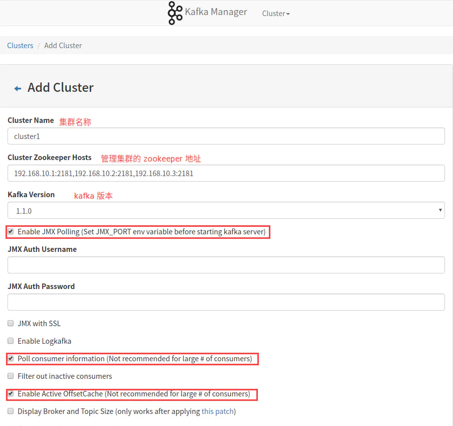

  - Enable JMX Polling

    是否开启 JMX 轮训，该部分直接影响部分 kafka broker 和 topic 监控指标指标的获取（生效的前提是 kafka 启动时开启了 JMX_PORT。主要影响如下之指标的查看：

    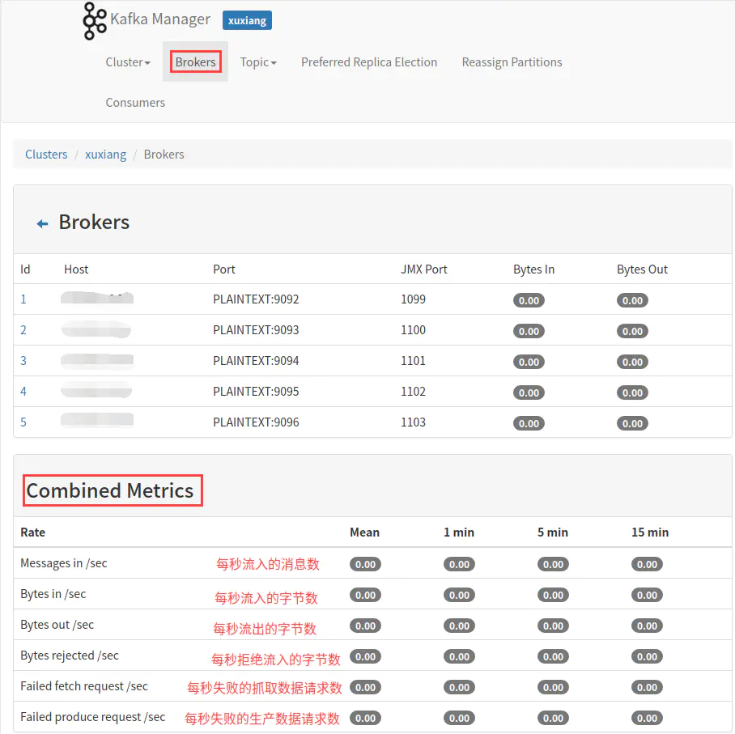

    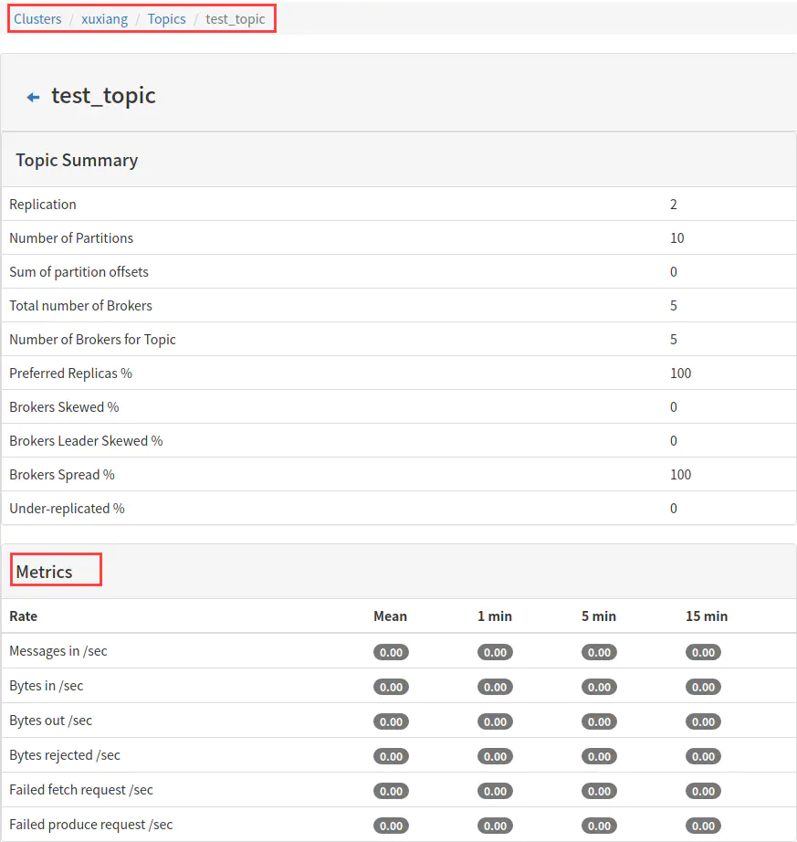

  - Poll consumer information

    是否开启获取消费信息，直接影响能够在消费者页面和 topic 页面查看消费信息。

    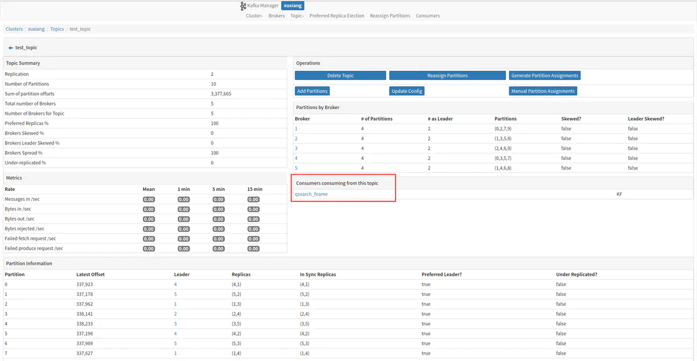

    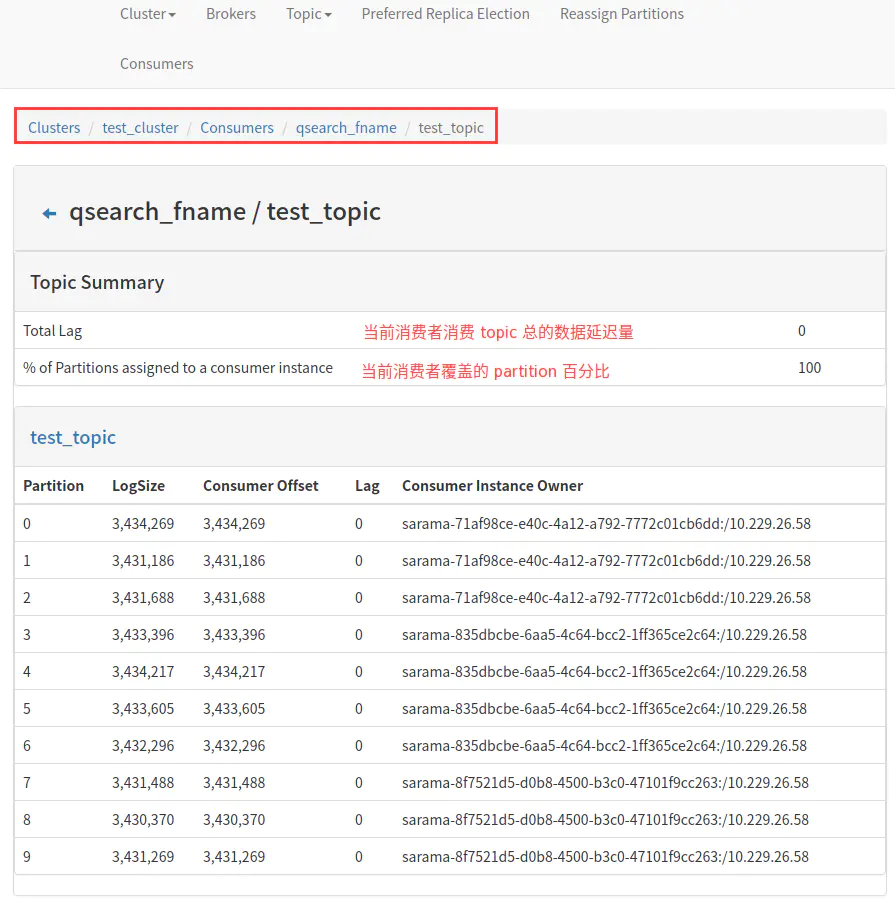

  - Enable Active OffsetCache

    是否开启 offset 缓存，决定 kafka-manager 是否缓存住 topic 的相关偏移量。

- 其他参数说明

  | 参数名                        | 参数说明                         | 默认值 | 备注 |
  | ----------------------------- | -------------------------------- | ------ | ---- |
  | brokerViewUpdatePeriodSeconds | Broker视图周期更新时间/单位（s） | 30     |      |
  | clusterManagerThreadPoolSize | 集群管理线程池大小 | 2	||
| clusterManagerThreadPoolQueueSize | 集群管理线程池列队大小 | 100	||
| KafkaCommandThreadPoolSize | Kafka命令线程池大小 | 2	||
| logkafkaCommandThreadPoolQueueSize | logkafka命令线程池列队大小 | 100	||
|logkafkaUpdatePeriodSeconds| Logkafka周期更新时间/单位（s）         | 30        ||
|partitionOffsetCacheTimeoutSecs| Partition Offset缓存过期时间/单位（s） | 5         ||
| brokerViewThreadPoolSize | Broker视图线程池大小 | 8 | 3 * number_of_brokers|
| brokerViewThreadPoolQueue Size | Broker视图线程池队列大小 | 1000 | 3 * total # of partitions across all topics|
| offsetCacheThreadPoolSize | Offset缓存线程池大小 | 8	||
| offsetCacheThreadPoolQueueSize | Offset缓存线程池列队大小 | 1000	||
| kafkaAdminClientThreadPoolSize | Kafka管理客户端线程池大小 | 8	||
| kafkaAdminClientTheadPoolQueue Sizec | Kafka管理客户端线程池队列大小 | 1000	||
| kafkaManagedOffsetMetadataCheckMillis | Offset元数据检查时间 | 30000 |（这部分解释属自己理解）|
| kafkaManagedOffsetGroupCacheSize | Offset组缓存大小 | 100000 |（这部分解释属自己理解）|
| kafkaManagedOffsetGroupExpireDays | Offset组缓存保存时间 | 7 |（这部分解释属自己理解）|
| Security Protocol | 安全协议 | PLAINTEXT |[SASL_PLAINTEXT,SASL_SSL,SSL]|


#### 二、Topic 管理

- Topic 列表

  下面对画方框的三列做着重解释。

  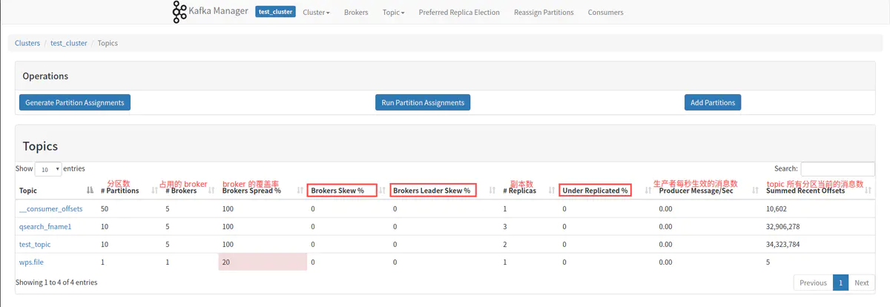

  - Brokers Skew% （broker 倾斜率）
    该 topic 占有的 broker 中，拥有超过该 topic 平均分区数的 broker 所占的比重。举个例子说明：

    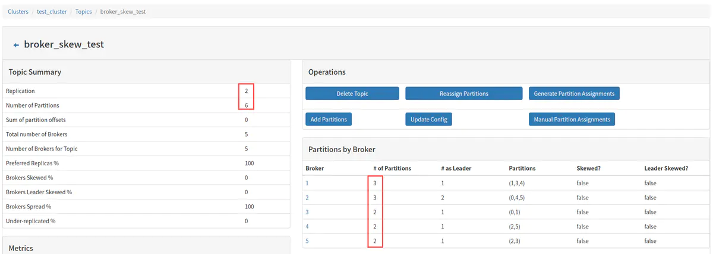

    上图，我们以一个 6 个分区，2 个副本的 topic 举例，该 topic 一共 6 * 2 = 12 个 分区，分布在 5 个 broker 上，平均一个 broker 应该拥有 2.4 个分区，因为分区为整数，所以 2 个或者 3 个都是属于平均范围，5 个 broker 并没有那个拥有超过平均分区数的，所以 Brokers Skew% 为 0。
     如果此时，我将 broker 1 上的分区 1 的副本移动到 broker 2 上，如下图所示：

    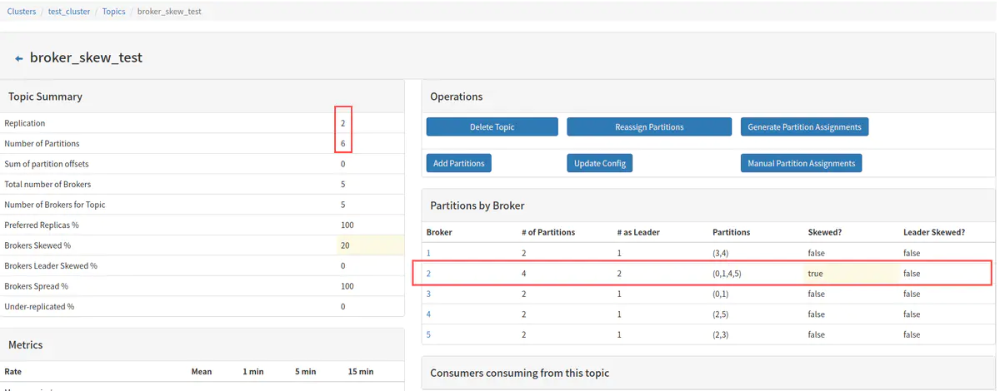

    上图，broker 2 上拥有 4 个分区，超过平均的 2 个或 3 个的平均水平，broker 2 就倾斜了，broker 倾斜率 1/5=20%。

    

    注意如下这种情况也是不计算作倾斜的。

    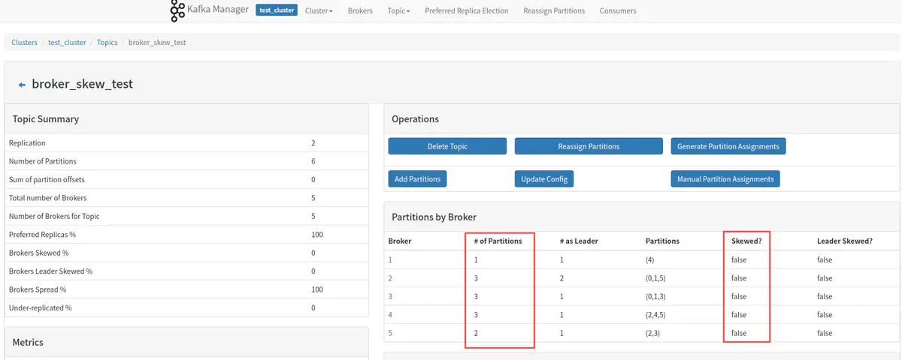

  - Brokers Leader Skew% （broker leader 分区倾斜率）

    该 topic 占有的 broker 中，拥有超过该 topic 平均 Leader 分区数的 broker 所占的比重。同样举个例子说明：

    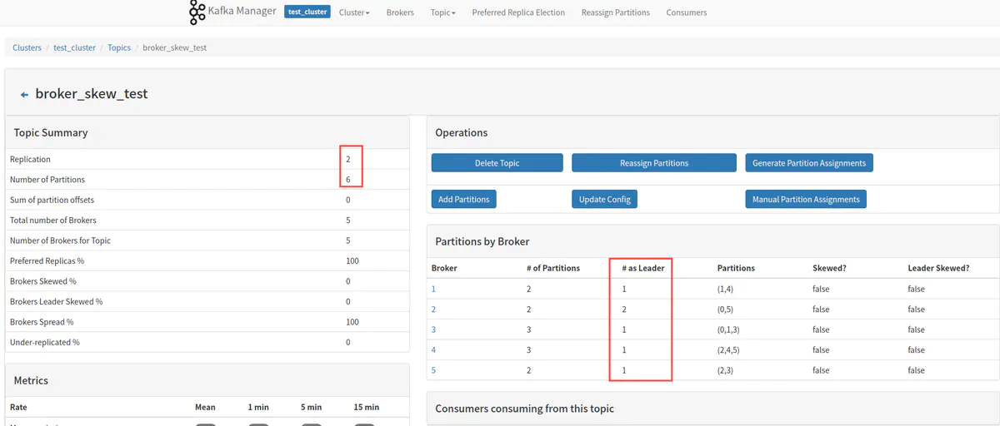

    我们还是以一个 6 个分区，2 个副本的 topic 举例，该 topic 一共有 6 个 Leader 分区，分布在 5 个 broker 上，平均一个 broker 应该拥有 1.2 个 Leader 分区，因为分区为整数，所以 1 个或者 2 个都是属于平均范围，如图所示，5 个 broker 没有那个拥有超过 2 个的 Leader 分区，所以 Brokers Leader Skew% 为 0。

    如果此时，我们将 broker3 的 Leader 分区移动到 broker2，如下图所示：

    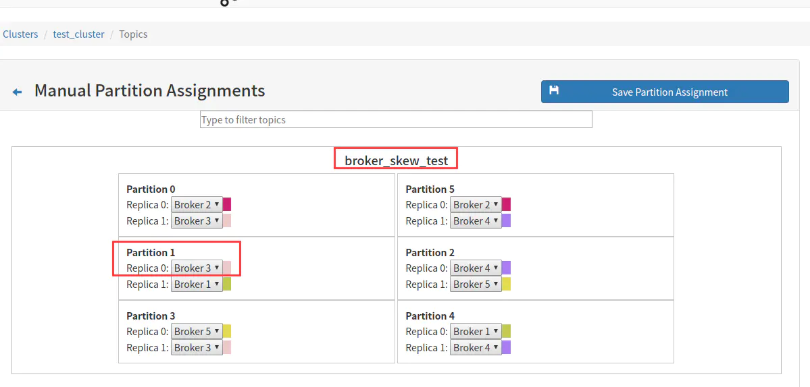

    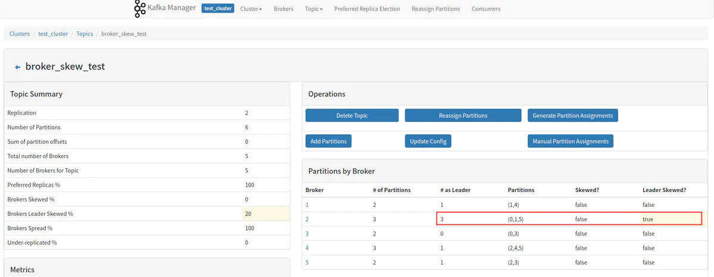

    此时，broker2 拥有 3 个 leader 分区，超过平均范围的 2 个，所以 broker2 就 Leader 分区倾斜了，倾斜率 1/5=20%。

  - Under Replicated%

    该 topic 下的 partition，其中副本处于失效或者失败的比率。失败或者失效是指副本不处于 ISR 队列中。目前控制副本是否处于 ISR 中由 **replica.log.max.ms** 这个参数控制。

    > replica.log.max.ms: 如果一个follower在这个时间内没有发送fetch请求或消费leader日志到结束的offset，leader将从ISR中移除这个follower，并认为这个follower已经挂了，默认值 10000 ms

    用下图举例说明：

    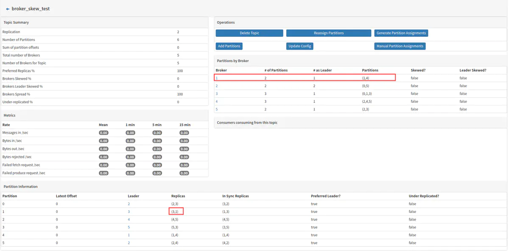

    broker1 此时拥有 partition1 和 partition4，其中 partition4 时 Leader，partition1 是副本，如果此时 broker 故障不可用，则会出现如下情况：

    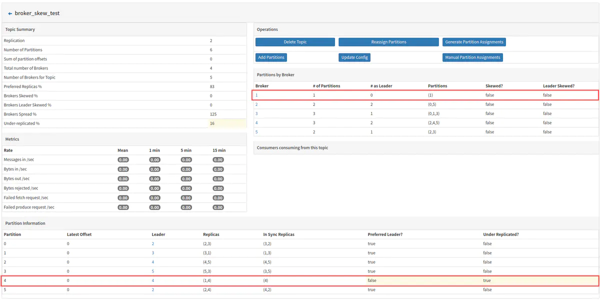

    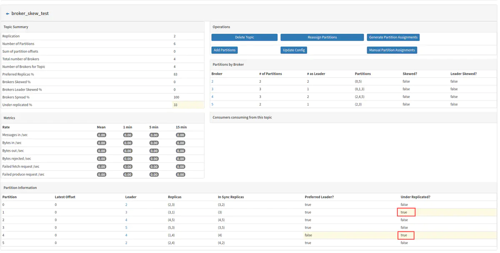

    上述两张图片时接连展现，先是发现borker1 上 partition4 这个 Leader 分区失效，继而从 ISR 队列中取出 broker4 上的副本作为 Leader 分区，然后在后期同步检测过程中发现broker1 上 partition1 这个副本失效。最后导致的结果就是 partition1 和 partition4 都出于副本失效或者失败的状态。此时 Under Replicated 的数值为：2/6=33%。

  - 总结

    上面三个参数对于衡量 topic 的稳定性有重要的影响：
     **Broker Skew**: 反映 broker 的 I/O 压力，broker 上有过多的副本时，相对于其他 broker ，该 broker 频繁的从 Leader 分区 fetch 抓取数据，磁盘操作相对于其他 broker 要多，如果该指标过高，说明 topic  的分区均不不好，topic 的稳定性弱；
     **Broker Leader Skew**：数据的生产和消费进程都至于 Leader 分区打交道，如果 broker 的 Leader 分区过多，该 broker 的数据流入和流出相对于其他 broker 均要大，该指标过高，说明 topic 的分流做的不够好；
     **Under Replicated**: 该指标过高时，表明 topic 的数据容易丢失，数据没有复制到足够的 broker 上。

- Topic 详情

  下面着重讲述红框部分：

  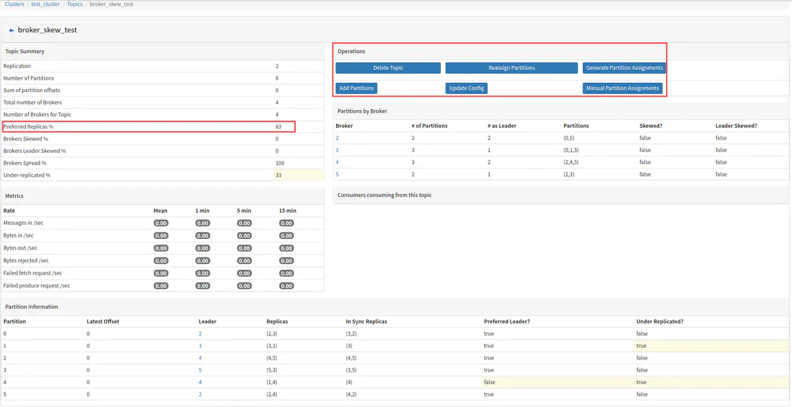

  - Preferred Replicas

    分区的副本中，采用副本列表中的第一个副本作为 Leader 的所占的比重，如上图，6 个副本组，其中只有 partition4 不是采用副本中的第一个在 broker1 中的分区作为 leader 分区，所以 Preferred Replicas 的值为 5/6=83%。

    

    > In an ideal scenario, the leader for a given partition should be the "preferred replica". This guarantees that the leadership load across the brokers in a cluster are evenly balanced.

    上述是关于“优先副本”的相关描述，即在理想的状态下，分区的 leader 最好是 “优先副本”，这样有利于保证集群中 broker 的领导权比较均衡。重新均衡集群的 leadership 可采用 kafka manager 提供的工具：

- Topic 操作

  | 操作                           | 说明                                  |
  | ------------------------------ | ------------------------------------- |
  | Delete Topic                   | 删除 topic                            |
  | Reassign Partitions            | 平衡集群负载                          |
  | Add Partitions                 | 增加分区                              |
  | Update Config                  | Topic 配置信息更新                    |
  | Manual Partition Assignments   | 手动为每个分区下的副本分配 broker     |
  | Generate Partition Assignments | 系统自动为每个分区下的副本分配 broker |

  一般而言，手动调整、系统自动分配分区和添加分区之后，都需要调用 **Reassign Partition**。

  - Manual Partition Assignments
     一般当有 Broker Skew 时或者 Broker Leader Skew 后可以借助该功能进行调整，本文前面的 Broker Skew 和 Broker Leader Skew 的说明都借助了该工具。
     例如将下图中的 broker1 的分区4 移动到 broker2 上。

    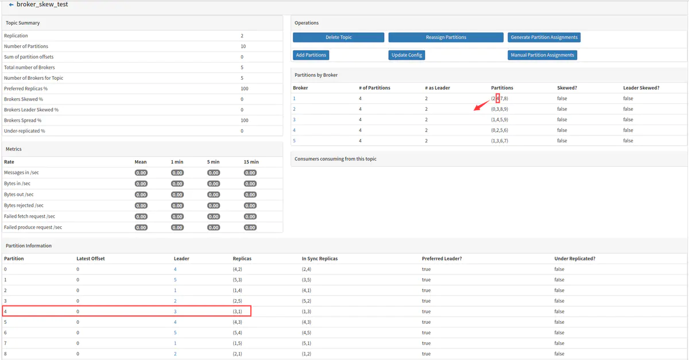

    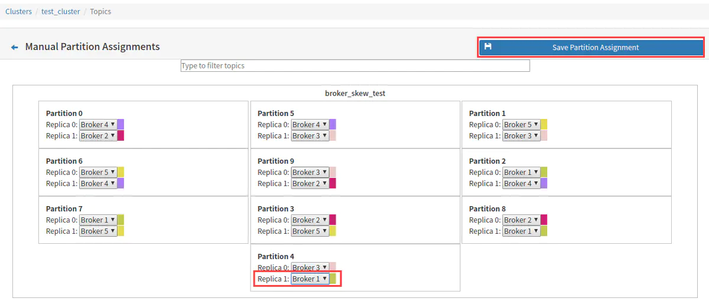

  - Generate Partition Assignments
     该功能一般在批量移动 partition 时比较方便，比如集群新增 broker 或者 topic 新增 partition 后，将分区移动到指定的 broker。
     例如下图将 topic 由原来的分布在 5 个 broker 修改为 4 个 broker：

    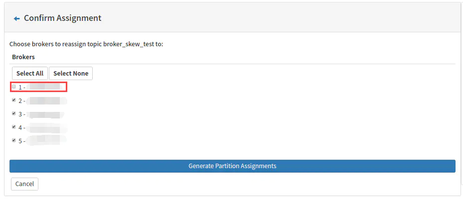

  - Update Config

    

```
scan '202204', {FILTER => "SingleColumnValueFilter('cf','device_type',=,'binary:15000001')"}
```


#### 三、消费监控

kafka manager 能够获取到当前消费 kafka 集群消费者的相关信息。

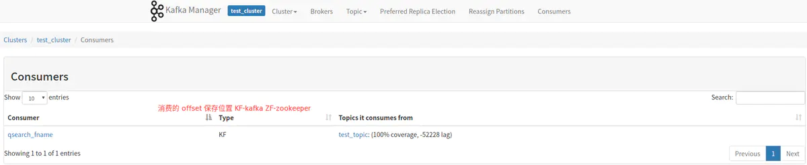

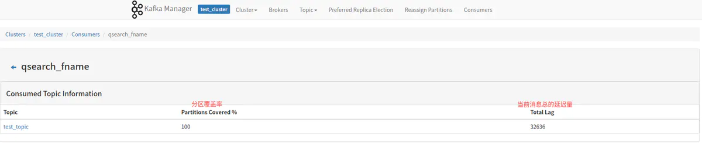

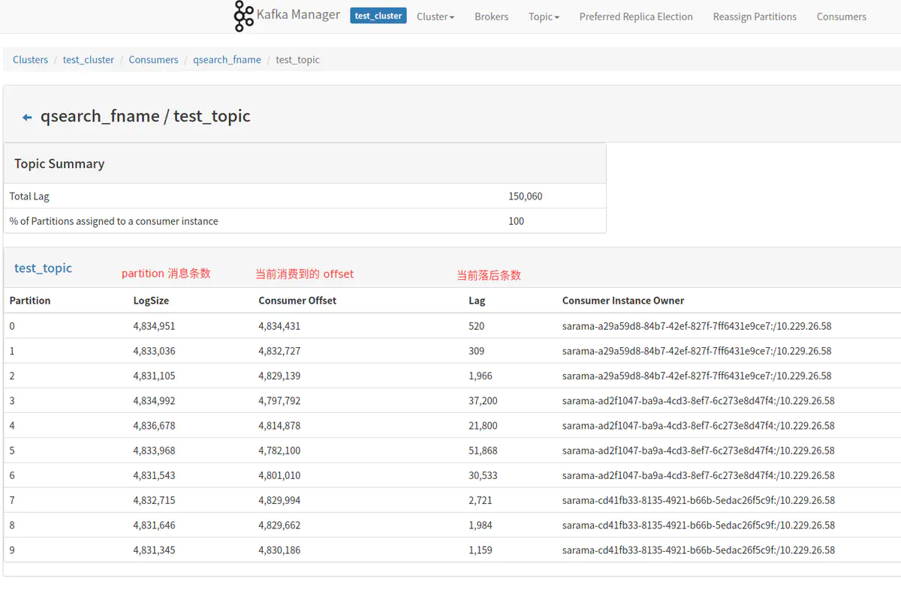


### Kafka Topic partitions数量选择分析

#### 一、partition 越多，吞吐量越大

首先我们需要明白以下事实：在kafka中，单个patition是kafka并行操作的最小单元。在producer和broker端，向每一个分区写入数据是可以完全并行化的，此时，可以通过加大硬件资源的利用率来提升系统的吞吐量，例如对数据进行压缩。在consumer段，kafka只允许单个partition的数据被一个consumer线程消费。因此，在consumer端，每一个Consumer Group内部的consumer并行度完全依赖于被消费的分区数量。综上所述，通常情况下，在一个Kafka集群中，partition的数量越多，意味着可以到达的吞吐量越大。

我们可以粗略地通过吞吐量来计算kafka集群的分区数量。假设对于单个partition，producer端的可达吞吐量为p，Consumer端的可达吞吐量为c，期望的目标吞吐量为t，那么集群所需要的partition数量至少为partition数=max(t/p,t/c)。在producer端，单个分区的吞吐量大小会受到批量大小、数据压缩方法、 确认类型（同步/异步）、复制因子等配置参数的影响。经过测试，在producer端，单个partition的吞吐量通常是在10MB/s左右。在consumer端，单个partition的吞吐量依赖于consumer端每个消息的应用逻辑处理速度。因此，我们需要对consumer端的吞吐量进行测量。

虽然随着时间的推移，我们能够对分区的数量进行添加，但是对于基于Key来生成的这一类消息需要我们重点关注。当producer向kafka写入基于key的消息时，kafka通过key的hash值来确定消息需要写入哪个具体的分区。通过这样的方案，kafka能够确保相同key值的数据可以写入同一个partition。kafka的这一能力对于一部分应用是极为重要的，例如对于同一个key的所有消息，consumer需要按消息的顺序进行有序消费。如果partition的数量发生改变，那么上面的有序性保证将不复存在。为了避免上述情况发生，通常的解决办法是多分配一些分区，以满足未来的需求。通常情况下，我们需要根据未来1到2年的目标吞吐量来设计kafka的分区数量。

一开始，我们可以基于当前的业务吞吐量为kafka集群分配较小的broker数量，随着时间的推移，我们可以向集群中增加更多的broker，然后在线方式将适当比例的partition转移到新增加的broker中去。通过这样的方法，我们可以在满足各种应用场景（包括基于key消息的场景）的情况下，保持业务吞吐量的扩展性。

在设计分区数时，除了吞吐量，还有一些其他因素值得考虑。正如我们后面即将看到的，对于一些应用场景，集群拥有过的分区将会带来负面的影响。

越多的分区需要打开更多地文件句柄
　　在kafka的broker中，每个分区都会对照着文件系统的一个目录。在kafka的数据日志文件目录中，每个日志数据段都会分配两个文件，一个索引文件和一个数据文件。当前版本的kafka，每个broker会为每个日志段文件打开一个index文件句柄和一个数据文件句柄。因此，随着partition的增多，需要底层操作系统配置更高的文件句柄数量限制。这更多的是一个配置问题。我们曾经见到过，在生产环境Kafka集群中，每个broker打开的文件句柄数量超过30,000。

#### 二、更多的 partition 会导致更高的不可用性

Kafka通过多副本复制技术，实现kafka集群的高可用和稳定性。每个partition都会有多个数据副本，每个副本分别存在于不同的broker。所有的数据副本中，有一个数据副本为Leader，其他的数据副本为follower。在kafka集群内部，所有的数据副本皆采用自动化的方式进行管理，并且确保所有的数据副本的数据皆保持同步状态。不论是producer端还是consumer端发往partition的请求，皆通过leader数据副本所在的broker进行处理。当broker发生故障时，对于leader数据副本在该broker的所有partition将会变得暂时不可用。Kafka将会自动在其他数据副本中选择出一个leader，用于接收客户端的请求。这个过程由kafka controller节点broker自动完成，主要是从Zookeeper读取和修改受影响partition的一些元数据信息。在当前的kafka版本实现中，对于zookeeper的所有操作都是由kafka controller来完成的（serially的方式）。
　　在通常情况下，当一个broker有计划地停止服务时，那么controller会在服务停止之前，将该broker上的所有leader一个个地移走。由于单个leader的移动时间大约只需要花费几毫秒，因此从客户层面看，有计划的服务停机只会导致系统在很小时间窗口中不可用。（注：在有计划地停机时，系统每一个时间窗口只会转移一个leader，其他leader皆处于可用状态。）

然而，当broker非计划地停止服务时（例如，kill -9方式)，系统的不可用时间窗口将会与受影响的partition数量有关。假如，一个2节点的kafka集群中存在2000个partition，每个partition拥有2个数据副本。当其中一个broker非计划地宕机，所有1000个partition同时变得不可用。假设每一个partition恢复时间是5ms，那么1000个partition的恢复时间将会花费5秒钟。因此，在这种情况下，用户将会观察到系统存在5秒钟的不可用时间窗口。

更不幸的情况发生在宕机的broker恰好是controller节点时。在这种情况下，新leader节点的选举过程在controller节点恢复到新的broker之前不会启动。Controller节点的错误恢复将会自动地进行，但是新的controller节点需要从zookeeper中读取每一个partition的元数据信息用于初始化数据。例如，假设一个kafka集群存在10,000个partition，从zookeeper中恢复元数据时每个partition大约花费2ms，则controller的恢复将会增加约20秒的不可用时间窗口。

通常情况下，非计划的宕机事件发生的情况是很少的。如果系统可用性无法容忍这些少数情况的场景，我们最好是将每个broker的partition数量限制在2,000到4,000，每个kafka集群中partition的数量限制在10,000以内。

越多的分区可能增加端对端的延迟
　　Kafka端对端延迟定义为producer端发布消息到consumer端接收消息所需要的时间。即consumer接收消息的时间减去producer发布消息的时间。Kafka只有在消息提交之后，才会将消息暴露给消费者。例如，消息在所有in-sync副本列表同步复制完成之后才暴露。因此，in-sync副本复制所花时间将是kafka端对端延迟的最主要部分。在默认情况下，每个broker从其他broker节点进行数据副本复制时，该broker节点只会为此工作分配一个线程，该线程需要完成该broker所有partition数据的复制。经验显示，将1000个partition从一个broker到另一个broker所带来的时间延迟约为20ms，这意味着端对端的延迟至少是20ms。这样的延迟对于一些实时应用需求来说显得过长。

注意，上述问题可以通过增大kafka集群来进行缓解。例如，将1000个分区leader放到一个broker节点和放到10个broker节点，他们之间的延迟是存在差异的。在10个broker节点的集群中，每个broker节点平均需要处理100个分区的数据复制。此时，端对端的延迟将会从原来的数十毫秒变为仅仅需要几毫秒。

根据经验，如果你十分关心消息延迟问题，限制每个broker节点的partition数量是一个很好的主意：对于b各broker节点和复制因子为r的kafka集群，整个kafka集群的partition数量最好不超过100br个，即单个partition的leader数量不超过100.

越多的partition意味着需要客户端需要更多的内存
　　在最新发布的0.8.2版本的kafka中，我们开发了一个更加高效的Java producer。新版producer拥有一个比较好的特征，他允许用户为待接入消息存储空间设置内存大小上限。在内部实现层面，producer按照每一个partition来缓存消息。在数据积累到一定大小或者足够的时间时，积累的消息将会从缓存中移除并发往broker节点。

如果partition的数量增加，消息将会在producer端按更多的partition进行积累。众多的partition所消耗的内存汇集起来，有可能会超过设置的内容大小限制。当这种情况发生时，producer必须通过消息堵塞或者丢失一些新消息的方式解决上述问题，但是这两种做法都不理想。为了避免这种情况发生，我们必须重新将produder的内存设置得更大一些。

根据经验，为了达到较好的吞吐量，我们必须在producer端为每个分区分配至少几十KB的内存，并且在分区数量显著增加时调整可以使用的内存数量。

类似的事情对于consumer端依然有效。Consumer端每次从kafka按每个分区取出一批消息进行消费。消费的分区数越多，需要的内存数量越大。尽管如此，上述方式主要运用于非实时的应用场景。

总结
　　通常情况下，kafka集群中越多的partition会带来越高的吞吐量。但是，我们必须意识到集群的partition总量过大或者单个broker节点partition过多，都会对系统的可用性和消息延迟带来潜在的影响。未来，我们计划对这些限制进行一些改进，让kafka在分区数量方面变得更加可扩展。

#### 三、如何确定分区数

“我应该选择几个分区？”——如果你在Kafka中国社区的群里，这样的问题你会经常碰到的。不过有些遗憾的是，我们似乎并没有很权威的答案能够解答这样的问题。其实这也不奇怪，毕竟这样的问题通常都是没有固定答案的。Kafka官网上标榜自己是"high-throughput distributed messaging system"，即一个高吞吐量的分布式消息引擎。那么怎么达到高吞吐量呢？Kafka在底层摒弃了Java堆缓存机制，采用了操作系统级别的页缓存，同时将随机写操作改为顺序写，再结合Zero-Copy的特性极大地改善了IO性能。但是，这只是一个方面，毕竟单机优化的能力是有上限的。如何通过水平扩展甚至是线性扩展来进一步提升吞吐量呢？ Kafka就是使用了分区(partition)，通过将topic的消息打散到多个分区并分布保存在不同的broker上实现了消息处理(不管是producer还是consumer)的高吞吐量。
Kafka的生产者和消费者都可以多线程地并行操作，而每个线程处理的是一个分区的数据。因此分区实际上是调优Kafka并行度的最小单元。对于producer而言，它实际上是用多个线程并发地向不同分区所在的broker发起Socket连接同时给这些分区发送消息；而consumer呢，同一个消费组内的所有consumer线程都被指定topic的某一个分区进行消费(具体如何确定consumer线程数目我们后面会详细说明)。所以说，如果一个topic分区越多，理论上整个集群所能达到的吞吐量就越大。
但分区是否越多越好呢？显然也不是，因为每个分区都有自己的开销：

- 客户端/服务端需要使用的内存就越多

  先说说客户端的情况。Kafka 0.8.2之后推出了Java版的全新的producer，这个producer有个参数batch.size，默认是16KB。它会为每个分区缓存消息，一旦满了就打包将消息批量发出。看上去这是个能够提升性能的设计。不过很显然，因为这个参数是分区级别的，如果分区数越多，这部分缓存所需的内存占用也会更多。假设你有10000个分区，按照默认设置，这部分缓存需要占用约157MB的内存。而consumer端呢？我们抛开获取数据所需的内存不说，只说线程的开销。如果还是假设有10000个分区，同时consumer线程数要匹配分区数(大部分情况下是最佳的消费吞吐量配置)的话，那么在consumer client就要创建10000个线程，也需要创建大约10000个Socket去获取分区数据。这里面的线程切换的开销本身已经不容小觑了。
  服务器端的开销也不小，如果阅读Kafka源码的话可以发现，服务器端的很多组件都在内存中维护了分区级别的缓存，比如controller，FetcherManager等，因此分区数越多，这种缓存的成本越久越大。

- 文件句柄开销

  每个分区在底层文件系统都有属于自己的一个目录。该目录下通常会有两个文件： base_offset.log和base_offset.index。Kafak的controller和ReplicaManager会为每个broker都保存这两个文件句柄(file handler)。很明显，如果分区数越多，所需要保持打开状态的文件句柄数也就越多，最终可能会突破你的ulimit -n的限制。

- 降低高可用性

  Kafka通过副本(replica)机制来保证高可用。具体做法就是为每个分区保存若干个副本(replica_factor指定副本数)。每个副本保存在不同的broker上。期中的一个副本充当leader 副本，负责处理producer和consumer请求。其他副本充当follower角色，由Kafka controller负责保证与leader的同步。如果leader所在的broker挂掉了，contorller会检测到然后在zookeeper的帮助下重选出新的leader——这中间会有短暂的不可用时间窗口，虽然大部分情况下可能只是几毫秒级别。但如果你有10000个分区，10个broker，也就是说平均每个broker上有1000个分区。此时这个broker挂掉了，那么zookeeper和controller需要立即对这1000个分区进行leader选举。比起很少的分区leader选举而言，这必然要花更长的时间，并且通常不是线性累加的。如果这个broker还同时是controller情况就更糟了。
  
- 更多的分区会导致端对端的延迟

  kafka端对端的延迟为producer端发布消息到consumer端消费消息所需的时间，即consumer接收消息的时间减去produce发布消息的时间。kafka在消息正确接收后才会暴露给消费者，即在保证in-sync副本复制成功之后才会暴露，瓶颈则来自于此。在一个broker上的副本从其他broker的leader上复制数据的时候只会开启一个线程，假设partition数量为n，每个副本同步的时间为1ms，那in-sync操作完成所需的时间即n*1ms，若n为10000，则需要10秒才能返回同步状态，数据才能暴露给消费者，这就导致了较大的端对端的延迟。
  
- 越多的partition会导致更长时间的恢复期

  kafka通过多副本复制技术，实现kafka的高可用性和稳定性。每个partition都会有多个副本存在于多个broker中，其中一个副本为leader，其余的为follower。当kafka集群其中一个broker出现故障时，在这个broker上的leader会需要在其他broker上重新选择一个副本启动为leader，这个过程由kafka controller来完成，主要是从Zookeeper读取和修改受影响partition的一些元数据信息。

  通常情况下，当一个broker有计划的停机上，该broker上的partition leader会在broker停机前有次序的一一移走，假设移走一个需要1ms，10个partition leader则需要10ms，这影响很小，并且在移动其中一个leader的时候，其他九个leader是可用的，因此实际上每个partition leader的不可用时间为1ms。但是在宕机情况下，所有的10个partition

  leader同时无法使用，需要依次移走，最长的leader则需要10ms的不可用时间窗口，平均不可用时间窗口为5.5ms，假设有10000个leader在此宕机的broker上，平均的不可用时间窗口则为5.5s。

  更极端的情况是，当时的broker是kafka controller所在的节点，那需要等待新的kafka leader节点在投票中产生并启用，之后新启动的kafka leader还需要从zookeeper中读取每一个partition的元数据信息用于初始化数据。在这之前partition leader的迁移一直处于等待状态。


说了这么多“废话”，很多人肯定已经不耐烦了。那你说到底要怎么确定分区数呢？答案就是：视情况而定。基本上你还是需要通过一系列实验和测试来确定。当然测试的依据应该是吞吐量。虽然LinkedIn这篇文章做了Kafka的基准测试，但它的结果其实对你意义不大，因为不同的硬件、软件、负载情况测试出来的结果必然不一样。我经常碰到的问题类似于，官网说每秒能到10MB，为什么我的producer每秒才1MB？ —— 且不说硬件条件，最后发现他使用的消息体有1KB，而官网的基准测试是用100B测出来的，因此根本没有可比性。不过你依然可以遵循一定的步骤来尝试确定分区数：创建一个只有1个分区的topic，然后测试这个topic的producer吞吐量和consumer吞吐量。假设它们的值分别是Tp和Tc，单位可以是MB/s。然后假设总的目标吞吐量是Tt，那么分区数 = Tt / max(Tp, Tc)
Tp表示producer的吞吐量。测试producer通常是很容易的，因为它的逻辑非常简单，就是直接发送消息到Kafka就好了。Tc表示consumer的吞吐量。测试Tc通常与应用的关系更大， 因为Tc的值取决于你拿到消息之后执行什么操作，因此Tc的测试通常也要麻烦一些。
另外，Kafka并不能真正地做到线性扩展(其实任何系统都不能)，所以你在规划你的分区数的时候最好多规划一下，这样未来扩展时候也更加方便。

#### 消息-分区的分配

默认情况下，Kafka根据传递消息的key来进行分区的分配，即hash(key) % numPartitions，如下图所示:

```java
def partition(key: Any, numPartitions: Int): Int = {
    Utils.abs(key.hashCode) % numPartitions
}
```

这就保证了相同key的消息一定会被路由到相同的分区。如果你没有指定key，那么Kafka是如何确定这条消息去往哪个分区的呢？

```java
if(key == null) {  // 如果没有指定key
        val id = sendPartitionPerTopicCache.get(topic)  // 先看看Kafka有没有缓存的现成的分区Id
        id match {
          case Some(partitionId) =>  
            partitionId  // 如果有的话直接使用这个分区Id就好了
          case None => // 如果没有的话，
            val availablePartitions = topicPartitionList.filter(_.leaderBrokerIdOpt.isDefined)  //找出所有可用分区的leader所在的broker
            if (availablePartitions.isEmpty)
              throw new LeaderNotAvailableException("No leader for any partition in topic " + topic)
            val index = Utils.abs(Random.nextInt) % availablePartitions.size  // 从中随机挑一个
            val partitionId = availablePartitions(index).partitionId
            sendPartitionPerTopicCache.put(topic, partitionId) // 更新缓存以备下一次直接使用
            partitionId
        }
      }
```

可以看出，Kafka几乎就是随机找一个分区发送无key的消息，然后把这个分区号加入到缓存中以备后面直接使用——当然了，Kafka本身也会清空该缓存（默认每10分钟或每次请求topic元数据时）

#### 如何设定 consumer 线程数

我个人的观点，如果你的分区数是N，那么最好线程数也保持为N，这样通常能够达到最大的吞吐量。超过N的配置只是浪费系统资源，因为多出的线程不会被分配到任何分区。让我们来看看具体Kafka是如何分配的。
topic下的一个分区只能被同一个consumer group下的一个consumer线程来消费，但反之并不成立，即一个consumer线程可以消费多个分区的数据，比如Kafka提供的ConsoleConsumer，默认就只是一个线程来消费所有分区的数据。——其实ConsoleConsumer可以使用通配符的功能实现同时消费多个topic数据，但这和本文无关。
再讨论分配策略之前，先说说KafkaStream——它是consumer的关键类，提供了遍历方法用于consumer程序调用实现数据的消费。其底层维护了一个阻塞队列，所以在没有新消息到来时，consumer是处于阻塞状态的，表现出来的状态就是consumer程序一直在等待新消息的到来。——你当然可以配置成带超时的consumer，具体参看参数consumer.timeout.ms的用法。
下面说说Kafka提供的两种分配策略： range和roundrobin，由参数partition.assignment.strategy指定，默认是range策略。本文只讨论range策略。所谓的range其实就是按照阶段平均分配。举个例子就明白了，假设你有10个分区，P0 ~ P9，consumer线程数是3， C0 ~ C2，那么每个线程都分配哪些分区呢？

C0 消费分区 0, 1, 2, 3

C1 消费分区 4, 5, 6

C2 消费分区 7, 8, 9

```java
val nPartsPerConsumer = curPartitions.size / curConsumers.size // 每个consumer至少保证消费的分区数
val nConsumersWithExtraPart = curPartitions.size % curConsumers.size // 还剩下多少个分区需要单独分配给开头的线程们
...
for (consumerThreadId <- consumerThreadIdSet) {   // 对于每一个consumer线程
        val myConsumerPosition = curConsumers.indexOf(consumerThreadId)  //算出该线程在所有线程中的位置，介于[0, n-1]
        assert(myConsumerPosition >= 0)
// startPart 就是这个线程要消费的起始分区数
        val startPart = nPartsPerConsumer * myConsumerPosition + myConsumerPosition.min(nConsumersWithExtraPart)
// nParts 就是这个线程总共要消费多少个分区
        val nParts = nPartsPerConsumer + (if (myConsumerPosition + 1 > nConsumersWithExtraPart) 0 else 1)
...
}
```

针对于这个例子，nPartsPerConsumer就是10/3=3，nConsumersWithExtraPart为10%3=1，说明每个线程至少保证3个分区，还剩下1个分区需要单独分配给开头的若干个线程。这就是为什么C0消费4个分区，后面的2个线程每个消费3个分区。


## Redis

登录命令

```
./redis-cli -h ip -p port -a password -c
```


## Python

### 清华pypi镜像部分包的直接地址

```
# pip
https://pypi.tuna.tsinghua.edu.cn/simple/pip/
# setuptools
https://pypi.tuna.tsinghua.edu.cn/simple/setuptools/
```


### namedtuple 用法

> **namedtuple是继承自tuple的子类。namedtuple创建一个和tuple类似的对象，而且对象拥有可访问的属性。**
>
> 因为元组的局限性：不能为元组内部的数据进行命名，所以往往我们并不知道一个元组所要表达的意义，
> 所以在这里引入了 collections.namedtuple 这个工厂函数，来构造一个带字段名的元组。
> 具名元组的实例和普通元组消耗的内存一样多，因为字段名都被存在对应的类里面。这个类跟普通的对象
> 实例比起来也要小一些，因为 Python 不会用 __dict__ 来存放这些实例的属性。

实现方法

```python
from collections import namedtuple
```

源代码


用法示例

```python
def namedtuple(typename, field_names, *, verbose=False, rename=False, module=None):
#    - typename: 元组名称
#    - field_names : 元组中元素的名称
#    - rename: 如果元素名称中包含python关键字， 必须设置rename=True
```

```python
from collections import  namedtuple

User = namedtuple('User', ['name', 'age', 'gender'])
u = User('villa', 33, 'male')
print(u.name)
print(u.age)
print(u.gender)
print(u)
```


### Pycharm 快捷键

```
批量注释    Ctrl+/
```


### Pychram 设置环境与导出环境

Pycharm 每个项目都需要设置环境，即 Porject Interpreter，这个环境有几种设置方法
1、将 Interpreter 设置为本机安装路径，如下图所示


优势：所有项目依赖包只需要装一遍即可
劣势：依赖环境的第三方库会有非常多，在某个项目的第三方库并不需要很多时，如果此时用这个 interpreter 生成 requirement.txt 就会有很多无关紧要的库，不利于打包部署

2、创建 Virtualenv Environment
此方法给项目分配一个单独的 Porject Interpreter


优势：单个项目有一个独立的环境，相关依赖包会与项目紧密相关，不会存在多余无用的依赖包
劣势：不同项目之间需要重新下载依赖包

环境依赖包导出
基本操作
1、进入对应环境，使用 `python.exe -m pip freeze > requirements.txt` 生成该环境的 requirements 文件（Windows）
2、联网环境下：使用这个 requirements.txt 文件，通过命令 `pip install -r requirements.txt`直接安装

离线环境下的操作

1、进入对应环境，使用 `python.exe -m pip freeze > requirements.txt` 生成该环境的 requirements 文件（Windows）

2、在联网环境下，使用 `pip download -r requestments.txt -d ./pip_packages ` 将所有依赖包存储在 pip_packages 目录下

3、将包和环境文件，拷贝到离线环境下，使用 `pip install --no-index --find-links=./pip_packages -r requestments.txt ` 离线安装所有包

​	（--find-links指定的是包文件的存放地址，-r指定的是txt文件的位置）

如果 Pycharm 使用的是系统 Python 环境，则到系统 Python 环境下安装，如果 Pycharm 使用的是虚拟环境，则到项目目录下的 venv/Scripts 下，有一个 python.exe，利用 venv/Scripts 下的 python.exe 生成 requirement.txt


### Python 文件的读写模式

```
r :读取模式（默认值）
w:写入模式
x:独占写入模式
a：附加模式
b:二进制模式
t：文本模式（默认值，与其他模式结合使用）
+：读写模式（与其他模式结合使用）
r+： 打开文件进行读写，会覆盖文件原内容，重新写入；若文件不存在，则会报错
w+：打开一个文件用于读写。如果该文件已存在则打开文件，并从开头开始编辑，即原有内容会被删除。如果该文件不存在，创建新文件
a+：打开一个文件用于读写。如果该文件已存在，文件指针将会放在文件的结尾。文件打开时会是追加模式。如果该文件不存在，创建新文件用于读写。
```


### pip 命令

```
pip [download/install]
 -i: 指定下载源
 -d: 指定下载目录
# 导出当前 Python 环境到一个文件
pip freeze > requirements.txt
# 下载 Python 环境的所有包到一个目录
pip download -d C:\Users\Administrator\Desktop\我的脚本\ZTCHS_Checker\pack -r requirements.txt# 导出当前 Python 环境到一个文件
pip freeze > requirements.txt
# 下载 Python 环境的所有包到一个目录
pip download -d C:\Users\Administrator\Desktop\我的脚本\ZTCHS_Checker\pack -r requirements.txt
# 指定清华镜像站，下载包到一个指定目录
pip download -d C:\Users\Administrator\Desktop\我的脚本\ZTCHS_Checker\pack -i https://pypi.tuna.tsinghua.edu.cn/simple setuptools
# 使用清华镜像站更新一个包
pip install -i https://pypi.tuna.tsinghua.edu.cn/simple pip -U
```


### datetime 模块

```python
# 字符串转 datetime 对象
datetime.datetime.strptime(data_str, "%Y-%m-%d %H:%M:%S")
# datetime 对象转字符串
datetime.xxx.xxx.strftime("%Y-%m-%d %H:%M:%S")
# 获取当前时间时间戳
datetime.datetime.now().timestamp()
# 如果不需要带毫秒
int(datetime.datetime.now().timestamp())
```


### @classmethon & @staticmethod

> 结论：
>
> 我们要写一个只在类中运行而不在实例中运行的方法时，可以使用 @classmethon 装饰器来创建方法
>
> 我们要写一个跟类有关系，但在运行时又不需要实例和类参与的方法时，可以使用 @staticmethod 装饰器来创建方法，staticmethod 方法可以在不创建实例的情况下直接调用

下面一个示例来演示这两个装饰器的使用方法和区别：

```python
class Kls(object):
    def __init__(self, data):
    	self.data = data
    def printd(self):
    	print(self.data)
    @staticmethod
    def smethod(*arg):
    	print('Static:', arg)
    @classmethod
    def cmethod(*arg):
    	print('Class:', arg)

 
>>> ik = Kls(23)
>>> ik.printd()
23
>>> ik.smethod()
Static: ()
>>> ik.cmethod()
Class: (<class '__main__.Kls'>,)
>>> Kls.printd()
TypeError: unbound method printd() must be called with Kls instance as first argument (got nothing instead)
>>> Kls.smethod()
Static: ()
>>> Kls.cmethod()
Class: (<class '__main__.Kls'>,)
```


## Spark

- RDD 分区数（在指定分区的情况下：partitionBy() 函数设定的分区值），至少应该和集群中的总核心数一样。
- 不涉及修改键记录的大部分 Spark 都能利用到已有的分区信息（比如我们手动指定的分区），但可能修改键记录的操作则可能导致子RDD 失去父 RDD 的分区信息，从而无法利用已有分区信息。
- 所有引入了将数据根据键跨节点进行混洗的操作，都能从数据分区中获益：cogroup()、groupWith()、join()、leftOuterJoin()、rightOuterJoin()、groupByKey()、reduceByKey()、combineByKey()、lookup()


## Vim

撤销修改：
```
u / :u：撤销上一次更改
U / :U：撤销单行内的所有修改
:undo：用来撤销删除、粘贴、搜索、替换等命令，与u命令有较多重合
```
重做修改：`Ctrl+R` 或 `:redo`


## SQL

### MySQL 添加字段描述

- 创建表时添加，使用关键词 COMMENT 在需要添加的字段定义后面，下方为例

  ```sql
  CREATE TABLE userinfo(
  id INT COMMENT '编号',
  uname VARCHAR(40) COMMENT '用户名',
  address VARCHAR(120) COMMENT '家庭住址',
  hobby VARCHAR(200) COMMENT '爱好'
  )COMMENT = '用户信息表';
  ```

- 修改表以添加

  ```sql
  ALTER TABLE userinfo COMMENT '用户信息资料表';
  ALTER TABLE userinfo MODIFY COLUMN uname VARCHAR(40) COMMENT '姓名';
  ```

- 查看表描述的方法

  ```sql
  # 在生成的 SQL 语句中查看
  SHOW CREATE TABLE userinfo;
  # 在元数据表里查看
  USE information_schema;
  SELECT * FROM TABLES WHERE TABLE_SCHEMA='shoppingcart' AND TABLE_NAME='userinfo';
  ```

- 查看字段描述的方法

  ```sql
  # 在生成的 SQL 语句中查看
  SHOW FULL COLUMNS FROM userinfo;
  # 在元数据的表里面看
  SELECT * FROM COLUMNS WHERE TABLE_SCHEMA='shoppingcart' AND TABLE_NAME='userinfo';
  ```


##  Git

### 常用命令

```shell
# 从版本库中删除某个文件
|-- git rm xxx
|-- git commit -m " remove xxx"
```


 ### .gitignore 文件

- 配置示例

  ```
  # 忽略 .a 文件
  *.a
  
  # 但否定忽略 lib.a, 尽管已经在前面忽略了 .a 文件
  !lib.a
  
  # 仅在当前目录下忽略 TODO 文件， 但不包括子目录下的 subdir/TODO
  /TODO
  
  # 忽略 build/ 文件夹下的所有文件
  build/
  
  # 忽略 doc/notes.txt, 不包括 doc/server/arch.txt
  doc/*.txt
  
  # 忽略所有的 .pdf 文件 在 doc/ directory 下的
  doc/**/*.pdf
  ```

- 配置模板

  ```
  Github 上为开发者提供了各种环境以及各种编程语言的 gitignore 文件配置模板：https://github.com/github/gitignore
  python项目的gitgnore文件 url:https://github.com/github/gitignore/blob/master/Python.gitignore
  ```

- 全局`.gitignore`设置方法( 这个文件将作用于所有 git 项目，并且作用于项目实例中的所有被跟踪的目录)

  ```
  git config --global core.excludesfile ~/.gitignore
  ```

- 局部`.gitignore`直接在项目目录中创建文件即可


## Nginx

### 基于 Nginx 的视频服务器搭建

> Nginx-1.20.2 + nginx-vod-module-1.28
>
> nginx-vod-module 是基于 Nginx 的视频流处理的第三方模块，详细的功能和配置可以上网查询，本文仅讲解最基本的网络点播服务的搭建


- 环境准备

  ```shell
  yum install -y pcre pcre-devel gcc-c++
  ```

- 上传安装包

  ```
  nginx-1.20.2.tar.gz
  nginx-vod-module-1.28.tar.gz
  ```

- 解压这些安装包

- 进入 nginx-1.20.2 目录，配置安装参数

  ```shell
  ./configure --prefix=/home/videoSrv/nginx --with-http_stub_status_module --with-http_ssl_module --with-cc-opt='-O0 -gstabs+3' --with-debug --add-module=/home/videoSrv/nginx-vod-module
  ```

- 编译安装

  ```shell
  make
  make install
  ```

- 配置 Nginx，添加如下内容（基础nginx配置不赘述，正常配置即可）

  ```nginx
  location /vod {
      vod hls;
      vod_mode local;
  
      vod_align_segments_to_key_frames on;
      vod_manifest_segment_durations_mode accurate;
  
      add_header Access-Control-Allow-Headers '*';
      add_header Access-Control-Expose-Headers 'Server,range,Content-Length,Content-Range';
      add_header Access-Control-Allow-Methods 'GET, HEAD, OPTIONS';
      add_header Access-Control-Allow-Origin '*';
  
      alias /home/videoSrv/media;
  }
  ```

- 新建视频存放目录：/home/videoSrv/media

- 存放视频

- 下载 VLC 本地播放器或 H5 播放器，此处以 VLC 播放器为例

- 视频访问链接

  ```
  http://10.0.0.1:8083/vod/example.mp4/index.m3u8
  
  - 10.0.0.1:8083：Nginx 服务的地址和端口
  - example.mp4：为视频名称
  - index.m3u8：为链接默认配置，不需要改动
  ```

- 打开 VLC 播放器

- 配置网络串流

  

  

- 此时，即可正常播放视频


### Nginx 实现文件下载

先看配置文件

```

server {
     listen    80;
     server_name  localhost;
 
     location ^~ /download/ {
        alias /home/webhtml/;
 
        if ($request_filename ~* ^.*?\.(html|doc|pdf|zip|docx|txt)$) {
            add_header Content-Disposition attachment;
            add_header Content-Type application/octet-stream;
        }
            sendfile on;   # 开启高效文件传输模式
            autoindex on;  # 开启目录文件列表
            autoindex_exact_size on;  # 显示出文件的确切大小，单位是bytes
            autoindex_localtime on;  # 显示的文件时间为文件的服务器时间
            charset utf-8,gbk;  # 避免中文乱码
      }
}
```

关键点解析：

```
server_name  localhost;  代表服务名，在这里直接访问 127.0.0.1就可以。如果是别的机器访问这台机器。则直接替换成这台机器的地址即可。

 location ^~ /download/ 带边的是拦截包含 download的请求

 alias /home/webhtml/;  是来配置下载文件的路径，也就是提供下载的文件要在这个路径下。

  if ($request_filename ~* ^.*?\.(html|doc|pdf|zip|docx|txt)$) {
            add_header Content-Disposition attachment;
            add_header Content-Type application/octet-stream;
        }
```

使用方法

首先把一个待下载的文件放在：/home/webhtml/ 目录下

然后就可以用这个url来下载文件了(本机访问)： 127.0.0.1/download/hello.txt

一般都是对外提供下载的（假设我这台部署nginx的机器是：10.2.5.10）：10.2.5.10/download/hello.tx  

我们可以知道的是，带有download的路径被拦截了，加上我们配的文件路径，最后去取文件：

/home/webhtml/hello.txt


# 错题集

### Too many open files的四种解决办法

> from: https://blog.csdn.net/devcloud/article/details/100174126
>
> Too many open files有四种可能:一 单个进程打开文件句柄数过多,二 操作系统打开的文件句柄数过多,三 systemd对该进程进行了限制,四 inotify达到上限.

- 单个进程打开文件句柄数过多

  ulimit中的nofile表示单进程可以打开的最大文件句柄数，可以通过ulimit -a查看，子进程默认继承父进程的限制（注意，是继承，不是共享，子进程和父进程打开的文件句柄数是单独算的）。

  网上还有一种解读是nofile表示单用户可以打开的文件句柄数，因为他们在limit.conf中看到类似于“openstack soft nofile 65536”，便认为是openstack用户最多可以打开的文件句柄数。该解读是错误的，“openstack soft nofile 65536”表示的含义是当你执行"su - openstack"切换到openstack用户后，你创建的所有进程最大可以打开的文件句柄数是65536。

  要查看一个进程可以打开的文件句柄数，可以通过“cat /proc/<pid>/limits”查看。

  要修改ulimit中的nofile，可以通过修改/etc/security/limits.conf文件，在其中加入类似“openstack soft nofile 65536”的语句来进行修改。修改完成后，可以通过“su - openstack”切换用户，或者重新登录，来使该配置生效。

  要动态修改一个进程的限制，可以使用prlimit命令，具体用法为：“prlimit --pid ${pid} --nofile=102400:102400”。

- 操作系统打开的文件句柄数过多

  整个操作系统可以打开的文件句柄数是有限的，受内核参数“fs.file-max”影响。

  可以通过执行“echo 100000000 > /proc/sys/fs/file-max”命令来动态修改该值，也可以通过修改"/etc/sysctl.conf"文件来永久修改该值。

- systemd对该进程进行了限制

  该场景仅针对被systemd管理的进程（也就是可以通过systemctl来控制的进程）生效，可以通过修改该进程的service文件（通常在/etc/systemd/system/目录下），在“[Service]”下面添加“LimitNOFILE=20480000”来实现，修改完成之后需要执行"systemctl daemon-reload"来使该配置生效。

- inotify达到上限

  inotify是linux提供的一种监控机制，可以监控文件系统的变化。该机制受到2个内核参数的影响：“fs.inotify.max_user_instances”和“fs.inotify.max_user_watches”，其中“fs.inotify.max_user_instances”表示每个用户最多可以创建的inotify instances数量上限，“fs.inotify.max_user_watches”表示么个用户同时可以添加的watch数目，当出现too many open files问题而上面三种方法都无法解决时，可以尝试通过修改这2个内核参数来生效。修改方法是修改"/etc/sysctl.conf"文件，并执行"sysctl -p"。


# 采花

## Shell脚本实现进程的自动拉起

> 使用脚本检查某个进程是否在运行，若否，则启动该进程。
>
> 主要思路：根据进程名进行查找（当然如果有两个名字一样的进程就不行了），用 ps + grep 检查进程是否已经存在，同时要注意用grep -v过滤掉当前脚本的进程（因为该进程的路径会作为参数传给这个脚本），还有要过滤掉grep命令产生的子进程（在shell中执行命令时会调用fork产生一个子进程，然后用exec更换进程的映象）
>
> 注意重启进程时直接启动了一个可执行文件：$process_path &
>
> 如果要启动的是shell脚本的话，可以使用：sh $process_path &
>
> 启动完进程之后可以再检查一下进程是否已经成功启动了。
>
> 最后，如果再加上crontab，就可以让脚本定时执行，一旦发现进程没有运行，则启动该进程，这样就实现了进程的自动拉起。

```shell
*/1 * * * * /home/xxx/proc_monitor.sh  /home/xxx/demo &
```

```shell
#!/bin/bash
# name:proc_monitor.sh
# 作用：监控程序，若程序被kill，则自动拉起程序

# 脚本的名字，用以在查找进程时过滤掉当前脚本的进程
script_name="proc_monitor.sh"

# 检查文件是否存在
# @param $1:要监控的程序的目录
function check_file()
{
    if [ $# -ne 1 ]; then
        echo "参数错误，正确使用方法： check_file /dir/file"
        return 1;
    fi

    if [ ! -f $1 ];then
        echo "文件 $1 不存在"
        return 1
    fi
}


# return 0:进程没有运行 1:进程已运行
# @param $1:要监控的程序的目录
function monitor_process()
{
    if [ $# -ne 1 ]; then
        echo "参数错误，正确使用方法：monitor_process /dir/file"
        return 1
    fi

    process_exists=$(ps -ef | grep $1 | grep -v grep | grep -v $script_name | wc -l)
    
    if [ $process_exists -eq 0 ]; then
        return 0
    else
        return 1
    fi
}


# 启动监控程序
# @param $1:要监控的程序的目录function start_monitor()
{
    if [ $# -ne 1 ]; then
        echo "参数错误，正确使用方法：start_monitor /dir/file"
        return 1
    fi

    process_path=$1
    process_name=$(echo $process_path | awk -F / '{print $NF}')
    
    monitor_process $process_name
    if [ $? -eq 0 ]; then
        echo "该进程没有运行：$process_path"
        echo "现将启动进程"

        $process_path &
        #sh $process_path &
        
        monitor_process $process_name
        if [ $? -eq 1 ]; then
            echo "重启进程成功"
        else
            echo "重启进程失败"
        fi
     else
        echo "进程已经启动"
     fi   
}


# 主程序
# @param $1:要监控的程序的目录
if [ $# -ne 1 ]; then
    echo "参数错误，正确使用方法：ecdata_proc_monitor /dir/file"
    exit 1
fi

check_file $1
if [ $? -ne 0 ]; then
    exit 1
fi

start_monitor $1
```

