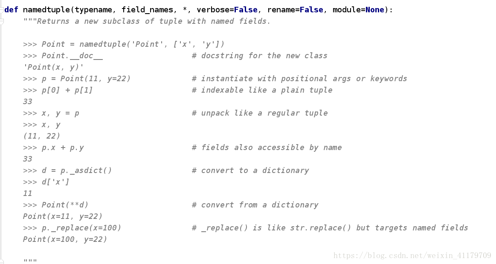
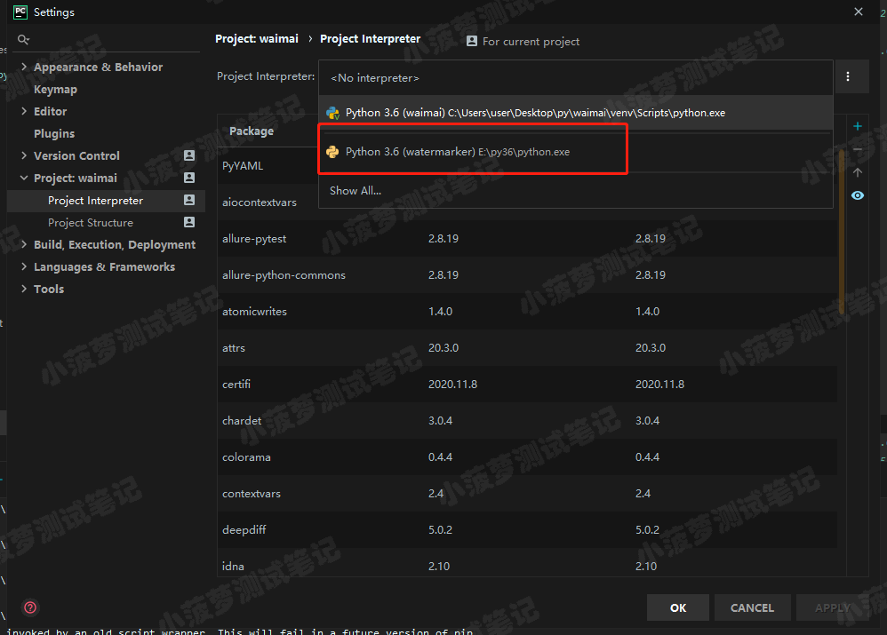
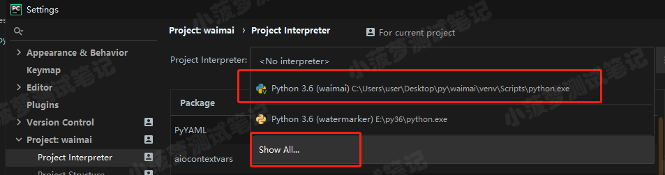
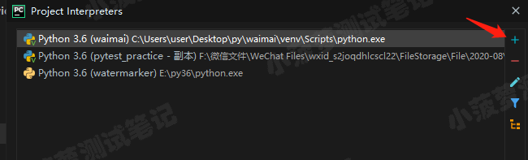
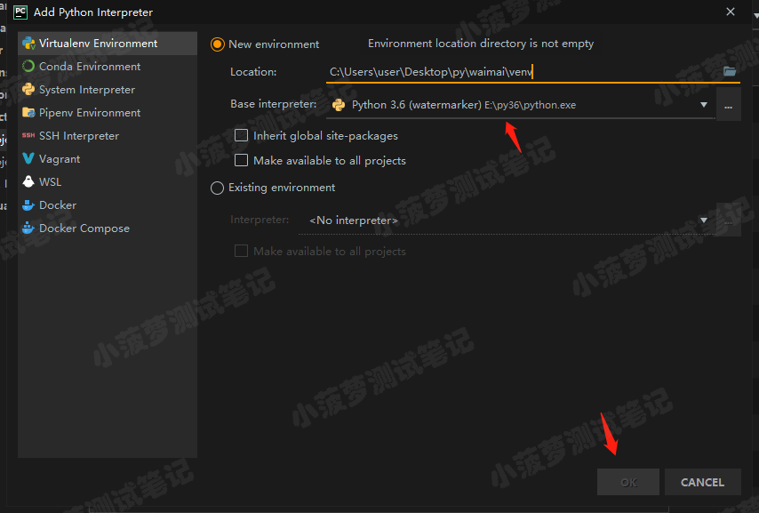
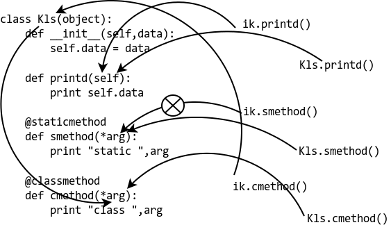
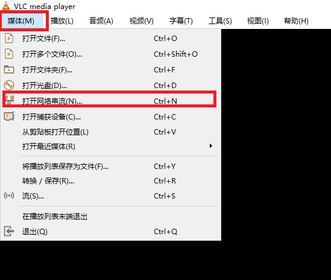
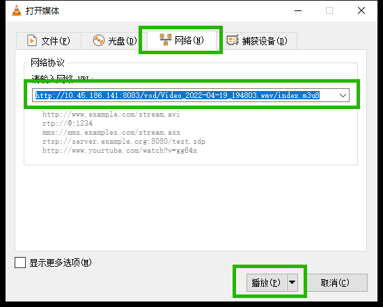

# Handbook

## Linux

- 查看 Java 程序堆内存使用情况

  ```shell
  jmap -heap <pid>
  ```

- 修改配置文件，将yum安装的rpm自动下载保存

  ```
  vi etc/yum.conf
  将keepcache=0修改为keepcache=1
  保存退出
  这样后面通过yum安装的rpm文件将会自动下载到/var/cache/yum/x86_64/7/*/packages
  项目组可以将packages中rpm文件打包用于现场安装和升级
  ```

- 查看内存槽数、哪些槽位插了内存及内存大小

  ```shell
  dmidecode | grep -P -A5 "Memory\s+Device" | grep Size | grep -v Range
  ```

- 查看最大支持内存数

  ```shell
  dmidecode | grep -P 'Maximum\s+Capacity'
  ```

- 查看槽位上内存的速率，没插的显示 unknown

  ```shell
  dmidecode | grep -A16 "Memory Device" | grep 'Speed'
  ```

- Linux 添加PATH 环境变量的几种方法（以添加 PYTHONPATH 为例）

  ```
  Linux下设置PYTHONPATH环境变量有三种方法：一种作用于当前终端，一种作用于当前用户，一种作用于所有用户。
  
  1.作用于当前终端，直接当前终端输入命令
    $ export PYTHONPATH=$PYTHONPATH:<你的要加入的路径>
    $ export PYTHONPATH=$PYTHONPATH:/home/hadoop/MyBI
    注1：'/home/hadoop/MyBI'是项目MyBI的项目名
    注2：作用范围当前终端，一旦当前终端关闭或在另一个终端中，则无效。
    注3：这种方式立即生效。
  
  2.作用于当前用户，修改当前用户目录下的'~/.bashrc'文件
    $ vi ~/.bashrc
    加入内容：
    export PYTHONPATH=$PYTHONPATH:/home/hadoop/MyBI
    也可以加入多个路径，用分号分隔
    export PYTHONPATH=$PYTHONPATH:<你的要加入的路径1>:<你的要加入的路径2>:等等
  
    注1：需要执行如下命令后生效（或者注销后重新登陆）
    $ source ~/.bashrc  
  
  3.作用于所有用户（需要root权限修改），修改'/etc/profile'文件
    $ vi /etc/profile
    加入内容：
    export PYTHONPATH=$PYTHONPATH:/home/hadoop/MyBI
    
    注1：需要执行如下命令后生效（或者注销后重新登陆）
    $ source /etc/profile
  ```


### Linux 标准输出、错误输出、标准输入

| 数字 | 含义         | 标准叫法                 |
| ---- | ------------ | ------------------------ |
| 0    | 标准输入     | stdin = standard input   |
| 1    | 标准输出     | stdout = standard output |
| 2    | 标准错误输出 | stderr = standard error  |

一些重定向的用法

```shell
1.想要把make输出的全部信息，输出到某个文件中，最常见的办法就是：
make xxx > build_output.txt
此时默认情况是没有改变2=stderr的输出方式，还是屏幕，所以，如果有错误信息，还是可以在屏幕上看到的。

2.只需要把make输出中的错误（及警告）信息输出到文件中ing，可以用：
make xxx 2> build_output.txt
相应地，由于1=stdout没有变，还是屏幕，所以，那些命令执行时候输出的正常信息，还是会输出到屏幕上，你还是可以在屏幕上看到的。

3.只需要把make输出中的正常（非错误，非警告）的信息输出到文件中，可以用：
make xxx 1> build_output.txt
相应地，由于2=stderr没有变，还是屏幕，所以，那些命令执行时候输出的错误信息，还是会输出到屏幕上，你还是可以在屏幕上看到的。

4.想要把正常输出信息和错误信息输出到分别的文件中，可以用：
make xxx 1> build_output_normal.txt 2>build_output_error.txt
即联合使用了1和2，正常信息和错误信息，都输出到对应文件中了。

5. 所有的信息都输出到同一个文件中：
make xxx > build_output_all.txt 2>&1
其中的2>&1表示错误信息输出到&1中，而&1，指的是前面的那个文件：build_output_all.txt 。
注意：上面所有的1,2等数字，后面紧跟着大于号'>' ，中间不能有空格
```


### vm.overcommit_memory & vm.overcommit_ratio

overcommit_memory: 有三个值可以配置
- 0: 用户申请内存的时候，系统会判断剩余的内存多少，如果不够的话那么就会失败
- 1: 用户申请内存的时候，系统不进行任何检查任务内存足够用，直到使用内存超过可用内存
- 2: 用户一次申请的内存大小不允许超过可用内存的大小

overcommit_ratio: 仅当 overcommit_memory 为 2 时，该参数才会生效，这个参数决定了系统可用内存的大小

计算公式:

```
(Physical-RAM-Size）* ratio / 100 + (Swap-Size)
  Physical-RAM-Size: 物理内存大小，具体为 free 命令回显中 Mem 行 Total 列的值
  Swap-Size: swap 内存大小，具体为 free 命令回显中 Swap 行 Total 列的值
  ratio: 即 overcommit_ratio 参数的配置值
```


### shell 异常处理的几个方法

1. 判断命令返回值

   ```shell
   #!/bin/sh
   cd /home/xxxx/
   if [ "$?"= "0" ]; then
      rm -rf *
   else
      echo "cannot change directory" 1>&2
      exit 1
   fi 
   ```

2. && 和 ||

   &&: 只有在shell1返回0（即正常）时，shell2才会执行，否则shell2根本就不执行

   ||: 在shell1执行失败时，shell2才会执行，否则shell2是不执行的

   ```shell
   cd /home/xxxx/ && rm -rf *
   cd /home/xxxx || error_exit "Cannot change directory"
   rm -rf *
   
   -------
   function error_exit {
     echo "$1" 1>&2
     exit 1
   }
   ```

3. trap


### Linux 内存管理之 RSS 和 VSZ

**RSS**( Resident Set Size )：常驻内存集合大小。表示相应进程在 RAM 中占用了多少内存，并不包含在 SWAP 中占用的虚拟内存。即使是在内存中的使用了共享库的内存大小也一并计算在内，包含了完整在 stack 和 heap 中的内存

**VSZ**( Virtual Memory Size)：虚拟内存大小。表明了该进程可以访问的所有内存，包括被交换的内存和共享库内存。

eg. 如果进程A的二进制文件大小为500KB，并且链接到了2500KB的共享库，有200KB的stack/heap大小，这200KB中又有100KB位于内存中，100KB位于[SWAP](https://so.csdn.net/so/search?q=SWAP&spm=1001.2101.3001.7020)空间中，并且加载了1000KB的共享库和400KB的自身二进制文件。则

​	RSS：400K + 1000K + 100K = 1500K

​	VSZ：500K + 2500K + 200K = 3200K


### ps 命令详解

> Linux ps （英文全拼：process status）命令用于显示当前进程的状态，类似于 windows 的任务管理器。

#### 基本内容

- 语法

  ```
  ps [options] [--help]
  ```

- 参数

  - ps 的参数非常多, 在此仅列出几个常用的参数并大略介绍含义
  - -A 列出所有的进程
  - -w 显示加宽可以显示较多的资讯
  - -au 显示较详细的资讯
  - -aux 显示所有包含其他使用者的进程

#### ps -aux

- au(x) 输出格式

  ```
  USER PID %CPU %MEM VSZ RSS TTY STAT START TIME COMMAND
  ```

  - USER: 进程拥有者
  - PID: 进程ID，进程的唯一标识符
  - %CPU: 占用的 CPU 使用率
  - %MEM: 占用的内存使用率
  - VSZ: 占用的虚拟内存大小(表示如果一个程序完全驻留在内存的话需要占用多少内存空间)
  - RSS: 占用的内存大小(常驻集大小)
  - TTY: 终端的次要装置号码 (minor device number of tty)
  - STAT: 该进程的状态:
    - D: 不可中断 Uninterruptible（usually IO）,不可被喚醒的睡眠狀態，通常這个程序可能在等待I/O的情況(ex>列印)
    - R: 运行，正在运行或在运行队列中等待
    - S: 进程处在睡眠状态(idle)，但可以被喚醒(signal)，表明这些进程在等待某些事件发生–可能是用户输入或者系统资源的可用性
    - T: 停止狀態(stop)，可能是在工作控制(背景暫停)或除錯 (traced) 狀態
    - Z: 僵死 ，进程已终止, 但进程描述符存在, 直到父进程调用wait4()系统调用后释放
    - W: 进入内存交换（从内核2.6开始无效）
    - <: 高优先序的行程
    - N: 低优先序的行程
    - L: 有些页被锁进内存 (实时系统或捱A I/O)
    - X: 死掉的进程
    - <: 高优先级
    - n: 低优先级
    - s: 包含子进程
    - +: 位于后台的进程组；
    - l: 多线程，克隆线程multi-threaded (using CLONE_THREAD, like NPTL pthreads do)
    - WCHAH: 正在等待的进程资源
  - START: 行程开始时间
  - TIME: 执行的时间
  - COMMAND:所执行的指令


#### ps -ef

- -e 显示所有进程
- -f 全格式
- -h 不显示标题
- -l 长格式
- r 只显示正在运行的进程
- x 显示没有控制终端的进程
- a 显示终端上的所有进程，包括其他用户的进程

ps -ef 命令输出格式

```shell
UID       PID       PPID      C     STIME    TTY       TIME         CMD
zzw      14124   13991      0     00:38      pts/0      00:00:00    grep --color=auto dae
```

- UID   ：程序被该 UID 所拥有

- PID   ：就是这个程序的 ID

- PPID  ：则是其上级父程序的ID

- C     ：CPU使用的资源百分比

- STIME ：系统启动时间

- TTY   ：登入者的终端机位置

- TIME  ：使用掉的CPU时间。

- CMD  ：所下达的是什么指令


#### 实例

查找指定进程格式：

```
ps -ef | grep 进程关键字
```

显示所有进程信息，连同命令行

```
ps -ef
```

显示进程信息：

```
ps -A 
```

显示指定用户信息

```
ps -u root //显示root进程用户信息
```


 


### sed 命令

- sed 递归替换当前目录下所有文件，将 x 替换为 y

  ```shell
  find . -type f -print0 | xargs -0 sed -i "s/x/y/g"
  ```


### iconv 命令详解

- 功能

  对于给定文件，把它的内容从一种编码转换成另一种编码

- 描述

  -f encoding :把字符从encoding编码开始转换。 

  -t encoding :把字符转换到encoding编码。 

  -l :列出已知的编码字符集合 

  -o file :指定输出文件 

  -c :忽略输出的非法字符 

  -s :禁止警告信息，但不是错误信息 

  --verbose :显示进度信息 

  -f和-t所能指定的合法字符在-l选项的命令里面都列出来了。 

- 举例

  列出当前支持的字符编码：

  ```shell
  iconv -l
  ```

  将文件file1转码,转后文件输出到fil2中： 

  ```shell
  iconv  -f EUC-JP-MS -t UTF-8 file1 -o file2   //没-o那么会输出到标准输出.
  ```

  实际需求，从hive中取出的数据是utf8的，要load到mysql中，gbk编码。所以在load之前要先对文件进行转码。

  ```shell
  mysql_cmd = "iconv -c -f utf-8 -t gbk ./data/al_ver_" + yesterday_time + ".xls -o ./data/GBK_al_ver_" + yesterday_time + ".xls "
  print(mysql_cmd)
  os.system(mysql_cmd)
   
  mysql_cmd = "mysql -h60.28.200.78 -uroot -pyeelion -A LogStat_RT  -e \"load data local  infile \'./data/GBK_al_ver_" + yesterday_time + ".xls ' into table HiveData_508\""
  print(mysql_cmd)
  os.system(mysql_cmd)
  ```

  


## MySQL


## ElasticSearch

- ES 查询可检索的内容

  ```
  curl 172.168.1.1:9200/_cat/
  ```

- ES 查询未分配的分片

  ```shell
  curl 172.168.1.1:9200/_cat/shards | grep 'UNASSIGNED'
  ```

- ES 查询集群健康状态

  ```shell
  curl 172.168.1.1:9200/_cluster/health?pretty
  ```

- 修改Es分片备份数：

  ```shell
  curl -XPUT 'http://ip:9200/_settings' -H 'Content-Type:application/json' -d '{"index":{"number_of_replicas":0}}'
  ```

- 修改每分钟编译次数

  ```shell
  curl -XPUT 'http://172.168.1.1:9200/_cluster/settings' -H 'Content-Type:application/json' -d '
  {
      "transient" : {
          "script.max_compilations_rate" : "2000/1m"
      }
  }'
  ```

- EsMaster 数量配置

  ```shell
  discovery_zen_minimum_master_nodes
  # 配置为 ES 节点数 / 2 + 1，例如：4 个 ES 节点，则备选举的节点数=4/2+1=3
  ```

  


## YARN

- 下载某个 Yarn 任务的日志

  ```shell
  yarn logs -applicationId <id>
  ```

  


## HBase


## Hive

- Hive 后台登录命令

  ```shell
  beeline -u jdbc:hive2://172.168.1.1:10000 -n hive -p hive
  ```

- Hive 删除数据库

  ```
  drop database if exists [database] cascade;
  # 删除完成后，需要同步删除 HDFS 上的目录
  ```

  


## GP

- GP 后台登录命令

  ```shell
  psql -h [ip] -p [port] [database] [username]
  ```

- GP 删除数据库

  ```sql
  drop database [database];
  ```

- GP 查询数据库连接

  ```sql
  select * from pg_stat_activity where DATNAME = '[database]';
  ```

- GP 解除数据库所有连接

  ```sql
  select pg_terminate_backend(procpid) from pg_stat_activity where DATNAME = '[database]';
  ```

- GP 查看 segment 信息

  ```sql
  SELECT * from gp_segment_configuration  order by status,role;
  ```

- GP 修复 down 掉的 segment

  ```shell
  gprecoverseg -a
  ```

- GP 状态查询命令

  ```shell
  # 查看状态
  gpstate
  # 查看mirror的状态
  gpstate -e
  # 查看 standby master 的状态
  gpstate -f
  # 查看整个 GP 群集的状态
  gpstate -s
  # 查看 GP 的版本
  gpstate -i
  # 帮助文档，可以查看gpstate更多用法
  gpstate --help
  # 其他 gpstatus 命令参数
  gpstate -b => 显示简要状态
  gpstate -c => 显示主镜像映射
  gpstart -d => 指定数据目录（默认值：$MASTER_DATA_DIRECTORY）
  gpstate -e => 显示具有镜像状态问题的片段
  gpstate -f => 显示备用主机详细信息
  gpstate -i => 显示GRIPLUM数据库版本
  gpstate -m => 显示镜像实例同步状态
  gpstate -p => 显示使用端口
  gpstate -Q => 快速检查主机状态
  gpstate -s => 显示集群详细信息
  gpstate -v => 显示详细信息
  ```

- GP服务启停

  ```shell
  # 正常启动
  gpstart
  # 正常关闭
  gpstop
  # 快速关闭
  gpstop -M fast
  # 重启
  gpstop –r
  # 重新加载配置文件
  gpstop –u
  ```

- 将本地文件拷贝到库表中

  ```shell
  psql -h$gphost -U$gpuser -p$gpport -d $gpdatabase -c "\copy $gptable from '$1/$file'"
  ```

- PSQL 快捷指令

  ```
  \l    列举数据库
  \c    选择/切换数据库
  \dt   查看某个库中的所有表
  \d    查看表结构
  \q    退出 psql
  ```
  


## Zookeeper

Zookeeper 客户端登录命令：

```shell
./zkCli.sh -server ip:port
```

Zookeeper 基本命令：

```
# 查看目录下所有文件夹
ls /xxx/xxx
# 创建 znode
create /xxx/xxx
```


## Kafka

修改 Topic 分区数

```shell
kafka-topics.sh --alter --topic one14 --zookeeper rhino74:2181 --partitions 3
```

查看消费组消费情况

```shell
kafka-consumer-groups.sh --bootstrap-server rhino221:9092 --group zww_topic_group510 --describe
```


## Redis

登录命令

```
./redis-cli -h ip -p port -a password
```


## Python

### 清华pypi镜像部分包的直接地址

```
# pip
https://pypi.tuna.tsinghua.edu.cn/simple/pip/
# setuptools
https://pypi.tuna.tsinghua.edu.cn/simple/setuptools/
```


### namedtuple 用法

> **namedtuple是继承自tuple的子类。namedtuple创建一个和tuple类似的对象，而且对象拥有可访问的属性。**
>
> 因为元组的局限性：不能为元组内部的数据进行命名，所以往往我们并不知道一个元组所要表达的意义，
> 所以在这里引入了 collections.namedtuple 这个工厂函数，来构造一个带字段名的元组。
> 具名元组的实例和普通元组消耗的内存一样多，因为字段名都被存在对应的类里面。这个类跟普通的对象
> 实例比起来也要小一些，因为 Python 不会用 __dict__ 来存放这些实例的属性。

实现方法

```python
from collections import namedtuple
```

源代码



用法示例

```python
def namedtuple(typename, field_names, *, verbose=False, rename=False, module=None):
#    - typename: 元组名称
#    - field_names : 元组中元素的名称
#    - rename: 如果元素名称中包含python关键字， 必须设置rename=True
```

```python
from collections import  namedtuple

User = namedtuple('User', ['name', 'age', 'gender'])
u = User('villa', 33, 'male')
print(u.name)
print(u.age)
print(u.gender)
print(u)
```


### Pycharm 快捷键

```
批量注释    Ctrl+/
```


### Pychram 设置环境与导出环境

Pycharm 每个项目都需要设置环境，即 Porject Interpreter，这个环境有几种设置方法
1、将 Interpreter 设置为本机安装路径，如下图所示



优势：所有项目依赖包只需要装一遍即可
劣势：依赖环境的第三方库会有非常多，在某个项目的第三方库并不需要很多时，如果此时用这个 interpreter 生成 requirement.txt 就会有很多无关紧要的库，不利于打包部署

2、创建 Virtualenv Environment
此方法给项目分配一个单独的 Porject Interpreter






优势：单个项目有一个独立的环境，相关依赖包会与项目紧密相关，不会存在多余无用的依赖包
劣势：不同项目之间需要重新下载依赖包

环境依赖包导出
基本操作
1、进入对应环境，使用 `python.exe -m pip freeze > requirements.txt` 生成该环境的 requirements 文件（Windows）
2、联网环境下：使用这个 requirements.txt 文件，通过命令 `pip install -r requirements.txt`直接安装

离线环境下的操作

1、进入对应环境，使用 `python.exe -m pip freeze > requirements.txt` 生成该环境的 requirements 文件（Windows）

2、在联网环境下，使用 `pip download -r requestments.txt -d ./pip_packages ` 将所有依赖包存储在 pip_packages 目录下

3、将包和环境文件，拷贝到离线环境下，使用 `pip install --no-index --find-links=./pip_packages -r requestments.txt ` 离线安装所有包

​	（--find-links指定的是包文件的存放地址，-r指定的是txt文件的位置）

如果 Pycharm 使用的是系统 Python 环境，则到系统 Python 环境下安装，如果 Pycharm 使用的是虚拟环境，则到项目目录下的 venv/Scripts 下，有一个 python.exe，利用 venv/Scripts 下的 python.exe 生成 requirement.txt


### Python 文件的读写模式

```
r :读取模式（默认值）
w:写入模式
x:独占写入模式
a：附加模式
b:二进制模式
t：文本模式（默认值，与其他模式结合使用）
+：读写模式（与其他模式结合使用）
r+： 打开文件进行读写，会覆盖文件原内容，重新写入；若文件不存在，则会报错
w+：打开一个文件用于读写。如果该文件已存在则打开文件，并从开头开始编辑，即原有内容会被删除。如果该文件不存在，创建新文件
a+：打开一个文件用于读写。如果该文件已存在，文件指针将会放在文件的结尾。文件打开时会是追加模式。如果该文件不存在，创建新文件用于读写。
```


### pip 命令

```
pip [download/install]
 -i: 指定下载源
 -d: 指定下载目录
# 导出当前 Python 环境到一个文件
pip freeze > requirements.txt
# 下载 Python 环境的所有包到一个目录
pip download -d C:\Users\Administrator\Desktop\我的脚本\ZTCHS_Checker\pack -r requirements.txt# 导出当前 Python 环境到一个文件
pip freeze > requirements.txt
# 下载 Python 环境的所有包到一个目录
pip download -d C:\Users\Administrator\Desktop\我的脚本\ZTCHS_Checker\pack -r requirements.txt
# 指定清华镜像站，下载包到一个指定目录
pip download -d C:\Users\Administrator\Desktop\我的脚本\ZTCHS_Checker\pack -i https://pypi.tuna.tsinghua.edu.cn/simple setuptools
# 使用清华镜像站更新一个包
pip install -i https://pypi.tuna.tsinghua.edu.cn/simple pip -U
```


### datetime 模块

```python
# 字符串转 datetime 对象
datetime.datetime.strptime(data_str, "%Y-%m-%d %H:%M:%S")
# datetime 对象转字符串
datetime.xxx.xxx.strftime("%Y-%m-%d %H:%M:%S")
# 获取当前时间时间戳
datetime.datetime.now().timestamp()
# 如果不需要带毫秒
int(datetime.datetime.now().timestamp())
```


### @classmethon & @staticmethod

> 结论：
>
> 我们要写一个只在类中运行而不在实例中运行的方法时，可以使用 @classmethon 装饰器来创建方法
>
> 我们要写一个跟类有关系，但在运行时又不需要实例和类参与的方法时，可以使用 @staticmethod 装饰器来创建方法，staticmethod 方法可以在不创建实例的情况下直接调用

下面一个示例来演示这两个装饰器的使用方法和区别：

```python
class Kls(object):
    def __init__(self, data):
    	self.data = data
    def printd(self):
    	print(self.data)
    @staticmethod
    def smethod(*arg):
    	print('Static:', arg)
    @classmethod
    def cmethod(*arg):
    	print('Class:', arg)

 
>>> ik = Kls(23)
>>> ik.printd()
23
>>> ik.smethod()
Static: ()
>>> ik.cmethod()
Class: (<class '__main__.Kls'>,)
>>> Kls.printd()
TypeError: unbound method printd() must be called with Kls instance as first argument (got nothing instead)
>>> Kls.smethod()
Static: ()
>>> Kls.cmethod()
Class: (<class '__main__.Kls'>,)
```




## Spark

- RDD 分区数（在指定分区的情况下：partitionBy() 函数设定的分区值），至少应该和集群中的总核心数一样。
- 不涉及修改键记录的大部分 Spark 都能利用到已有的分区信息（比如我们手动指定的分区），但可能修改键记录的操作则可能导致子RDD 失去父 RDD 的分区信息，从而无法利用已有分区信息。
- 所有引入了将数据根据键跨节点进行混洗的操作，都能从数据分区中获益：cogroup()、groupWith()、join()、leftOuterJoin()、rightOuterJoin()、groupByKey()、reduceByKey()、combineByKey()、lookup()


## Vim

撤销修改：
```
u / :u：撤销上一次更改
U / :U：撤销单行内的所有修改
:undo：用来撤销删除、粘贴、搜索、替换等命令，与u命令有较多重合
```
重做修改：`Ctrl+R` 或 `:redo`


## SQL

### MySQL 添加字段描述

- 创建表时添加，使用关键词 COMMENT 在需要添加的字段定义后面，下方为例

  ```sql
  CREATE TABLE userinfo(
  id INT COMMENT '编号',
  uname VARCHAR(40) COMMENT '用户名',
  address VARCHAR(120) COMMENT '家庭住址',
  hobby VARCHAR(200) COMMENT '爱好'
  )COMMENT = '用户信息表';
  ```

- 修改表以添加

  ```sql
  ALTER TABLE userinfo COMMENT '用户信息资料表';
  ALTER TABLE userinfo MODIFY COLUMN uname VARCHAR(40) COMMENT '姓名';
  ```

- 查看表描述的方法

  ```sql
  # 在生成的 SQL 语句中查看
  SHOW CREATE TABLE userinfo;
  # 在元数据表里查看
  USE information_schema;
  SELECT * FROM TABLES WHERE TABLE_SCHEMA='shoppingcart' AND TABLE_NAME='userinfo';
  ```

- 查看字段描述的方法

  ```sql
  # 在生成的 SQL 语句中查看
  SHOW FULL COLUMNS FROM userinfo;
  # 在元数据的表里面看
  SELECT * FROM COLUMNS WHERE TABLE_SCHEMA='shoppingcart' AND TABLE_NAME='userinfo';
  ```


##  Git

### 常用命令

```shell
# 从版本库中删除某个文件
|-- git rm xxx
|-- git commit -m " remove xxx"
```


 ### .gitignore 文件

- 配置示例

  ```
  # 忽略 .a 文件
  *.a
  
  # 但否定忽略 lib.a, 尽管已经在前面忽略了 .a 文件
  !lib.a
  
  # 仅在当前目录下忽略 TODO 文件， 但不包括子目录下的 subdir/TODO
  /TODO
  
  # 忽略 build/ 文件夹下的所有文件
  build/
  
  # 忽略 doc/notes.txt, 不包括 doc/server/arch.txt
  doc/*.txt
  
  # 忽略所有的 .pdf 文件 在 doc/ directory 下的
  doc/**/*.pdf
  ```

- 配置模板

  ```
  Github 上为开发者提供了各种环境以及各种编程语言的 gitignore 文件配置模板：https://github.com/github/gitignore
  python项目的gitgnore文件 url:https://github.com/github/gitignore/blob/master/Python.gitignore
  ```

- 全局`.gitignore`设置方法( 这个文件将作用于所有 git 项目，并且作用于项目实例中的所有被跟踪的目录)

  ```
  git config --global core.excludesfile ~/.gitignore
  ```

- 局部`.gitignore`直接在项目目录中创建文件即可


## Nginx

### 基于 Nginx 的视频服务器搭建

> Nginx-1.20.2 + nginx-vod-module-1.28
>
> nginx-vod-module 是基于 Nginx 的视频流处理的第三方模块，详细的功能和配置可以上网查询，本文仅讲解最基本的网络点播服务的搭建


- 环境准备

  ```shell
  yum install -y pcre pcre-devel gcc-c++
  ```

- 上传安装包

  ```
  nginx-1.20.2.tar.gz
  nginx-vod-module-1.28.tar.gz
  ```

- 解压这些安装包

- 进入 nginx-1.20.2 目录，配置安装参数

  ```shell
  ./configure --prefix=/home/videoSrv/nginx --with-http_stub_status_module --with-http_ssl_module --with-cc-opt='-O0 -gstabs+3' --with-debug --add-module=/home/videoSrv/nginx-vod-module
  ```

- 编译安装

  ```shell
  make
  make install
  ```

- 配置 Nginx，添加如下内容（基础nginx配置不赘述，正常配置即可）

  ```nginx
  location /vod {
      vod hls;
      vod_mode local;
  
      vod_align_segments_to_key_frames on;
      vod_manifest_segment_durations_mode accurate;
  
      add_header Access-Control-Allow-Headers '*';
      add_header Access-Control-Expose-Headers 'Server,range,Content-Length,Content-Range';
      add_header Access-Control-Allow-Methods 'GET, HEAD, OPTIONS';
      add_header Access-Control-Allow-Origin '*';
  
      alias /home/videoSrv/media;
  }
  ```

- 新建视频存放目录：/home/videoSrv/media

- 存放视频

- 下载 VLC 本地播放器或 H5 播放器，此处以 VLC 播放器为例

- 视频访问链接

  ```
  http://10.0.0.1:8083/vod/example.mp4/index.m3u8
  
  - 10.0.0.1:8083：Nginx 服务的地址和端口
  - example.mp4：为视频名称
  - index.m3u8：为链接默认配置，不需要改动
  ```

- 打开 VLC 播放器

- 配置网络串流

  

  

- 此时，即可正常播放视频


### Nginx 实现文件下载

先看配置文件

```

server {
     listen    80;
     server_name  localhost;
 
     location ^~ /download/ {
        alias /home/webhtml/;
 
        if ($request_filename ~* ^.*?\.(html|doc|pdf|zip|docx|txt)$) {
            add_header Content-Disposition attachment;
            add_header Content-Type application/octet-stream;
        }
            sendfile on;   # 开启高效文件传输模式
            autoindex on;  # 开启目录文件列表
            autoindex_exact_size on;  # 显示出文件的确切大小，单位是bytes
            autoindex_localtime on;  # 显示的文件时间为文件的服务器时间
            charset utf-8,gbk;  # 避免中文乱码
      }
}
```

关键点解析：

```
server_name  localhost;  代表服务名，在这里直接访问 127.0.0.1就可以。如果是别的机器访问这台机器。则直接替换成这台机器的地址即可。

 location ^~ /download/ 带边的是拦截包含 download的请求

 alias /home/webhtml/;  是来配置下载文件的路径，也就是提供下载的文件要在这个路径下。

  if ($request_filename ~* ^.*?\.(html|doc|pdf|zip|docx|txt)$) {
            add_header Content-Disposition attachment;
            add_header Content-Type application/octet-stream;
        }
```

使用方法

首先把一个待下载的文件放在：/home/webhtml/ 目录下

然后就可以用这个url来下载文件了(本机访问)： 127.0.0.1/download/hello.txt

一般都是对外提供下载的（假设我这台部署nginx的机器是：10.2.5.10）：10.2.5.10/download/hello.tx  

我们可以知道的是，带有download的路径被拦截了，加上我们配的文件路径，最后去取文件：

/home/webhtml/hello.txt
