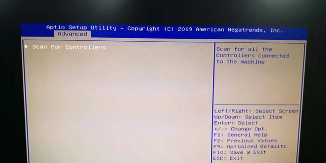

# PM8060 RAID 阵列卡热备盘设置(基于浪潮服务器)

> 浪潮服务器常见的阵列卡类型
> 1.LSI 9361-8I 这类阵列卡应用比较广泛，配置阵列直接进入到9361-8I的配置界面就可以配置了，功能都在里面，配置也比较简单，唯一要注意的就是开机需要设置BOIS里Boot Mode的模式，默认是UEFI MODE，需要改成Legacy,这样开机自检才能检测到阵列卡。
>
> 2.PM8060 这类阵列卡在做冗余热备盘的设置时，在自检到阵列卡后进入阵列卡里设置，没有提供相关的热备盘设置功能，要想做热备盘必须在BIOS里PMC选项里做。

1. BIOS里设置Boot Mode的模式为 UEFI模式，设置成这个模式才可以在BIOS里配置阵列信息。

   开机F2进入BIOS-->Advanced-->CSM Configuration-->Boot Mode [UEFI mode]-->storage [UEFI]

   

   

   将Boot Mode 和 storage两个选项默认的Legacy改成UEFI Mode后，保存设置重启。

2. 重启后进入BIOS 里PMC选项进行阵列卡设置，8块硬盘选择7块做RAID 5后返回再选择GLOBAL Hotspares里设置热备盘。

   BIOS-->Advanced-->PMC maxVlew storage Manager-->Scan For Controllers-->Controller #0 PM8060-RAID-->Logical Device Configuration-->Global Hotspares-->ADD

   

   

   

   

   

   

   在Create Array里创建新的阵列，选择7块硬盘组建RAID 5 完成后再做热备盘设置

   

   选择ADD选项，设置剩下的硬盘为热备盘即可

   设置完成后按F10 保存并退出。

3. 全部配置完后需要再把Boot Mode模式改成Legacy，这样开机自检才能检测到阵列卡，并从阵列卡启动。

   

