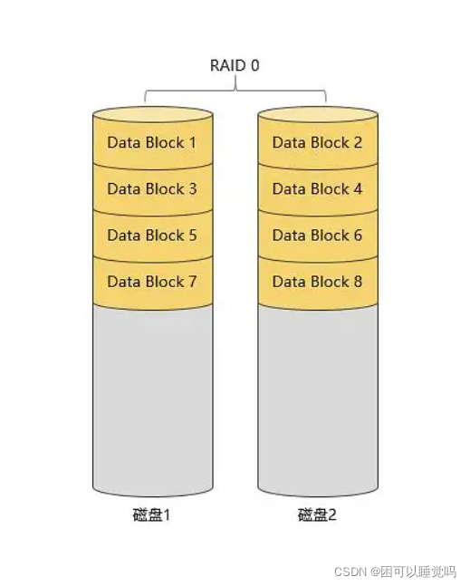
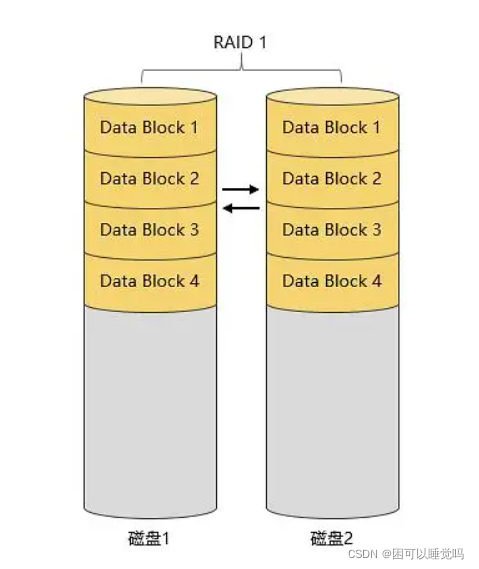
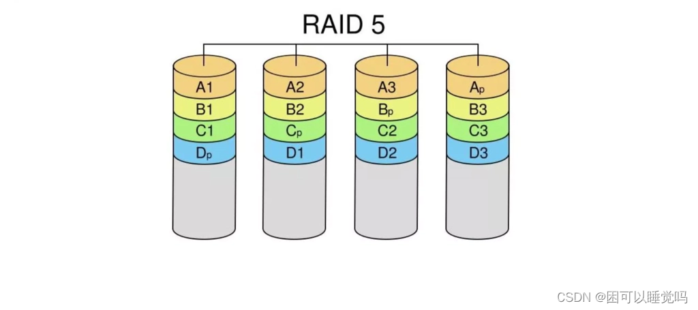
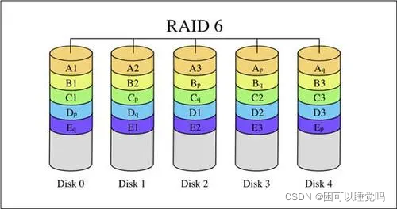
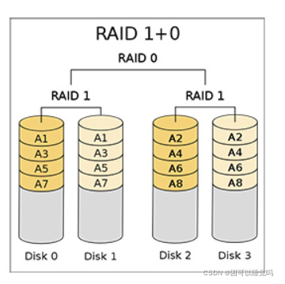
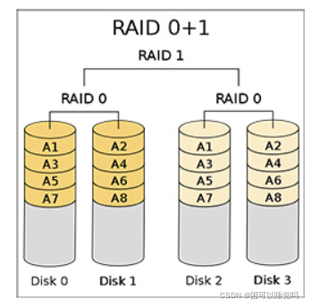

# RAID 阵列方案解析

## RAID 介绍

1. RAID是Redundant Array of Independent Disks的缩写，中文简称为独立冗余磁盘阵列
2. 把多块独立的物理硬盘按不同的方式组合起来形成一个硬盘组(逻辑硬盘)，从而提供比单个硬盘更高的存储性能和提供数据备份技术
3. RAID技术分为几种不同的等级，分别可以提供不同的速度，安全性和性价比。根据实际情况选择适当的RAID级别可以满足用户对存储系统可用性、性能和容量的要求
4. 组成磁盘阵列的不同方式称为RAID级别(RAID Levels)
5. 常用的RAID级别：RAID 0，RAID 1，RAID 5，RAID 6，RAID 1+0 等

## 阵列卡介绍

- 阵列卡是用来实现RAID功能的板卡
- 通常是由I/O处理器、硬盘控制器、硬盘连接器和缓存等一系列组件构成的
- 不同的RAID卡支持的RAID功能不同，例如支持RAID0、 RAID1、 RAID5、 RAID10等
- RAID卡的接口类型 IDE接口、SCSI接口、SATA接口和SAS接口
  - IDE接口（并行接口，价格低廉，兼容性强）
  - SCSI接口（串行接口，是小型计算机系统接口，广泛应用于小型机上的高速数据传输技术，支持热拔插，CPU占用率低，但是价格高）
  - SATA接口（串行接口）
  - SAS接口（新一代scsi接口，向下兼容SATA）

阵列卡的缓存：

- 缓存(Cache)是RAID卡与外部总线交换数据的场所,RAID卡先将数据传送到缓存，再由缓存和外边数据总线交换数据。
- 缓存的大小与速度是直接关系到RAID卡的实际传输速度的重要因素，大缓存可以提高命中率
- 不同的RAID卡出厂时配备的内存容量不同，一般为几兆到数百兆容量不等。

## 各 RAID 级别介绍

### RAID 0（条带化存储）

数据存储模型

- RAID 0连续以位或字节为单位进行分割数据，将数据分段存储在各个硬盘中，n块硬盘并行读/写数据，因此具有很高的数据传输率，可以达到单个硬盘的N倍，但它没有数据冗余；
- RAID 0只是单纯地提高性能，并没有为数据的可靠性提供保证，而且其中的一个磁盘失效将影响到所有数据，因此并不能算真正的RAID结构；
- RAID 0不能应用于数据安全性要求高的场合。

特点：

（1）最少需要两块磁盘

（2）数据条带分布式

（3）没有冗余，性能最佳（不存储镜像、不校验信息）

（4）不能应用于对数据安全性要求高的场合

### RAID 1（镜像存储）

数据存储模型

- 通过磁盘数据镜像实现数据冗余，在成对的独立磁盘上产生互为备份的数据
- 当原始数据繁忙时，可直接从镜像拷贝中读取数据,因此RAID1可以提高读取性能
- RAID 1 是磁盘阵列中单位成本最高的，但提供了很高的数据安全性和可用性。当一个磁盘失效时，系统可以自动切换到镜像磁盘上读写,而不需要重组失效的数据
- N（偶数）块硬盘组成镜像，容量为N/2

特点：

（1）最少需要两块磁盘

（2）提供数据冗余（提供备份）

（3）性能好

（4）N（偶数）块硬盘组成镜像，容量为N/2

### RAID 5（奇偶校验）

数据存储模型

- N (N>=3) 块盘组成阵列，一份数据产生N-1个条带，同时还有1份校验数据,共N份数据在N块盘上循环均衡存储
- N块盘同时读写，读性能很高，但由于有校验机制的问题，写性能相对不高；
- (N-1) /N磁盘利用率（有一块是用来校验的）；
- 可靠性高，允许坏1块盘，不影响所有数据

特点：

（1）最少3块磁盘

（2）数据条带形式分布

（3）以奇偶校验作冗余

（4）适合多读少写的情景，是性能与数据冗余最佳的折中方案

### RAID 6

数据存储模型

- N（N≥4）块盘组成阵列，(N-2) /N磁盘利用率
- 与RAID 5相比，RAID 6增加了第二个独立的奇偶校验信息块
- 两个独立的奇偶系统使用不同的算法，即使两块磁盘同时失效也不会影响数据的使用
- 相对于RAID 5有更大的"写损失" ，因此写性能较差

### RAID 1+0 （RAID 10）

先做镜像，再做条带

数据存储模型

- N (偶数，N>=4)。块盘两两镜像后，再组合成一个RAID 0
- N/2磁盘利用率
- N/2块盘同时写入，N块盘同时读取
- 性能高，可靠性高

特点：

（1）最少4块磁盘

（2）先按RAID 0 分成两组，再分别对两组按RAID 1 方式镜像

（3）兼顾冗余（提供镜像存储）和性能（数据条带形式分布）

（4）在实际应用中较为常用

### RAID 0+1

先做条带，再做镜像

数据存储模型

- 读写性能与RAID 1+0相同；
- 安全性低于RAID 1+0；
- 使用较少。

### 各级别 RAID 对比

| RAID级别 | 硬盘数量    | 硬盘使用率 | 是否有校验 | 保护能力               | 写性能                     |
| -------- | ----------- | ---------- | ---------- | ---------------------- | -------------------------- |
| RAID 0   | N           | N          | 无         | 无                     | 单个硬盘的N倍              |
| RAID 1   | N(偶数)     | N/2        | 无         | 允许一个设备故障       | 需写两对存储设备，互为主备 |
| RAID 5   | N≥3         | (N-1)/N    | 有         | 允许一个设备故障       | 需写计算校验               |
| RAID 6   | N≥4         | (N-2)/N    | 有         | 允许两个设备故障       | 需双重写计算校验           |
| RAID 10  | N≥4（偶数） | N/2        | 无         | 允许两个基组中各坏一个 | N/2块盘同时写入            |

## RAID 热备盘

### 热备盘介绍

与CPU系统电连接的硬盘，它能替换下系统中的故障盘。与冷备份的区别是，冷备份盘平时与机器不相连接，硬盘故障时才换下故障盘。

当一个正在使用的磁盘发生故障后，一个空闲、加电并待机的磁盘将马上代替此故障盘，此方法就是热备用。热备用磁盘上不存储任何的用户数据，最多可以有8个磁盘作为热备用磁盘。

一个热备用磁盘可以专属于一个单一的冗余阵列或者它也可以是整个阵列热备用磁盘池中的一部分。而在某个特定的阵列中，只能有一个热备用磁盘。

当磁盘发生故障时，控制器的固件能自动的用热备用磁盘代替故障磁盘，并通过算法把原来储存在故障磁盘上的数据重建到热备用磁盘上。

数据只能从带有冗余的逻辑驱动器上进行重建(除了RAID 0以外)，并且热备用磁盘必须有足够多的容量。

系统管理员可以更换发生故障的磁盘，并把更换后的磁盘指定为新的热备用磁盘。

### RAID 热备盘工作模式

Local Spare 特定热备：针对某一RAID组，只有该组硬盘出现问题后才启用恢复

Globe Spare 全局热备：针对所有RAID组，只要某一个RAID组出现问题就进行恢复

Enclosure Spare 机框热备：针对盘柜，只会作用于该磁盘所在盘柜，当该磁盘所在盘柜中RIAD组故障才进行恢复

### 总结

热备盘总是和RAID5阵列对应起来，如果不是RAID5级别(或者以上)的阵列，就没有必要创建热备盘。

因为当别的硬盘损坏、热备盘自动起用时，需要用RAID5阵列中未损坏的硬盘对热备盘进行数据重建。

注意在数据重建过程中不能插拔阵列中的非损坏硬盘!

一旦正常开始数据重建，我们就可以更换损坏的硬盘了，更换后的硬盘会自动成为新的热备盘。

不管是是raid1，raid10，raid5等等都好，他们要不要热备盘都可以的，但是为了更安全稳定，在规划raid方案的时候还是建议你配上热备盘的！
