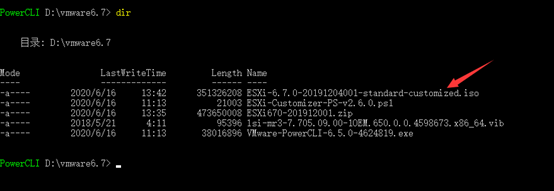

# VMware EXSi 整合 RAID 卡驱动
## 一、问题介绍

VMware EXSi 6.7 在浪潮服务器（PM8060 RAID 卡）上安装时，无法扫描到已经做好 RAID 的阵列，原因是EXSI的安装包无浪潮服务器的raid驱动，需要自己手工将驱动打上


## 二、准备软件

> 封装好驱动的系统镜像：浪潮安装EXSI6.7和EXSI6.5 带raid驱动版
>
> 下载地址
> 链接：https://pan.baidu.com/s/1ZL9ksRtAmfzdcltblTj_9A
> 提取码：sktr
>
> 封装需要的软件下载地址（网友整理）：
>
> 下载地址
> 链接：https://pan.baidu.com/s/1r_398tA_TCymemMuouGJnA
> 提取码：he43

需要准备的软件：

-  VMware-PowerCLI，前往 VMware 官网下载或使用上方提供的百度网盘
-  ESXi-Customizer-PS，前往 VMware 官网下载或使用上方提供的百度网盘
-  ESXi6.7 镜像包，zip 版本，前往 VMware 官网下载或使用上方提供的百度网盘，注意需要下载 zip 格式
-  RAID 卡驱动包 DRV-ESX67-ADAP.zip，如果不是浪潮服务器的 PM8060 驱动卡，请注意从服务器官网获取对应驱动，不可使用本驱动文件


## 三、开始封装

### 3.1 安装 VMware PowerCLI

系统下安装VMware-PowerCLI-6.5.0-4624819.exe文件；

安装完成后，桌面会生成一个图标VMware PowerCLI：


运行该图标解除Powershell禁止运行脚本限制

命令：

使用get-executionpolicy查看状态确实为Restricted

使用set-executionpolicy remotesigned将属性从Restricted更改为remotesigned，如下图，输入A，完成后，将此窗口关闭


再重新打开VMware vSphere PowerCLI显示就可以加载脚本正常运行


开始注入RAID卡驱动

打开PowerCLI，把vib格式的驱动程序、Customer-PS、以及Zip格式的系统镜像包(下载zip版本镜像非iso版本)都放到一个路径下，如下图：进入需要整合镜像的文件夹


执行整合命令,等待整合完成

```shell
.\ESXi-Customizer-PS-v2.6.0.ps1 -izip .\ESXi670-201912001.zip -pkgDir D:\vmware6.7

# 备注：ESXi670-201912001.zip为zip镜像版本，请参考实际下载的文件名字。
# D:\vmware6.7为整合镜像所在的目录，请参考实际创建的目录，并该目录不能带中文。
```


查看本地磁盘d:\vmware 文件夹已生成整合后的镜像iso文件





## 可能遇到的问题

1. 整合PM8060的RAID卡会提示校验签名失败(could not find a trusted signer )，需要在命令的最后添加一个 “-nsc”不校验签名的参数

```shell
.\ESXi-Customizer-PS-v2.6.0.ps1 -izip .\ESXi670-201912001.zip -pkgDir D:\vmware6.7 -nsc
```

2. 若增加参数-nsc依然报错，请参考步骤3命令可以修改为Set-ExecutionPolicy Bypass，然后继续执行后续命令，选择全是：A

   

   