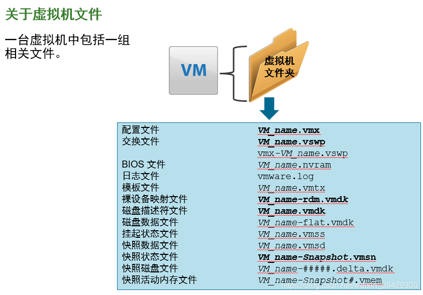
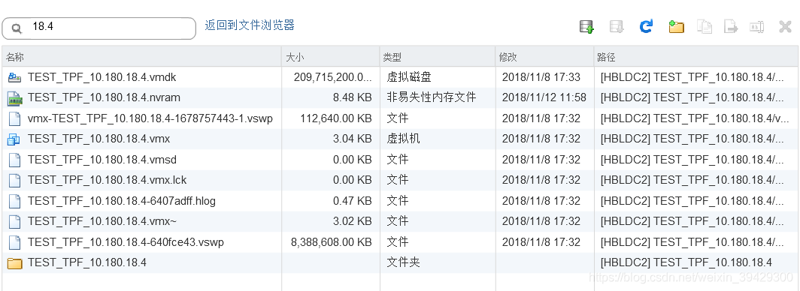
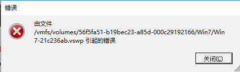
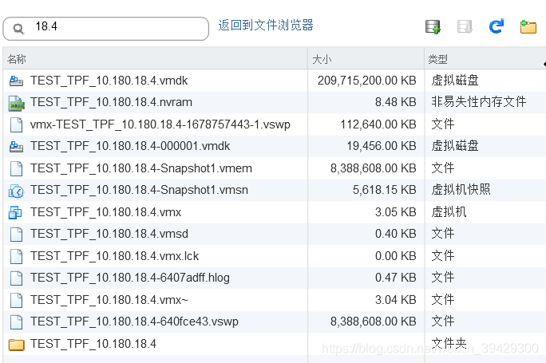
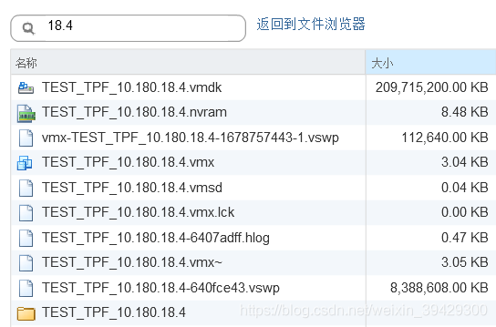
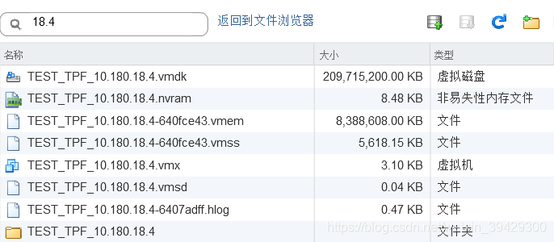
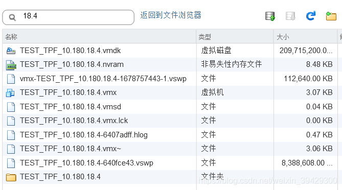
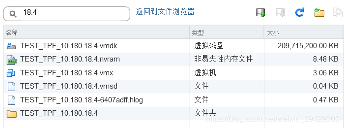

# vmware 虚拟机文件组成探索

VMware将一台台的虚拟机封装成一个文件夹到数据存储中
在虚拟机完成安装，正常开机，未做快照、挂起等操作时，虚机文件如下：

- 开机状态下

  

  - .vmdk
    该文件是虚拟机的磁盘文件，它储存了虚拟机硬盘驱动器里的信息。
    一台虚拟机可以由一个或多个虚拟磁盘文件组成，如果在新建虚拟机时指定虚拟机磁盘文件为单独一个文件时，系统将只创建一个.vmdk文件，该文件包括了虚拟机磁盘分区信息，以及虚拟机磁盘的所有数据。随着数据写入虚拟磁盘，虚拟磁盘文件将变大，但始终只有这一个磁盘文件。如果在新建虚拟机时指定为每2GB单独创建一个磁盘文件的话，虚拟磁盘总大小就决定了虚拟磁盘文件的数量。系统将创建一个.vmdk文件和多个-s###.vmdk文件（s###为磁盘文件编号），其中.vmdk文件只包括磁盘分区信息，多个-s###.vmdk文件存储磁盘数据信息。随着数据写入某个虚拟磁盘文件，该虚拟磁盘文件将变大，直到文件大小为2GB，然后新的数据将写入到其他s###编号的磁盘文件中。

  - .nvram
    可以理解为是虚拟机的BIOS文件，这个小型文件包括虚拟机启动过程的BIOS信息。它类似于拥有BIOS芯片的物理服务器，能够设置硬件配置选项。一台虚拟机也应该在NVRAM文件里有虚拟BIOS。当虚拟机首次启动时，按F2键可以访问BIOS。不管虚拟机的硬盘配置发生了什么变化，都会保存在NVRAM文件里。如果删除这个文件的话，在虚拟机启动时会自动地重新创建。
    vmx-虚机名-数字串.vswp
    是当前已使用的内存缓存文件，我们可以打开虚拟机查看当前内存，便会发现已使用的内存大小和该文件大小相同

  - .vmx
    虚拟机配置文件，这个文件包括虚拟机所有配置信息与硬件设置。不管对虚拟机的设置作了何种编辑，所有的信息都会以文本形式保存在这个文件里。这个文件包括与虚拟机有关的多种信息，如特殊硬件配置，高级能源与资源设置、VMware工具选项以及能源管理选项。
    可以手动的对此文件进行编辑，在出现故障时，我们也可以通过配置文件与虚拟磁盘vmdk文件，来实现虚拟机的快速恢复。因为我们也可以理解为，vmx和vmdk文件是虚拟机最重要的两个文件。

  - .vmsd
    该文件储存了虚拟机快照的相关信息和元数据，由于虚拟机当前没有快照，所以我们可以看到，该文件大小为0K

  - .vmx.lck
    虚拟机系统锁定文件，防止在虚拟机运行时被其他程序打开造成冲突。

  - .hlog
    启动数据存储迁移任务时，将在目标数据存储上创建基于虚拟机名称哈希的主机日志（.hlog）文件

  - .vmx~
    与.vmxf文件都是辅助虚拟机配置文件，用于虚拟机组的配置。

  - .vswp
    虚拟内存文件，在启动虚拟机时，如果ESXi主机由于过量使用而消耗光其物理内存时，会创建一个内存交换文件代替物理主机内存。这些文件的大小等于分配给虚拟机的内存大小。这些文件通常创建在虚拟机里，不过只有当主机耗尽所有物理内存时才使用。理论上来说，当虚拟机内存足够时，该文件不会被使用，可以被删除，但是通常删除该文件时，会出现如下错误，建议不要删除。

    

    由于虚拟机内存读或写入磁盘没有物理主机RAM快，如果虚拟机开始使用这个文件的话，性能会有所降低。这些文件会占用虚拟存储上非常大的磁盘空间，因此要确保有足够的可用空间，这是因为如果没有足够的空间创建这个文件的话，虚拟机启动不了。
    当虚拟机关闭或暂停时，这些文件将删除，也就是说，仅当虚拟机启动时，才会有子虚拟内存文件。

- 开机做快照后

  

  > 快速保存虚机状态（设置、内存、硬盘）
  > 将原磁盘文件变为只读，生成可读写的张量磁盘
  > 新增文件（在开机状态的基础上）

  - .vmdk
    Vmdk文件中多了一个虚机名-000001.vmdk的磁盘文件，这是拍摄快照后生成的磁盘文件，快照完成后，虚拟机磁盘数据将不再写入原来的Win7.vmdk中，而写入新的快照磁盘中，当该文件达到置备大小（既Win7.vmdk磁盘大小）时，将按照序号递增，生成新的磁盘文件。
  - .vmsn
    这个文件与快照一起使用，用于存储虚拟机在进行快照时的状态。每在虚拟机上创建一个快照就会生成一个.vmsn文件，在删除快照时，文件自动删除。当暂停虚拟机时，如果删除该文件，虚拟机将重新启动并还原到快照前状态。
  - .vmem
    该文件也是虚拟内存文件，用于保存快照前虚拟内存信息，我们可以看到。该文件大小与虚拟内存vswp文件相同，都等于虚拟机分配内存的大小。

- 删除快照后

  

  vmdk文件整合
  .vmem .vmsn释放，快照 .vmdk文件与上一编号.vmdk整合

- 挂起后

  

  少了

  - .vswp
  - vmx-虚机名-数字串.vswp
  - .vmx.lck
  - .vmx~

  挂起虚拟机后，虚拟机不再运行，不许使用虚拟内存，所以此时vswp虚拟内存文件被删除。
  新增

  - .vmem
    为了保存挂起前虚拟机虚拟内存使用情况，vmware会生成一个.vmem文件，来记录。
  - .vmss
    这个文件用于虚拟机暂停时，保存虚拟机的存储内容，以便在重新开始时继续运行。当虚拟机再次运行时，这个文件的内容将写回主机服务器的物理内存，不过，这个文件不会自动删除，除非关闭虚拟机。当虚拟机再次暂停时，如果先前的暂停文件存在的话，这个文件将再次使用而不会删除和重新创建。当暂停虚拟机时，这个文件删除的话，那么虚拟机将正常启动，而不是从暂停状态启动。

- 恢复虚拟机后

  

- 关机状态

  

  
