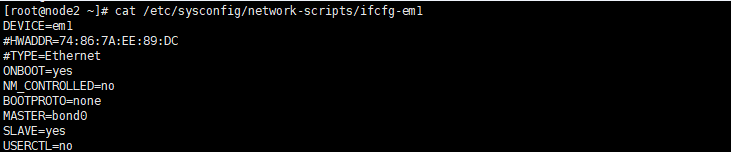
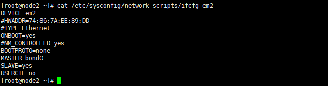
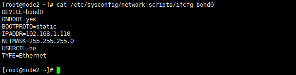
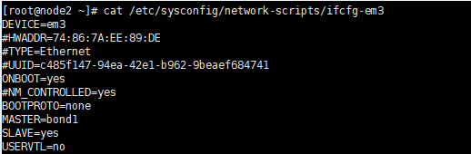
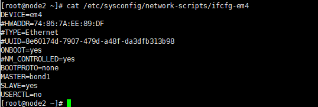
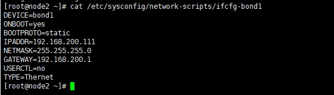
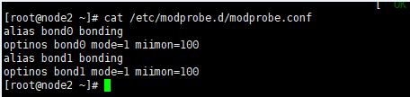
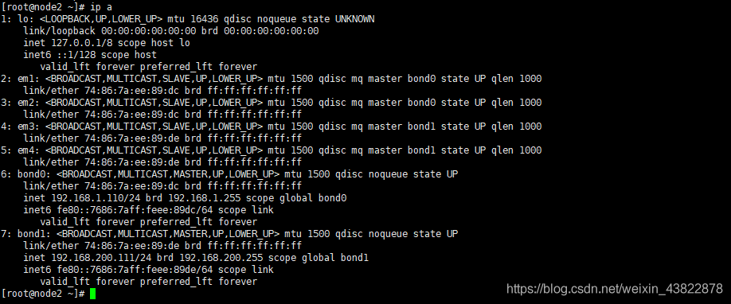
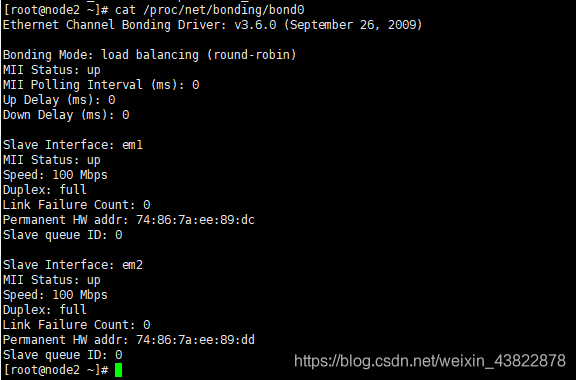
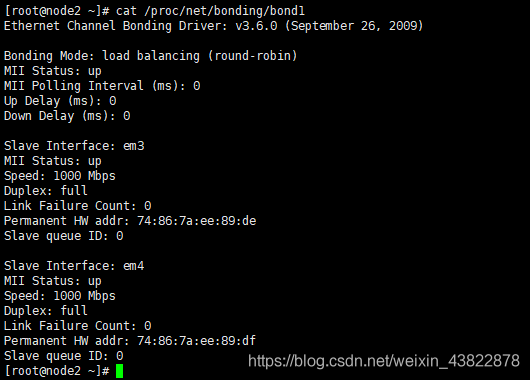

# Linux 配置网卡 bond

> 基于 CentOS7

- 通过命令确定内核是否支持 bonding

  ```shell
  cat /boot/config-2.6.32-573.el6.x86_64 |grep -i bonding
  ```

- 先做bond0内网网卡

  - 第一块网卡配置

    

  - 第二块网卡配置

    

  - bond0的配置文件信息

    

- 再做bond1外网网卡

  - 第三块网卡配置

    

  - 第四块网卡配置

    

  - bond1的配置文件信息

    

- 都配置完后，重启网卡

  ```shell
  service network restart
  ```

- 创建加载模块，让系统支持bonding

  

- 加载bond module

  

- 查看是否有bond0和bond1这两块网卡信息

  

- 查看绑定结果

  - bond0网卡信息

    

  - bond1网卡信息

    

