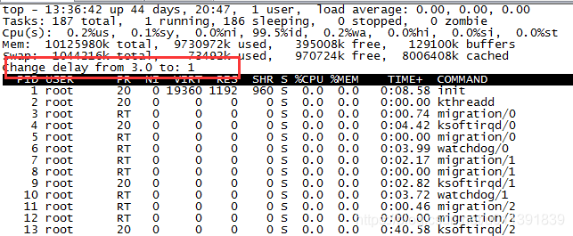
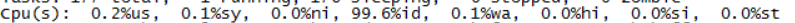
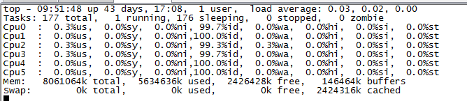
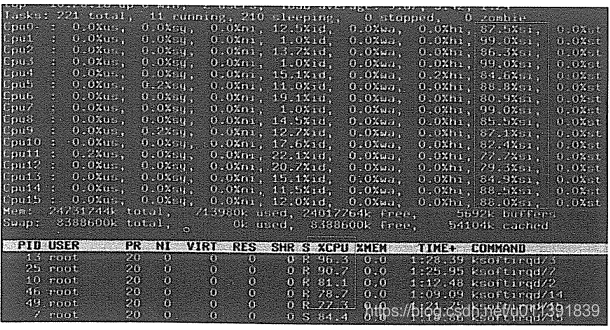
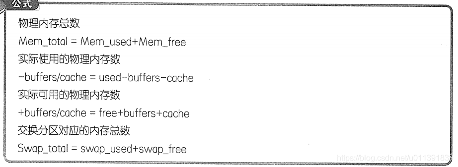
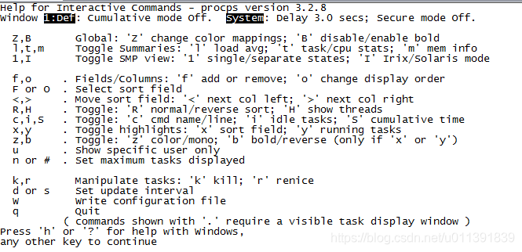
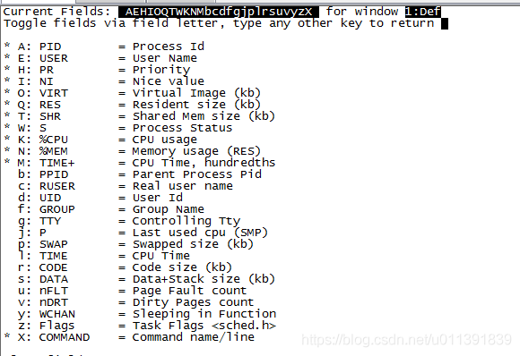
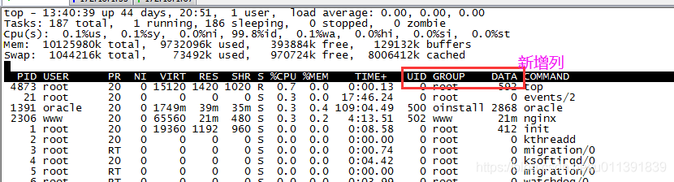
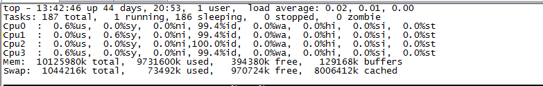

# top 命令详解

> Top命令类似于Windows系统的任务管理器工具。它对于所有正在运行的进行和系统负荷提供不断更新的概览信息，包括系统负载、CPU利用分布情况、内存使用、每个进程的内容使用情况等信息。

## 1、Top 命令基本回显解析



- 系统状态

  

  | 参数                           | 解析                                                         |
  | ------------------------------ | ------------------------------------------------------------ |
  | top - 17:25:29                 | 系统当前时间                                                 |
  | up 43 days,41 min              | 系统到目前为止已运行的时间                                   |
  | 1 user                         | 当前登录系统的用户数量                                       |
  | load average: 0.20, 0.05, 0.01 | 系统负载（任务队列的平均长度），3个数值分别为1分钟、5分钟、15分钟前到现在的平均值 |

  > top给出的系统运行时间，反应了当前系统存活多久，对于某些应用而言，系统需要保证7*24小时的高可用性，这个字段信息就能很好的衡量系统的高可用性。

- Task 进程状态信息

  

  显示的是进程状态信息的汇总，分别对应：**所有启动的进程数、正在运行的进程数、挂起的进程数、停止的进程数、僵尸进程数**。

  在linux操作系统中，一般有以下5种状态的进程信息：D：不可中断睡眠态（通常出现在IO阻塞）、R：运行态、S：睡眠态、T：已停止、z：僵尸态

- CPU

  

  | 参数    | 解析                                          | 重要性   |
  | ------- | --------------------------------------------- | -------- |
  | 0.2%us  | 用户空间占用CPU百分比                         | 重点关注 |
  | 0.1%sy  | 内核空间占用CPU百分比                         | 重点关注 |
  | 0.0%ni  | 用户进程空间内改变过优先级的进程占用CPU百分比 |          |
  | 99.6%id | 空闲CPU百分比                                 | 重点关注 |
  | 0.1%wa  | 等待输入输入的CPU百分比                       | 重点关注 |
  | 0.0%hi  | 硬中断占用CPU百分比                           | 重点关注 |
  | 0.0%si  | 软中断CPU百分比                               | 重点关注 |
  | 0.0%st  | 虚拟CPU等待实际CPU的时间的百分比。            |          |

  一般我们关注多的是us、sy、id、wa、hi、wi这个6个数值，在这里我们需要注意的指标如下：

  **CPU(s)：**表示当前CPU的平均值，默认top命令配置显示的是平均的CPU使用情况，如果按下键盘1可以显示各颗逻辑CPU的使用情况，如下图所示：

  

  - 统计空闲的CPU利用率我们直接统计%id的计数即可，当id持续过低的时候，表示系统迫切需要解决CPU资源问题。
  - 统计使用的是CPU需要用1-%id获取。或者us+sy+si.
  - wa：使用率过高的时候，我们需要考虑IO的性能是否有瓶颈，可以在使用iostat、sar等命令做进一步分析；
  - hi:使用率过高时，表示当前硬件中断占用很大的百分比。一般硬件中断我们可以分析文件/proc/interrupts、/proc/irq/pid/smp_affinity、服务irqbalance是否配置，以及CPU的频率设置，通过这些可以帮系统打散优化系统的硬件中断。
  - si：Linux kernel通过用一种软件的方法（可延迟函数）来模拟硬件的中断模式，通常叫做软中断。常见的软件中断一般都是和网络有关。从网卡到IP层的数据报文收发都是si处理的，长时间写日志也可能产生软件中断。
  - 当软中断出现瓶颈的时候，系统有个进行叫ksoftirqd，每个CPU都有自己对应的ksoftirqd/n（n为CPU的逻辑ID），每个ksoftirqd的内核线程都会去运行对应的ksoftirqd（函数）来处理自己的中断队列上的软件中断。所以，当网络出现阻塞的时候，软件中断程序ksoftirqd肯定会出现瓶颈。此时我们可以通过ps aux|grep ksoftirqd查看ksoftirqd的瓶颈。

  

  Ni：优先级（priority）为操作系统用来决定CPU分类的参数，Linux使用（round-robin）的算法来做CPU排程，优先序越高，有可能获得的CPU时间就越多。但是我们可以通过nice命令以更改过的优先序来执行程序，如果未制定程序，则会打印出目前的排程优先序，内定的adjustment为10，范围为-20（最高优先序）到19（最低优先序）。

- Mem 内存信息（物理内存）

  

  物理内存总量、已经使用的物理内存、空闲物理内存、内核缓存内存量。

- Swap 交换内存（虚拟内存）

  

  交换区总量、已使用交互区总量、空闲交换区总量、缓冲的交换区总量。

  > 有以下结论可以帮助内存分析
  >
  > 1. buffer和cache的作用是所用I/O系统调用的时间，比如读写等。一般一个系统而言，如果cache的值很大，说明cache住的文件多。如果频繁访问文件都能被命中，很明显会比读取磁盘调用快，磁盘的IO必定会减小。
  >
  >    注意：cache的命中率很关键，如果频繁访问的文件不能被命中，对于cache而言是个比较的大的资源浪费，此时应考虑drop cache并提升对应的cache的命中率。
  >
  > 2. 从字段的意义上来说mem.free表示的是空闲内存总量，但是需要注意的是，虽然buffer/cache会占用一定的物理内存，但是当系统需要内存的时候，这些内存立即释放出来，也就是说buffer/cache可以看成可用内存。
  >
  >    

- 进程信息

  

  | 参数    | 解析                                                     |
  | ------- | -------------------------------------------------------- |
  | PID     | 进程ID                                                   |
  | USER    | 进程所有者                                               |
  | PR      | 优先级                                                   |
  | NI      | nice值，负值表示高优先级，正值表示低优先级               |
  | VIRT    | 进程使用的虚拟内存总量,单位kb,VIRT=SWAP+RES              |
  | RES     | 进程使用的、未被换出的物理内存大小，单位kb,RES=CODE+DATA |
  | SHR     | 共享内存大小，单位kb                                     |
  | %CPU    | 上传更新到现在的CPU时间占用百分比                        |
  | %MEM    | 进程使用的物理内存百分比                                 |
  | TIME+   | 进程使用的CPU时间总计，单位1/100秒                       |
  | COMMAND | 命令名/命令行                                            |

  > 注意如下：
  >
  > 1. 在top命令中，第六、七行显示的是所有进程相关的信息，它默认显示的是进程的信息，如果要显示线程级的信息，可以通过ps命令获取。
  > 2. 进程实际使用的内容可以看RES那一列的信息，VIRT表示进程使用的是虚拟内存数据，SHR表示共享内存的数据。
  > 3. TIME+表示是进程使用的CPU时间总计，而非进程的存活时间。且TIME+默认精确到1/100秒。由于TIME+显示的是CPU时间，所以可能存在TIME+大于程序运行时间，也可能小于程序运行时间，这两没有必然的关系，无安全取决于该程序所能分配到的CPU时间而定。
  > 4. %CPU标识进程所占CPU的百分比，通过这个可以得出CPU利用率；
  > 5. 默认情况下系统不会显示进程分布在哪几颗逻辑CPU上，如果想分析各颗CPU对应的应用程序，可以修改top的默认配置，添加字段Last used CPU 即可。


## 2、Top 命令详解

- top 命令参数

  d 指定每两次屏幕信息刷新之间的时间间隔。当然用户可以使用s交互命令来改变之。 

  p 通过指定监控进程ID来仅仅监控某个进程的状态。 

  q 该选项将使top没有任何延迟的进行刷新。如果调用程序有超级用户权限，那么top将以尽可能高的优先级运行。

  S 指定累计模式 

  s 使top命令在安全模式中运行。这将去除交互命令所带来的潜在危险。 

  i 使top不显示任何闲置或者僵死进程。 

  c 显示整个命令行而不只是显示命令名 

- top 命令交互参数（在命令执行期间可以使用的一些交互命令）

  Ctrl+L 擦除并且重写屏幕。 

  h或者? 显示帮助画面，给出一些简短的命令总结说明。 

  k 终止一个进程。系统将提示用户输入需要终止的进程PID，以及需要发送给该进程什么样的信号。一般的终止进程可以使用15信号；如果不能正常结束那就使用信号9强制结束该进程。默认值是信号15。在安全模式中此命令被屏蔽。 

  i 忽略闲置和僵死进程。这是一个开关式命令。 

  q 退出程序。 

  r 重新安排一个进程的优先级别。系统提示用户输入需要改变的进程PID以及需要设置的进程优先级值。输入一个正值将使优先级降低，反之则可以使该进程拥有更高的优先权。默认值是10。 

  S 切换到累计模式。 

  s 改变两次刷新之间的延迟时间。系统将提示用户输入新的时间，单位为s。如果有小数，就换算成m s。输入0值则系统将不断刷新，默认值是5 s。需要注意的是如果设置太小的时间，很可能会引起不断刷新，从而根本来不及看清显示的情况，而且系统负载也会大大增加。 

  f 或者F 从当前显示中添加或者删除项目。 

  o 或者O 改变显示项目的顺序。 

  l 切换显示平均负载和启动时间信息。 

  m 切换显示内存信息，关闭或开启第一部分第四行 Mem 和 第五行 Swap 信息的表示。 

  t 切换显示进程和CPU状态信息，关闭或开启第一部分第二行 Tasks 和第三行 Cpus 信息的表示。 

  c 切换显示命令名称和完整命令行。 

  M 根据驻留内存大小进行排序。 

  P 根据CPU使用百分比大小进行排序。 

  T 根据时间/累计时间进行排序。 

  W 将当前设置写入~/.toprc文件中。这是写top配置文件的推荐方法。

  E 切换顶部内存显示单位，每次切换转换率为1000，切换的单位为 k,m,g,t,p

  e 切换进程显示部分的内存显示单位，每次切换转换率为1000，切换的单位为 k,m,g,t,p

  n 设置在进程列表所显示进程的数量

  

- 进程列表可展示的参数详解

  | 序号 | 列名    | 含义                                                         |
  | ---- | ------- | ------------------------------------------------------------ |
  | a    | PID     | 进程id                                                       |
  | b    | PPID    | 父进程id                                                     |
  | c    | RUSER   | Real user name                                               |
  | d    | UID     | 进程所有者的用户id                                           |
  | e    | USER    | 进程所有者的用户名                                           |
  | f    | GROUP   | 进程所有者的组名                                             |
  | g    | TTY     | 启动进程的终端名。不是从终端启动的进程则显示为 ?             |
  | h    | PR      | 优先级                                                       |
  | i    | NI      | nice值。负值表示高优先级，正值表示低优先级                   |
  | j    | P       | 最后使用的CPU，仅在多CPU环境下有意义                         |
  | k    | %CPU    | 上次更新到现在的CPU时间占用百分比                            |
  | l    | TIME    | 进程使用的CPU时间总计，单位秒                                |
  | m    | TIME+   | 进程使用的CPU时间总计，单位1/100秒                           |
  | n    | %MEM    | 进程使用的物理内存百分比                                     |
  | o    | VIRT    | 进程使用的虚拟内存总量，单位kb。VIRT=SWAP+RES                |
  | p    | SWAP    | 进程使用的虚拟内存中，被换出的大小，单位kb。                 |
  | q    | RES     | 进程使用的、未被换出的物理内存大小，单位kb。RES=CODE+DATA    |
  | r    | CODE    | 可执行代码占用的物理内存大小，单位kb                         |
  | s    | DATA    | 可执行代码以外的部分(数据段+栈)占用的物理内存大小，单位kb    |
  | t    | SHR     | 共享内存大小，单位kb                                         |
  | u    | nFLT    | 页面错误次数                                                 |
  | v    | nDRT    | 最后一次写入到现在，被修改过的页面数。                       |
  | w    | S       | 进程状态(D=不可中断的睡眠状态,R=运行,S=睡眠,T=跟踪/停止,Z=僵尸进程) |
  | x    | COMMAND | 命令名/命令行                                                |
  | y    | WCHAN   | 若该进程在睡眠，则显示睡眠中的系统函数名                     |
  | z    | Flags   | 任务标志，参考 sched.h                                       |


## 3、top 命名常用操作示例

```shell
top //每隔5秒显式所有进程的资源占用情况
top -d 2 //每隔2秒显式所有进程的资源占用情况
top -c //每隔5秒显式进程的资源占用情况，并显示进程的命令行参数(默认只有进程名)
top -p 12345 -p 6789//每隔5秒显示pid是12345和pid是6789的两个进程的资源占用情况
top -d 2 -c -p 123456 //每隔2秒显示pid是12345的进程的资源使用情况，并显式该进程启动的命令行参数
```


## 4、Top 命令进阶操作：自定义配置

默认的top命令配置并不能满足我们的日常需求时，我们可以自定义一些top配置，来更好的分析系统。用户输入top命令后，按下H键可以看到一应的top配置帮助页面：



常用的top修改配置如下：修改刷新间隔时间，添加字段、删除字段、排序、保存等：

- **Top间隔刷新**：在top命令后，按下d键盘进入间隔刷新配置，输入间隔秒数即可。

  

- **添加进程字段显示列**：输入完top命令后，按下字母f,进入列配置页面

  

  选择前面对应的字母，如d,则会增加一列UID；变成大写字母表示显示，小写字母表示没有选择不显示：

  

- **显示平均/各颗CPU的利用率信息**：进入top命令后，输入数字1；再次按下数字1后，又恢复原来的平均的CPU信息。

  

> 需要注意的是，上面几种技巧因为没有加W保存，所以当用户退出top交互界面后，下次登录又会重新加载，如果需要则输入W保存。

