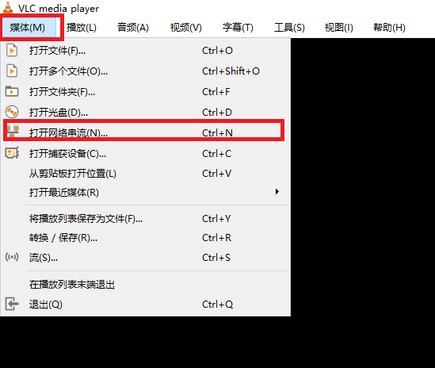
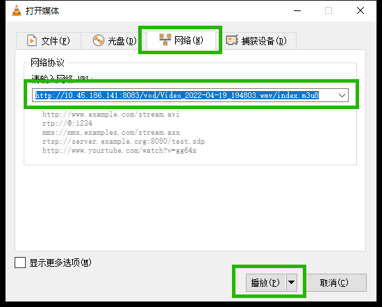

# 基于 Nginx 的视频服务器搭建

> Nginx-1.20.2 + nginx-vod-module-1.28
>
> nginx-vod-module 是基于 Nginx 的视频流处理的第三方模块，详细的功能和配置可以上网查询，本文仅讲解最基本的网络点播服务的搭建


- 环境准备

  ```shell
  yum install -y pcre pcre-devel gcc-c++
  ```

- 上传安装包

  ```
  nginx-1.20.2.tar.gz
  nginx-vod-module-1.28.tar.gz
  ```

- 解压这些安装包

- 进入 nginx-1.20.2 目录，配置安装参数

  ```shell
  ./configure --prefix=/home/videoSrv/nginx --with-http_stub_status_module --with-http_ssl_module --with-cc-opt='-O0 -gstabs+3' --with-debug --add-module=/home/videoSrv/nginx-vod-module
  ```

- 编译安装

  ```shell
  make
  make install
  ```

- 配置 Nginx，添加如下内容（基础nginx配置不赘述，正常配置即可）

  ```nginx
  location /vod {
      vod hls;
      vod_mode local;
  
      vod_align_segments_to_key_frames on;
      vod_manifest_segment_durations_mode accurate;
  
      add_header Access-Control-Allow-Headers '*';
      add_header Access-Control-Expose-Headers 'Server,range,Content-Length,Content-Range';
      add_header Access-Control-Allow-Methods 'GET, HEAD, OPTIONS';
      add_header Access-Control-Allow-Origin '*';
  
      alias /home/videoSrv/media;
  }
  ```

- 新建视频存放目录：/home/videoSrv/media

- 存放视频

- 下载 VLC 本地播放器或 H5 播放器，此处以 VLC 播放器为例

- 视频访问链接

  ```
  http://10.0.0.1:8083/vod/example.mp4/index.m3u8
  
  - 10.0.0.1:8083：Nginx 服务的地址和端口
  - example.mp4：为视频名称
  - index.m3u8：为链接默认配置，不需要改动
  ```

- 打开 VLC 播放器

- 配置网络串流

  

  

- 此时，即可正常播放视频
