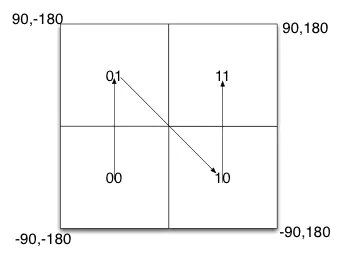
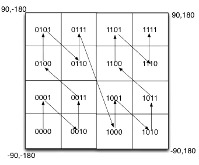
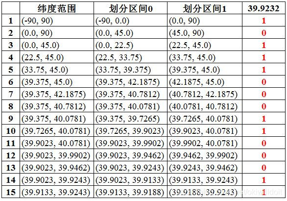
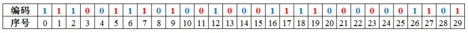
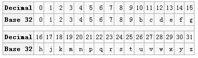
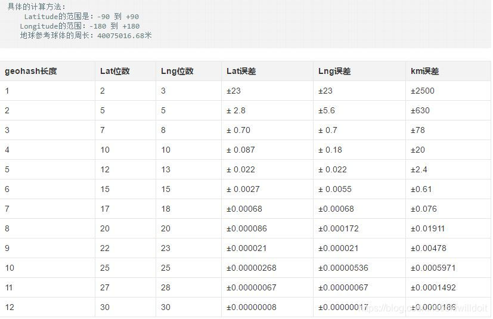
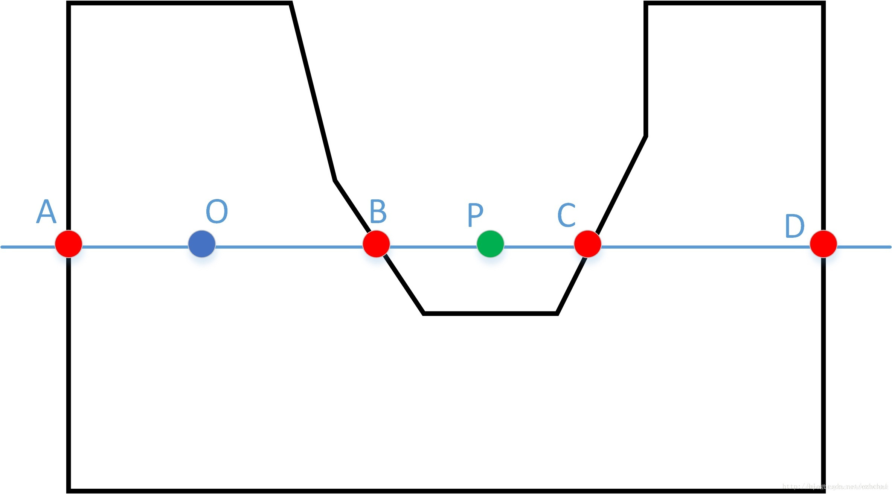
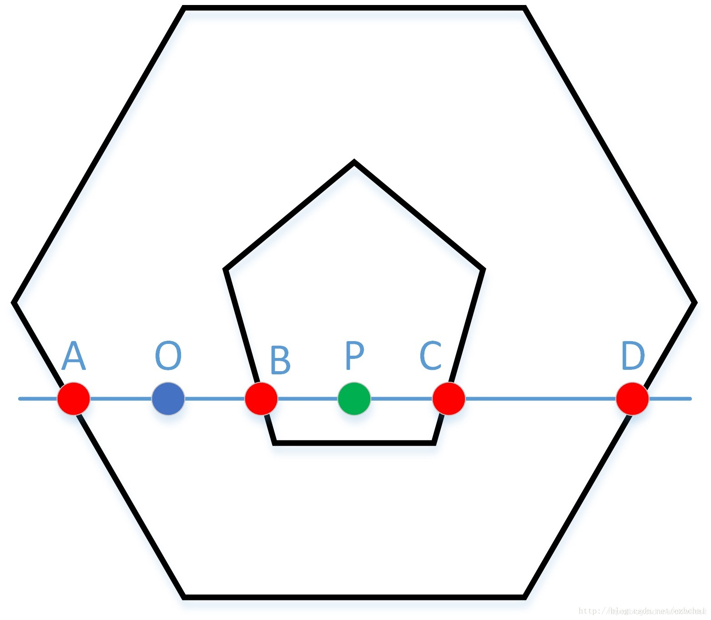
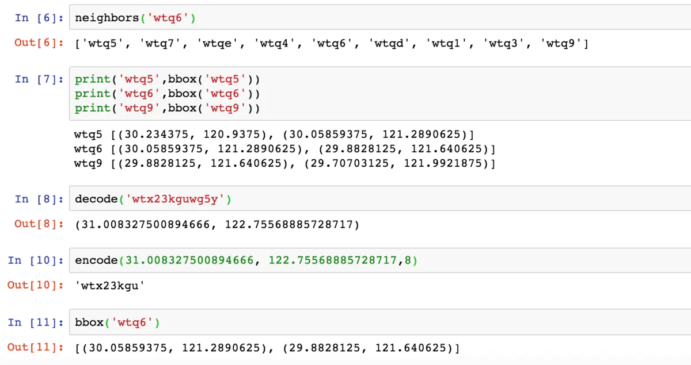

# GeoHash 算法简介
## 一、基本原理

GeoHash是一种地址编码方法。他能够把二维的空间经纬度数据编码成一个字符串。

我们知道，经度范围是东经180到西经180，纬度范围是南纬90到北纬90，我们设定西经为负，南纬为负，所以地球上的经度范围就是[-180， 180]，纬度范围就是[-90，90]。如果以本初子午线、赤道为界，地球可以分成4个部分。

如果纬度范围[-90°, 0°)用二进制0代表，（0°, 90°]用二进制1代表，经度范围[-180°, 0°)用二进制0代表，（0°, 180°]用二进制1代表，那么地球可以分成如下4个部分：



 如果在小块范围内递归对半划分呢？



可以看到，划分的区域更多了，也更精确了。geohash算法就是基于这种思想，划分的次数更多，区域更多，区域面积更小了。通过将经纬度编码，给地理位置分区


## 二、算法过程

以经纬度值：（116.389550， 39.928167）进行算法说明，对纬度39.928167进行逼近编码 (地球纬度区间是[-90,90]）

1. 区间[-90,90]进行二分为[-90,0),[0,90]，称为左右区间，可以确定39.928167属于右区间[0,90]，给标记为1

2. 接着将区间[0,90]进行二分为 [0,45),[45,90]，可以确定39.928167属于左区间 [0,45)，给标记为0

3. 递归上述过程39.928167总是属于某个区间[a,b]。随着每次迭代区间[a,b]总在缩小，并越来越逼近39.928167

4. 如果给定的纬度x（39.928167）属于左区间，则记录0，如果属于右区间则记录1，序列的长度跟给定的区间划分次数有关，如下图：

   

同理，地球经度区间是[-180,180]，可以对经度116.389550进行编码。通过上述计算，纬度产生的编码为1 1 0 1 0 0 1 0 1 1 0 0 0 1 0，经度产生的编码为1 0 1 1 1 0 0 0 1 1 0 0 0 1 1

- 合并：偶数位放经度，奇数位放纬度，把2串编码组合生成新串如下图：

  

  将11100 11101 00100 01111 0000 01101转成十进制，对应着28、29、4、15，0，13 十进制对应的base32编码就是wx4g0e,如下

  

- 同理，将编码转换成经纬度的解码算法与之相反。


## 三、GeoHash 算法的特点

Geohash比直接用经纬度的高效很多，而且使用者可以发布地址编码，既能表明自己位于北海公园附近，又不至于暴露自己的精确坐标，有助于隐私保护。 

GeoHash用一个字符串表示经度和纬度两个坐标。在数据库中可以实现在一列上应用索引（某些情况下无法在两列上同时应用索引）

GeoHash表示的并不是一个点，而是一个矩形区域。

GeoHash编码的前缀可以表示更大的区域。例如wx4g0ec1，它的前缀wx4g0e表示包含编码wx4g0ec1在内的更大范围。 这个特性可以用于附近地点搜索。

编码越长，表示的范围越小，位置也越精确。因此我们就可以通过比较GeoHash匹配的位数来判断两个点之间的大概距离。下表编码长度的误差：




## 四、判断点与多边形的关系

在实际项目中，我们需要经常判断一个geohash点是否在一个多边形内。比如点外卖场景中，判断一个用户是否在一个商户的配送范围内，这个配送范围就是一个多边形。下面介绍最常用的射线法。
射线法，也叫奇偶测试法
【交点数目】一条射线从点P开始，穿过多边形的边界的次数称为交点数目
【判断】

交点数目=偶数 => P在多边形外部
交点数目=奇数 => P在多边形内部
【适用情况】多边形是简单的（没有自相交点）
【缺点|不适用的情况】对于非简单多边形，是不适用的
 

举例来说，如下图所示。所谓射线法，关键在于单向发射，为简化问题，以水平线为例，程序实现中也是这么处理的。O点向右发出射线，与多边形的交点是B、C、D，向左发出射线，交点是A，均为奇数个。P点在多边形外，无论想哪方向发出摄像，都有2个交点。



 对于带内岛的形状，射线法同样适用，如上图所示。在实际应用中，射线法会有很多特殊情况需要讨论，全部都讨论会比较复杂，但结论是一样的。这里不做过多讨论了，不过可以给大家结论：射线法适用于所有类型的多边形进行点与多边形关系的判断，且实现相对简单，速度较快，是工程应用的不二之选。




## 五、GeoHash 算法的 Python 实现

```python
__all__ = ['encode','decode','bbox','neighbors']
_base32 = '0123456789bcdefghjkmnpqrstuvwxyz'
#10进制和32进制转换，32进制去掉了ailo
_decode_map = {}
_encode_map = {}
for i in range(len(_base32)):
    _decode_map[_base32[i]] = i
    _encode_map[i]=_base32[i]
del i
```

```python
# 交线位置给左下
def encode(lat,lon,precision=12):
    lat_range, lon_range = [-90.0, 90.0], [-180.0, 180.0]
    geohash=[]
    code=[]
    j=0
    while len(geohash)<precision:
#         print(code,lat_range,lon_range,geohash)
        j+=1
        lat_mid=sum(lat_range)/2
        lon_mid=sum(lon_range)/2
        #经度
        if lon<=lon_mid:
            code.append(0)
            lon_range[1]=lon_mid
        else:
            code.append(1)
            lon_range[0]=lon_mid
        #纬度
        if lat<=lat_mid:
            code.append(0)
            lat_range[1]=lat_mid
        else:
            code.append(1)
            lat_range[0]=lat_mid
        ##encode
        if len(code)>=5:
            geohash.append(_encode_map[int(''.join(map(str,code[:5])),2)])
            code=code[5:]
    return ''.join(geohash)
```

```python
def decode(geohash):
    lat_range, lon_range = [-90.0, 90.0], [-180.0, 180.0]
    is_lon=True
    for letter in geohash:
        code=str(bin(_decode_map[letter]))[2:].rjust(5,'0')
        for bi in code:
            if is_lon and bi=='0':
                lon_range[1]=sum(lon_range)/2
            elif is_lon and bi=='1':
                lon_range[0]=sum(lon_range)/2
            elif (not is_lon) and bi=='0':
                lat_range[1]=sum(lat_range)/2
            elif (not is_lon) and bi=='1':
                lat_range[0]=sum(lat_range)/2
            is_lon=not is_lon
    return sum(lat_range)/2,sum(lon_range)/2
```

```python
def neighbors(geohash):
    neighbors=[]
    lat_range,lon_range=180,360
    x,y=decode(geohash)
    num=len(geohash)*5
    dx=lat_range/(2**(num//2))
    dy=lon_range/(2**(num-num//2))
    for i in range(1,-2,-1):
        for j in range(-1,2):
            neighbors.append(encode(x+i*dx,y+j*dy,num//5))
#     neighbors.remove(geohash)
    return neighbors
```

```python
def bbox(geohash):
    lat_range, lon_range = [-90.0, 90.0], [-180.0, 180.0]
    is_lon=True
    for letter in geohash:
        code=str(bin(_decode_map[letter]))[2:].rjust(5,'0')
        for bi in code:
            if is_lon and bi=='0':
                lon_range[1]=sum(lon_range)/2
            elif is_lon and bi=='1':
                lon_range[0]=sum(lon_range)/2
            elif (not is_lon) and bi=='0':
                lat_range[1]=sum(lat_range)/2
            elif (not is_lon) and bi=='1':
                lat_range[0]=sum(lat_range)/2
            is_lon=not is_lon
    #左上、右下；(lat_max,lon_min),(lat_min,lon_max)
    return [(lat_range[1],lon_range[0]),(lat_range[0],lon_range[1])]
```



