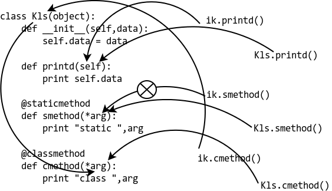

# @classmethon & @staticmethod

> 结论：
>
> 我们要写一个只在类中运行而不在实例中运行的方法时，可以使用 @classmethon 装饰器来创建方法
>
> 我们要写一个跟类有关系，但在运行时又不需要实例和类参与的方法时，可以使用 @staticmethod 装饰器来创建方法，staticmethod 方法可以在不创建实例的情况下直接调用

下面一个示例来演示这两个装饰器的使用方法和区别：

```python
class Kls(object):
    def __init__(self, data):
    	self.data = data
    def printd(self):
    	print(self.data)
    @staticmethod
    def smethod(*arg):
    	print('Static:', arg)
    @classmethod
    def cmethod(*arg):
    	print('Class:', arg)

 
>>> ik = Kls(23)
>>> ik.printd()
23
>>> ik.smethod()
Static: ()
>>> ik.cmethod()
Class: (<class '__main__.Kls'>,)
>>> Kls.printd()
TypeError: unbound method printd() must be called with Kls instance as first argument (got nothing instead)
>>> Kls.smethod()
Static: ()
>>> Kls.cmethod()
Class: (<class '__main__.Kls'>,)
```



