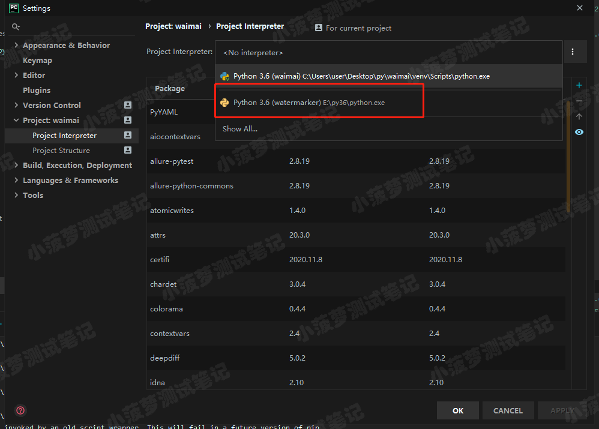
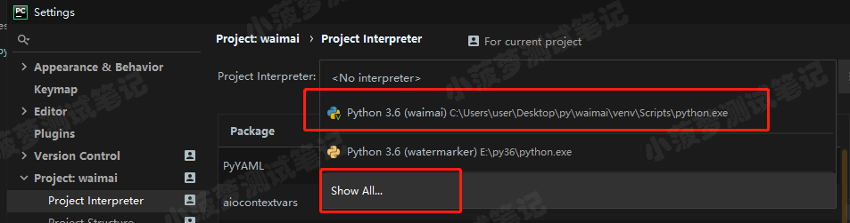
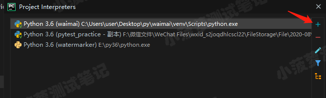
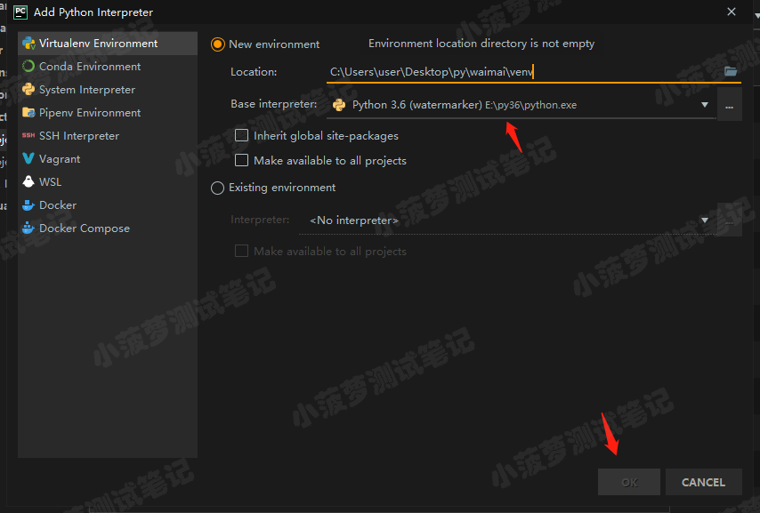

# Pychram 设置环境与导出环境

Pycharm 每个项目都需要设置环境，即 Porject Interpreter，这个环境有几种设置方法
1、将 Interpreter 设置为本机安装路径，如下图所示

优势：所有项目依赖包只需要装一遍即可
劣势：依赖环境的第三方库会有非常多，在某个项目的第三方库并不需要很多时，如果此时用这个 interpreter 生成 requirement.txt 就会有很多无关紧要的库，不利于打包部署

2、创建 Virtualenv Environment
此方法给项目分配一个单独的 Porject Interpreter

优势：单个项目有一个独立的环境，相关依赖包会与项目紧密相关，不会存在多余无用的依赖包
劣势：不同项目之间需要重新下载依赖包

环境依赖包导出
基本操作
1、进入对应环境，使用 `python.exe -m pip freeze > requirements.txt` 生成该环境的 requirements 文件（Windows）
2、联网环境下：使用这个 requirements.txt 文件，通过命令 `pip install -r requirements.txt`直接安装

离线环境下的操作

1、进入对应环境，使用 `python.exe -m pip freeze > requirements.txt` 生成该环境的 requirements 文件（Windows）

2、在联网环境下，使用 `pip download -r requestments.txt -d ./pip_packages ` 将所有依赖包存储在 pip_packages 目录下

3、将包和环境文件，拷贝到离线环境下，使用 `pip install --no-index --find-links=./pip_packages -r requestments.txt ` 离线安装所有包

​	（--find-links指定的是包文件的存放地址，-r指定的是txt文件的位置）

如果 Pycharm 使用的是系统 Python 环境，则到系统 Python 环境下安装，如果 Pycharm 使用的是虚拟环境，则到项目目录下的 venv/Scripts 下，有一个 python.exe，利用 venv/Scripts 下的 python.exe 生成 requirement.txt

