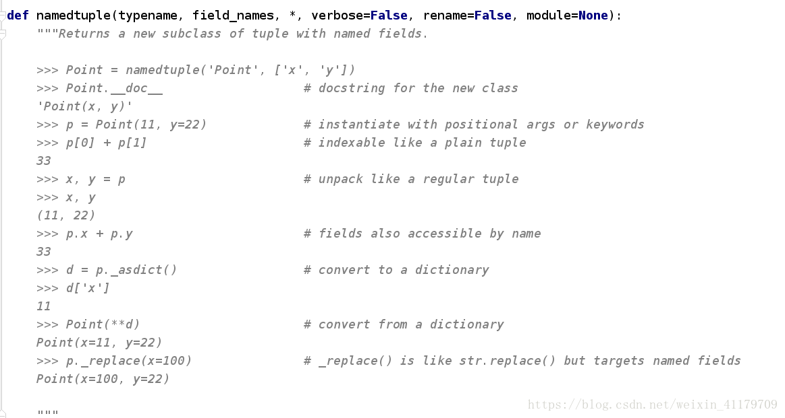

# namedtuple 用法

> **namedtuple是继承自tuple的子类。namedtuple创建一个和tuple类似的对象，而且对象拥有可访问的属性。**
>
> 因为元组的局限性：不能为元组内部的数据进行命名，所以往往我们并不知道一个元组所要表达的意义，
> 所以在这里引入了 collections.namedtuple 这个工厂函数，来构造一个带字段名的元组。
> 具名元组的实例和普通元组消耗的内存一样多，因为字段名都被存在对应的类里面。这个类跟普通的对象
> 实例比起来也要小一些，因为 Python 不会用 __dict__ 来存放这些实例的属性。

实现方法

```python
from collections import namedtuple
```

源代码



用法示例

```python
def namedtuple(typename, field_names, *, verbose=False, rename=False, module=None):
#    - typename: 元组名称
#    - field_names : 元组中元素的名称
#    - rename: 如果元素名称中包含python关键字， 必须设置rename=True
```

```python
from collections import  namedtuple

User = namedtuple('User', ['name', 'age', 'gender'])
u = User('villa', 33, 'male')
print(u.name)
print(u.age)
print(u.gender)
print(u)
```


