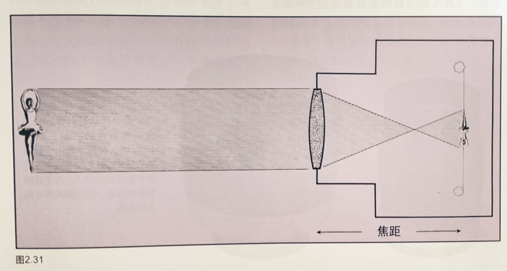
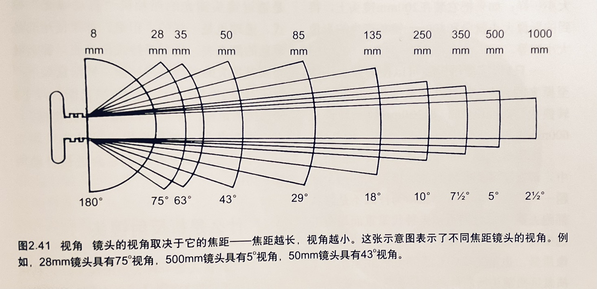

# 《纽约摄影学院摄影教程》笔记
## 第一单元 第一课

**基本原则：**   1、一副好的照片要有一个鲜明的主题（有时也称之为主体）。或是表现一个人，或是表现一个事物，甚至可以表现该题材的一个故事情节。主题必须明确，毫不含糊，使任何观赏者一眼就能看出来   2、一副好照片必须能把注意力引向被摄主体，换句话说，使观赏者的目光一下子就投向被摄主体   3、一副好照片必须画面简洁，只包括那些有利于把视线引向被摄主体的内容，而排除或压缩那些可能分散注意力的内容

> -   "摄影师通常都必须要在捕捉“精彩瞬间”与理想构图之间进行抉择。如果在你的 相机前发生了激动人心或出乎意料的场景，拍下这张照片 。如果你仍有机会。可以再拍一张构图完美的照片"
>
> -   “必须用全新的方式重新观察你周围的一切”
>
> -   "我们看的太多，所以就视而不见了"
>
> -   “你想象中最美妙的场景就存在于你所在之处方圆一英里的范围之内”

## 第一单元 第二课 照相机和镜头

> “世界上所有类似照相机 的设备装置都不可能促使你成为一名优秀的摄影师，它们都不可能取代摄影本身对摄影者的智力、技能和才干的要求” “影像的质量永远取决于摄影师的观察能力”

### 照相机的类型

上面这些部件依结构安排的方式不同，就产生了不同类型的照相机

-   35mm自动相机

-   35mm直视取景器照相机

-   35mm单镜头反光照相机

-   120mm单镜头反光照相机

-   双镜头反光照相机

-   一次成像照相机

-   机背取景照相机

### 镜头

镜头的原理即小孔成像，但镜头还会解决以下问题：

1.  镜头能汇聚光束，产生清晰的图像

2.  镜头能接纳大量的光线，使得在很短的时间内内，也能获得合适的曝光

### 镜头速度（光圈）

指特定的镜头在特定的时间内进光量的多少 用光圈值（f）表示进光量 光圈值越小，进光量越大 开大一档光圈，进光量会增加一倍：f值完整序列：f1 f1.4 f2 f2.8 f4 f5.6 f8 f11 f16 f22 f32 f44 f64 f 值记忆小技巧：每个数字大约都是向前数两个数字的两倍，即：1 2 4 8 16 … 1.4 2.8 5.6 11 22…

### 焦距

镜头的焦距基本就是从镜头中心点到形成清晰影像的成像平面（胶片或传感器等）的距离

镜头的焦距决定了镜头拍摄的物体在被摄平面上的大小

### 孔径与焦距的关系

正常情况下，相同的孔径，焦距越大，进光量越少。相同的焦距，孔径越大，进光量越大。

因此，如果我们拍摄时，同时考虑两个变量，这会非常繁琐。

于是，我们统一以光圈值（f）作为进光量大小的衡量，不管什么镜头，什么焦距，相同的f值，必会带来相同的进光量。

### 焦距与影像大小的关系

影像大小与焦距成正比，焦距大一倍，成像也加一倍

### 标准镜头、广角镜头、远摄镜头

标准镜头拍摄的视角与人眼视角相似 比标准镜头覆盖更大像场（焦距比标准镜头短）的镜头即为广角镜头 比标准镜头覆盖更窄像场（焦距比标准镜头长）的镜头即为远摄镜头（长焦镜头）

但是，标准镜头的焦距并非一成不变，对于不同的胶片或传感器尺寸，标准镜头的焦距也会不一样

胶片尺寸

标准镜头焦距

35mm

50mm

2又1/4英寸

75mm

4x5英寸

150mm

8x10英寸

300mm

常见的相机均为35mm，因此，50mm是大家熟知的标准镜头，但实际上，50mm只是一个近似数，通常情况下，40-60mm之间均是标准镜头

另外一个确认标准镜头焦距的方法是计算胶片或传感器的对角线长度，对角线长度近似等于标准镜头焦距

焦距与视野角度的关系

**远摄镜头的缺点**

-   昂贵

-   笨重

-   越长焦距，对稳定性要求越高

    -   经验准则是：当快门速度至少等于镜头焦距数的倒数时，才能手持拍摄

    -   但为了保证锐利的影像，更推荐快门速度是镜头焦距两倍的倒数

### 折反镜头

一种长焦距镜头，通过使用凹面的反光镜增加影像大小 优点：轻便（很短的镜头筒就能实现很长的焦距） 缺点：成像不如同等远摄镜头好；光圈固定不可调

> 注意：远摄镜头务必不能对准太阳！远摄镜头也是一种望远镜，能够汇聚光线和热量

### 什么是变焦镜头

可变焦距的镜头 使用变焦镜头聚焦时（手动对焦），可以先将镜头调整至最大焦距聚焦，然后再把焦距调小到期望的焦距，这样就能得到更清晰的图像。原因在于，在最大焦距下便于观察物体是否对焦清晰。

变焦镜头的特殊效果（变焦特效，拉爆）： 拍摄时，在快门打开的同时拧动变焦环，会产生一种放射性的影像效果

### 什么是微距镜头

一种可以非常接近被摄物体进行聚焦的镜头。微距镜头在成像平面上形成的影像大小，与被摄物体自身的真实尺寸大致相等 成像平面上的影像大小与物体真实大小的关系叫复制比率。 一般而言，1:1的复制比称之为微距镜头； 1:1.2-1:2的复制比称之为微距焦镜头； 1:2-1:4的复制比称之为近聚焦镜头

微距与焦距没有关系，尽管大多数微距镜头都是长焦镜头，但冠以镜头微距，仅是因为其除去有普通镜头的特性外，还能非常靠近被摄物体进行拍摄。

微距镜头对于拍摄小物体颇有价值

拍摄微距照片的诀窍是，对焦要精确，原因在于微距照片的景深范围很小，稍有偏差就会导致对焦失败。

### 什么是眩光

所有镜头在传输影像的过程中，都会受到某种非理想因素影响。我们把这些不理想因素造成的成片与被摄物体实际情况所产生的差距，叫做像差。 现代镜头之所以复杂，都是为了尽可能的减少像差。 眩光就是像差的一种。 眩光产生的原因：相机镜头通常由许多片单独的玻璃透镜（透镜单元）组合在一起形成。明亮的光线通过这些透镜单元时，有一小部分会被反射回去，这种内部的反射形成的幻影就是眩光。 降低眩光的方式：

-   首先，几乎所有现代镜头都会在每个透镜单元表面涂上极薄的化学物质膜，以降低透镜的表面反射率（因此，在擦拭镜头时需要格外小心）。但当镜头对准强光源时，仍会出现眩光现象。

-   安装滤镜时，尤其注意眩光，因为相当于多加了一块透镜

-   安装遮光罩

-   调整镜头拍摄方向，以消除眩光

-   尝试遮挡光源，但注意不要让遮挡物出现在取景器中 观察眩光的方法：单反相机中，在取景器中观察到眩光，那么影像中就会出现眩光，如果取景器中没有，那么影像中也不会有。但对于旁轴相机来说则不一定。

### 什么是透视畸变

透视畸变源于透视的特征。

透视的两个特征：

1.  被摄物体越远，显得越小，比如：铁轨；

2.  镜头离被摄物体越远，被摄体外观上的大小变化越小

**广角镜头的透视畸变**

广角镜头常常产生失真的畸变的原因在于：广角镜头拍摄时，更接近被摄物体，基于上文的透视第二特征，畸变更明显。

换句话说，在相同距离使用所有镜头进行拍摄，它们的畸变程度是一样的

**远摄镜头的透视畸变**

基于透视的第一个特征：被摄物体越远，显得越小。会有一种`反向畸变`。这种反向畸变多见于远摄镜头。以下图为例，由于拍摄者站的足够远，透视效果减到最小，以至于投手和击手看起来同样大小，就像站在一块似的，而事实上他们相隔着好一段距离。

### 什么是肖像镜头

拍摄肖像时，我们希望 "头-肩" 可以充满画面，但又不希望出现透视畸变。

于是，我们需要一个拍摄人像 "比较好" 的焦段的镜头：85-135mm(书中表示，但现在市面上 50mm 的镜头通常也会作为肖像镜头)

> **I say**：
>
> 事实上，镜头对于人脸的影响实质上，是对人脸立体感的表达，广角镜头由于透视畸变的影响，会使得人脸过于立体（鼻子过高、过大），远摄镜头由于反向畸变的原因，会使得人脸过于扁平。因此，在选择肖像镜头时，倒不需要特别拘泥于人云亦云，多使用不同焦段的镜头去拍摄，去比对，自会选择出自己最中意的肖像焦段，当然，除非审美或风格取向，一般选择出的，基本都是在 50-135mm 范围内

### 什么是线性畸变

如下图，建筑线条弯曲向中间，使得原本平行的线条不平行了

造成这种现象的原因，不在于相机，也不在于镜头。而在于拍摄时站的位置，当站位不再建筑的正中，由于透视的原理，就会导致每根线条朝不同角度汇聚，从而使得拍出来的就不像一个高楼，而像一个金字塔。

这个问题在所有镜头中都有，只不过由于广角镜头使得线条倾斜角度更明显，因此这一现象更为显著。

解决的方法：

1.  使照相机背部与所拍摄建筑物的正面平行即可；

2.  使用机背取景相机，这种相机镜头可以上下左右移动，这是消除线性畸变最好的方法；

3.  （个人补充）还可以通过后期来解决

**什么是透视控制镜头**

有少数厂家会生产单反使用的透视控制(PC)镜头。这种镜头可以通过转动手柄，实现镜头的上下左右的移动。这种镜头价格昂贵，且效果不及机背取景相机

### 什么是鱼眼镜头

鱼眼镜头是一种焦距极短且视角接近或等于 180° 的镜头。16mm 或焦距更短的镜头通常即可认为是鱼眼镜头。

> 每种镜头拍摄什么场景，有一个常用的推荐，比如广角适合大场景或风光，但这不意味这些镜头只能拘泥于这些场景，要深刻的理解并记住每种镜头的的特征，在拍摄时，灵活的运用。以想要表达的主题为中心，镜头是为拍摄主题服务的。
>
> -   广角镜头：宽广的视野；突出的透视；可以靠近拍摄
>
> -   长焦镜头：出色的距离；压缩景深；优秀的畸变控制

## 第一单元 第三课 如何使用照相机